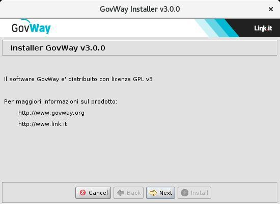

.. _inst_installer:

=========================
Esecuzione dell'Installer
=========================

#. Scarica qui_ la binary release di GovWay

    .. _qui: https://www.govway.org/download

#. Scompatta l'archivio, verifica ed eventualmente imposta la variabile d'ambiente *JAVA_HOME* in modo che riferisca la directory radice dell'installazione di Java. Lancia l'utility di installazione mandando in esecuzione il file *install.sh* su Unix/Linux, oppure *install.cmd* su Windows.

.. note::
   L'utility di installazione non installa il prodotto ma
   produce tutti gli elementi necessari che dovranno essere dispiegati
   nell'ambiente di esercizio. L'utility di installazione mostra
   all'avvio una pagina introduttiva.

   Introduzione

#. Dopo la pagina introduttiva, cliccando sul pulsante *Next*, si
   procede con la scelta della *Modalità di Installazione*. Le scelte
   possibili sono:

   -  *Nuova Installazione*: scelta da effettuare nel caso in cui si
      stia procedendo con una nuova installazione di GovWay.

   -  *Aggiornamento*: scelta da effettuare nel caso in cui si stia
      procedendo con l'aggiornamento di una versione di GovWay
      precedentemente installata.

.. toctree::
        :maxdepth: 2

        nuovaInstallazione
	aggiornamento
