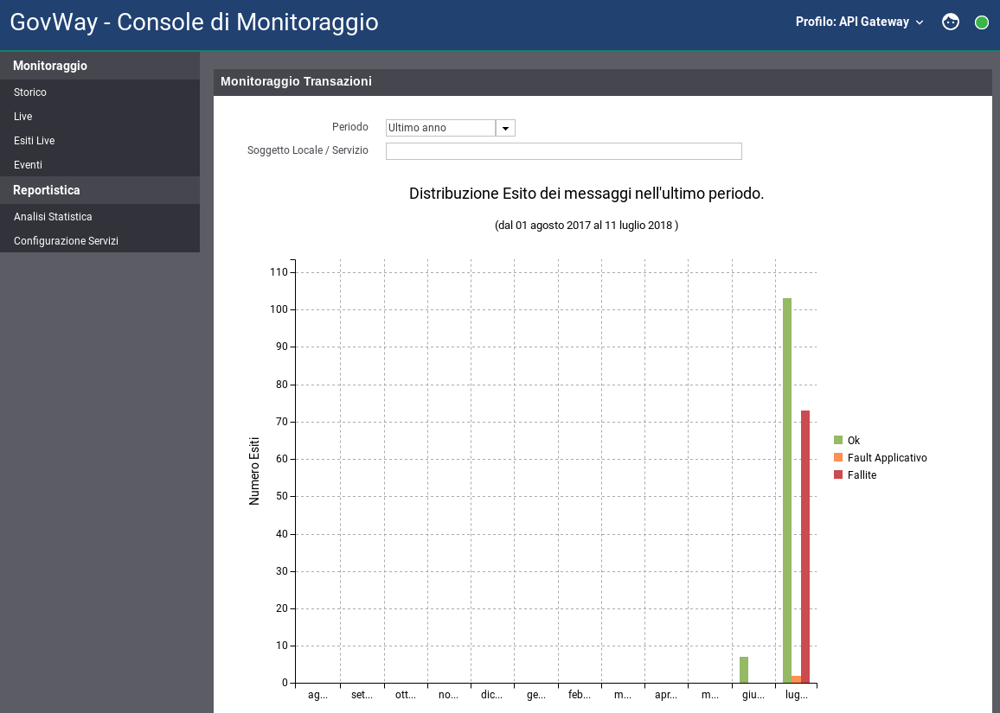

.. _mon_accesso_homepage:

Homepage
--------

Una volta effettuato l'accesso, viene mostrata la pagina di benvenuto
(:numref:`mon_homepage_fig`) che permette di visualizzare, tramite un grafico, il volume di
traffico complessivo, suddiviso in base all'esito delle singole
comunicazioni. Il grafico può essere modificato specificando alcuni
valori tramite gli elementi seguenti:

-  Periodo

   Vengono mostrati i dati, aggiornati alla data odierna, con una tra le
   quattro finestre temporali disponibili: 1 giorno, 1 settimana, 1 mese
   e 1 anno.

-  Soggetto Locale / API

   Consente di filtrare i dati del grafico specificando il soggetto
   locale che partecipa, come fruitore o erogatore, alle comunicazioni
   registrate. In alternativa è possibile anche indicare una specifica
   API.

    Pagina di ingresso con statistiche generali sul traffico
