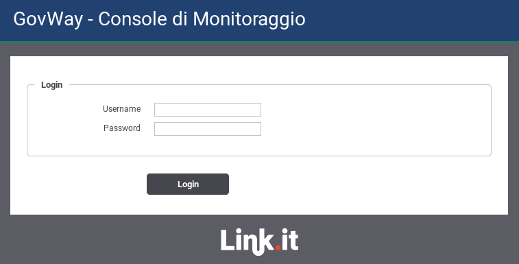

.. _mon_accesso:

====================
Accesso alla Console
====================

L'utente accede alla console govwayMonitor tramite browser all'indirizzo
http://<hostname>/govwayMonitor. All'inizio si viene rediretti alla
pagina di login dove possono essere inserite le proprie credenziali di
accesso (:numref:`mon_login_fig`).

    Maschera di login della Console di Monitoraggio (govwayMonitor)

.. toctree::
        :maxdepth: 2

        profili
	homepage
	testata
