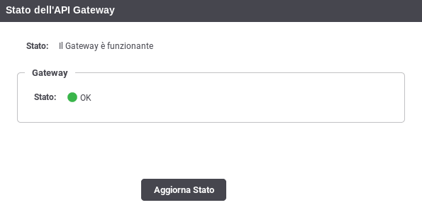
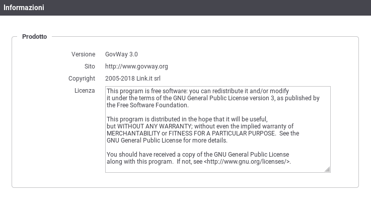

.. _mon_accesso_testata:

La Testata
----------

La testata della console (:numref:`mon_testata_fig`) prevede l'indicazione sul lato sinistro del
nome esteso dell'applicazione; tale testo rappresenta un link che porta
alla homepage ed è inoltre preceduto dall'icona di autodiagnosi che,
assumendo tre colorazioni possibili, raffigura lo stato del gateway:

-  *verde*: rappresenta lo stato di corretto funzionamento.

-  *giallo*: notifica un'anomalia che non sta compromettendo
   completamente il funzionamento del gateway. Questa situazione avviene
   ad esempio in un'installazione in load balancing quando uno dei nodi
   non risulta disponibile.

-  *rosso*: notifica il verificarsi di un problema.

    Testata del GovWay Monitor

Cliccando sull'icona si raggiunge la pagina di riepilogo (:numref:`mon_stato_fig`) che
descrive lo stato complessivo di GovWay.

    Stato di funzionamento complessivo di GovWay

Sul lato destro sono presenti le voci descritte di seguito e
rappresentate nella :numref:`mon_testata_fig`:

-  Soggetto

   Nome del soggetto interno, rispetto al quale sono visualizzati di
   dati di monitoraggio e statistica.

-  Profilo

   Menu a discesa che consente di selezionare il profilo di
   interoperabilità tra quelli disponibili per l'utente in sessione.
   Selezionare un profilo ha l'effetto di filtrare le informazioni
   presentate dall'interfaccia in base allo specifico protocollo
   corrispondente. Ad esempio:

   -  API Gateway

   -  SPCoop

   -  eDelivery

   -  Fatturazione Elettronica

   Selezionando il profilo "Tutti" non verrà effettuato alcun filtro
   preimpostato nelle diverse sezioni in consultazione, ma sarà
   necessario indicare il profilo richiesto in ogni singolo contesto.

    Informazioni sul prodotto

-  Icona Utente

   Menu a discesa per l'accesso alle seguenti funzionalità:

   -  Informazioni

      informazioni di dettaglio sulla versione del software installata (:numref:`mon_info_fig`).

   -  Profilo Utente

      Informazioni sul profilo dell'utente in sessione con la
      possibilità di effettuare la modifica della password (:numref:`mon_profiloUtente_fig`).

   -  Logout

      Permette di effettuare il logout, disconnettendo così l'utente
      attuale.

.. figure:: ../_figure_monitoraggio/ProfiloUtente.png
    :scale: 100%
    :align: center
    :name: mon_profiloUtente_fig

    Profilo Utente
