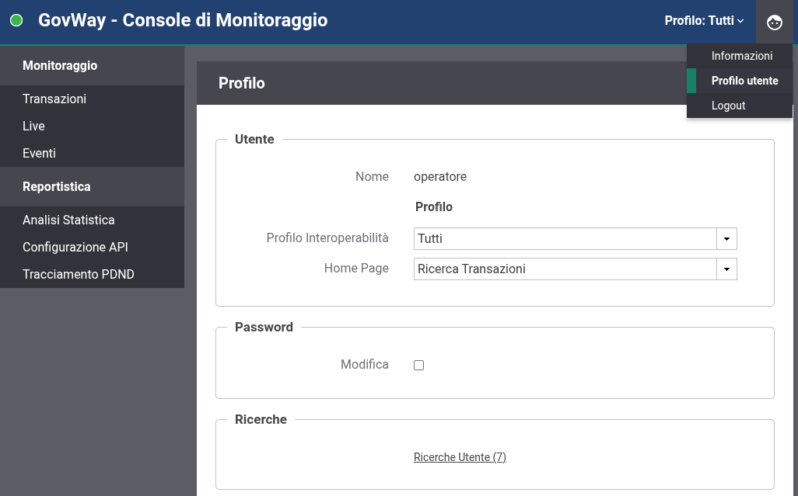

.. _mon_accesso_profilo:

Profilo Utente
----------------

Durante l'utilizzo della Console di Monitoraggio è preferibile configurare il profilo dell'utenza più opportuno all'utilizzo che se ne intende fare rispetto ai parametri descritti di seguito.

    Profilo Utente della Console di Monitoraggio

- Profilo Interoperabilità: consente di impostare un profilo di interoperabilità di default associato all'utente. Per una descrizione dei profili si rimanda alla console di gestione nella sezione ':ref:`console_profiliInteroperabilita`';

- Soggetto Operativo: voce presente solamente se è stato selezionato un profilo di interoperabilità, consente di associare un soggetto operativo di default all'utente;

- Home Page: definisce la homepage visualizzata a login effettuato, consentendo di scegliere tra la pagina di ricerca delle transazioni o un report statistico;

- Intervallo Temporale: voce presente solo se è stato selezionato un report statistico per l'homepage della console di monitoraggio, consentendone di indicare l'intervallo temporale.

.. note::
    Il profilo di interoperabilità e il soggetto operativo sono modificabili anche una volta effettuato il login sulla console, agendo nelle voci presenti nel menù in alto a destra. Le modifiche attuate in questa modalità non sono persistenti e al successivo login verranno nuovamente presentate le scelte impostate come default nel profilo utente.

È infine possibile modificare la password associata all'utente.
