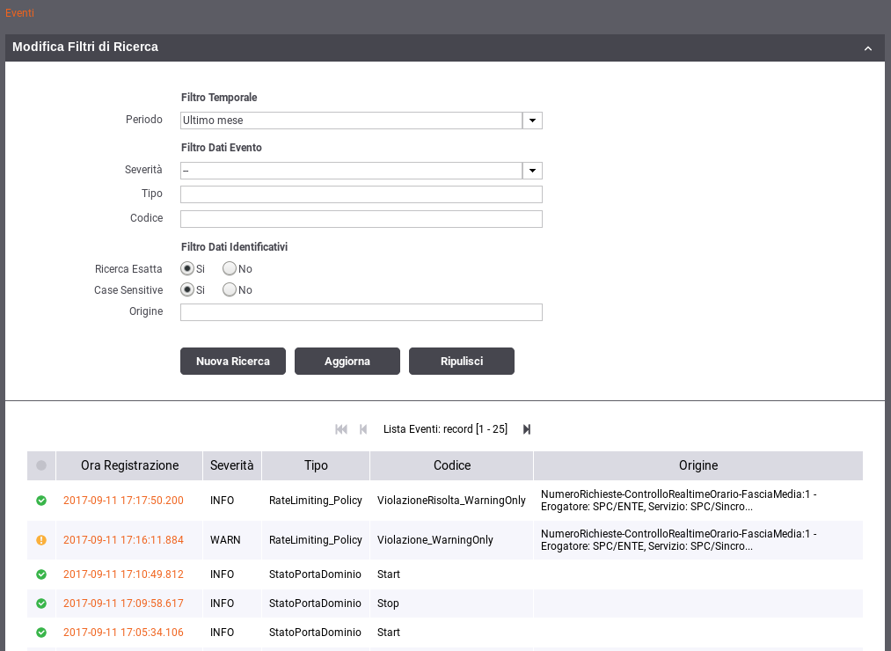

.. _mon_eventi:

======
Eventi
======

GovWay rileva e segnala gli eventi occorsi, i quali vengono classificati
e resi disponibili per la consultazione.

La consultazione degli eventi è possibile attraverso la console
govwayMonitor accedendo alla voce di menu "Eventi" presente nella
sezione Monitoraggio.

La pagina di consultazione mostra la lista degli eventi registrati
seguendo un ordine temporale decrescente (:numref:`mon_eventi_fig`) e le colonne mostrano i
campi di maggiore importanza.

Dall'elenco è possibile selezionare il singolo elemento per
visualizzarne il dettaglio. Ciascun evento è composto dai seguenti dati:

-  Ora Registrazione

   Timestamp relativo all'evento.

-  Severità

   Livello di severità dell'evento. Può assumere i valori: FATAL, ERROR,
   INFO, WARN, DEBUG.

-  Tipo

   Etichetta che rappresenta la tipologia di appartenenza dell'evento.
   Ad esempio, quando si effettua il riavvio di GovWay verrà generato un
   evento di tipo "StatoGateway".

-  Codice

   Il codice che identifica univocamente l'evento.

-  Origine

   Riporta, quando applicabile, l'identificativo di un elemento della
   configurazione del servizio, responsabile dell'evento sollevato.

-  Descrizione

   Un campo di testo opzionale che fornisce una descrizione dell'evento.

-  Cluster ID

   Un campo utilizzato nel caso di installazioni in cluster per
   identificare il nodo in cui si è verificato l'evento.

    Consultazione Eventi

Sopra l'elenco degli eventi è possibile espandere una maschera per
impostare alcuni criteri per filtrare gli eventi da visualizzare:

-  **Filtro Temporale**

   -  **Periodo**: Intervallo temporale in cui si sono verificati gli
      eventi da cercare.

-  Filtro Dati Evento

   -  **Severità**: Livello di severità.

   -  **Tipo**: Il tipo di evento (per maggiori dettagli vedi tabella
      sottostante).

   -  **Codice**: Il codice associato all'evento (per maggiori dettagli
      vedi tabella sottostante).

-  **Filtro Dati Identificativi**: elementi per filtrare gli eventi in
   base agli identificativi.

   -  **Ricerca Esatta**: specifica se il confronto con l'identificativo
      avviene per pattern oppure in maniera esatta.

   -  **Case Sensitive**: specifica se il valore fornito viene
      confrontato considerando maiuscole e minuscole o meno.

   -  **Origine**: pattern o valore esatto dell'identificativo di
      configurazione.

   -  **ID Cluster**: pattern o valore esatto dell'identificativo del
      nodo cluster.

Un evento può essere correlato ad una o più transazioni applicative (ad
esempio poiché l'evento è stato scatenato dall'esecuzione di una
transazione). Consultando il dettaglio di una transazione sarà possibile
visualizzare gli eventi ad essa correlati.

La seguente tabella descrive gli eventi previsti.

.. table:: Eventi
   :widths: 25 25 50
   :name: mon_eventi_tab

   ======================================================= =====================================   =====================================
    Tipo Evento                                             Codice Evento                           Descrizione                                                                                                                                                                                                                  
   ======================================================= =====================================   =====================================
    StatoGateway                                            Valori Possibili:
                                                            - Start
                                                            - Stop
                                                                                                    Questo evento segnala l'avvio e il fermo di GovWay o del singolo nodo in caso di installazione in cluster.                                                                                                                   
    ControlloTraffico\_ NumeroMassimo RichiesteSimultanee   Valori Possibili:
                                                            - Violazione
                                                            - ViolazioneRisolta
                                                            - Violazione\_WarningOnly
                                                            - ViolazioneRisolta\_WarningOnly
                                                                                                    Questo evento segnala il raggiungimento della soglia massima di richieste simultanee  [1]_. Il secondo codice segnala l'evento di risoluzione.
    ControlloTraffico\_ SogliaCongestione                   Valori Possibili:
                                                            - Violazione
                                                            - ViolazioneRisolta
                                                                                                                                                                                Questo evento segnala il raggiungimento della soglia di congestionamento\ :sup:`` (percentuale sul numero massimo di richieste simultanee). Il secondo codice segnala l'evento di risoluzione.
    RateLimiting\_Policy                                    Valori Possibili:
                                                            - Violazione
                                                            - ViolazioneRisolta
                                                            - Violazione\_WarningOnly
                                                            - ViolazioneRisolta\_WarningOnly
                                                                                                    Questo evento segnala la violazione di una policy di rate limiting\ :sup:`` e la successiva risoluzione. Nel caso sia stata configurata, per la policy, la modalità "WarningOnly" l'evento conterrà i due codici appositi.
   ======================================================= =====================================   =====================================

.. [1]
   Le soglie sul numero massimo di richieste simultanee, sul
   congestionamento del gateway e le relative policy di controllo, sono
   concetti legati alla funzionalità di Controllo del Traffico, i cui
   aspetti di configurazione sono trattati nel Manuale Utente della
   govwayConsole.
