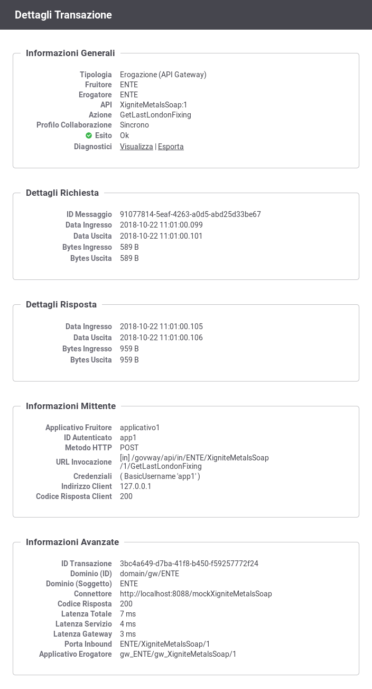
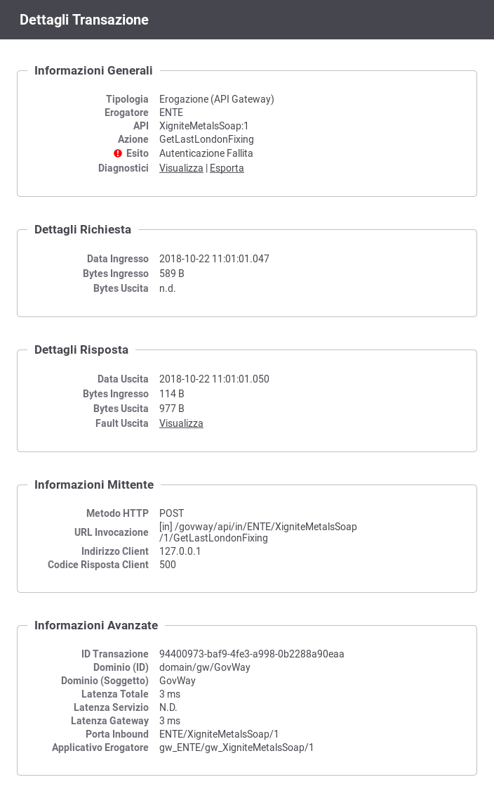
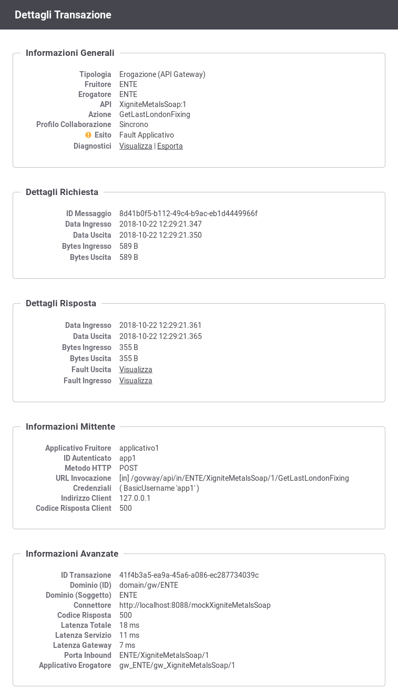
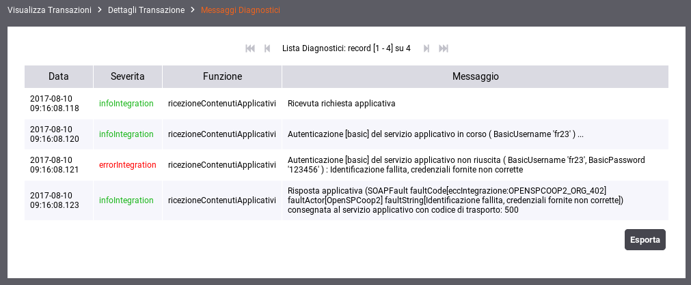
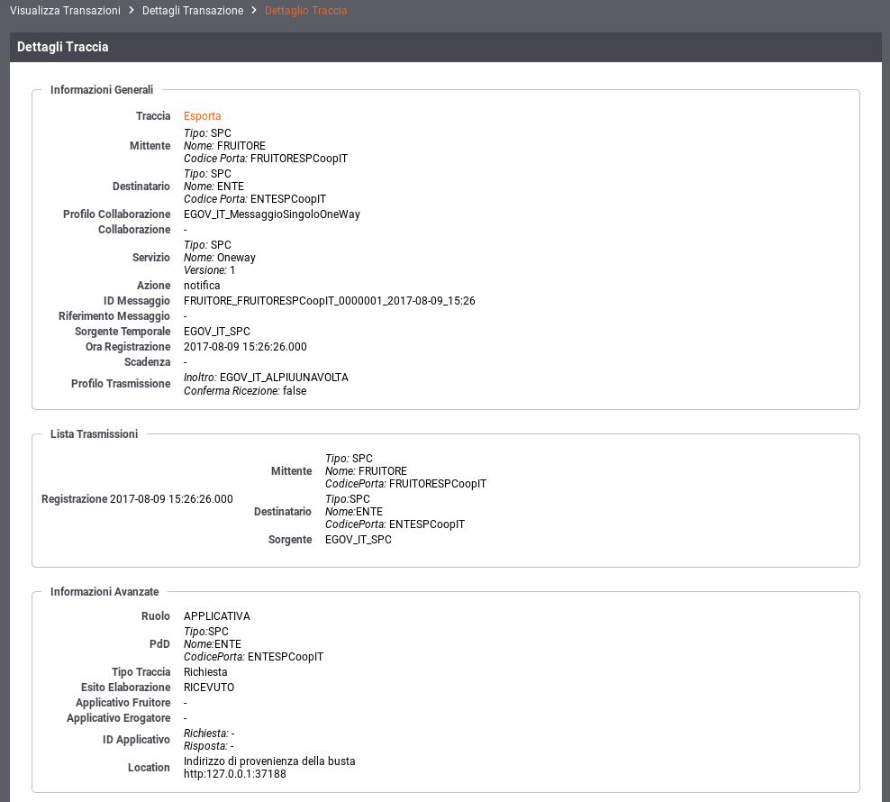
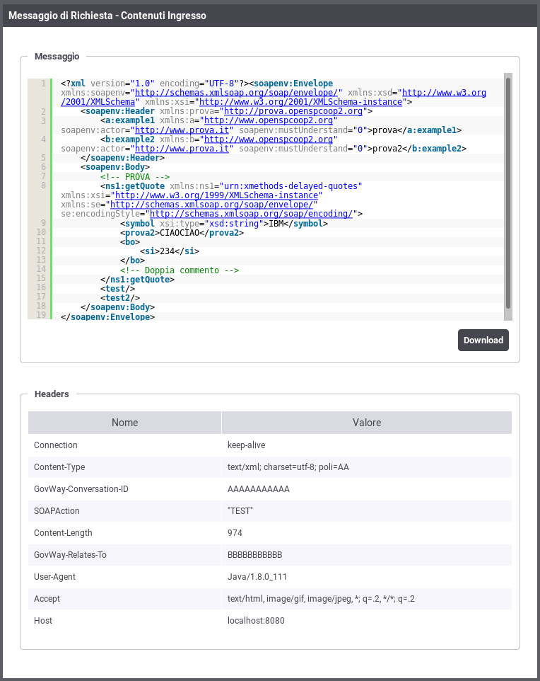
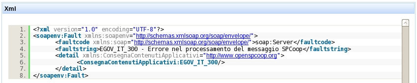

.. _mon_dettaglio_transazione:

Dettaglio Transazione
~~~~~~~~~~~~~~~~~~~~~

Dal risutalto di una ricerca transazioni, sia in modalità "live" (:ref:`mon_live`) che
in modalità "storico" (:ref:`mon_storico`), cliccando sulla data di ingresso di una
specifica transazione si ottiene la pagina con le informazioni di
dettaglio, suddivisa nelle seguenti sezioni:

-  Informazioni Generali

-  Dettagli Richiesta

-  Dettagli Risposta

-  Informazioni Mittente

-  Informazioni Avanzate

Le informazioni presenti nel dettaglio cambiano a seconda dell'esito
della transazione:

-  In :numref:`mon_TransazioneOK_fig` vediamo un esempio di dettaglio di transazione con esito OK.

-  In :numref:`mon_TransazioneErrore_fig` vediamo un esempio di pagina di dettaglio relativa a una
   transazione con esito ERRORE.

-  In :numref:`mon_TransazioneFault_fig` vediamo un esempio di dettaglio relativo ad una transazione con esito "Fault Applicativo".

    Dettaglio di una transazione con esito OK

    Dettaglio di una transazione con esito Errore

    Dettaglio di una transazione con esito Fault Applicativo

La sezione ***Informazioni Generali*** mostra le proprietà generali
della transazione ed in particolare i riferimenti al servizio invocato e
l'esito. Nello stesso riquadro si trova il link per la visualizzazione
dei messaggi diagnosti o per effettuare un'esportazione degli stessi
(:numref:`mon_Diagnostici_fig`).

    Dettaglio dei messaggi diagnostici relativi ad una transazione

Nella sezione ***Dettagli Richiesta*** sono visualizzati i dati generali
della richiesta, quali id del messaggio, dimensioni in KB e timestamp
del messaggio in ingresso e uscita. Nel medesimo riquadro è possibile
selezionare Visualizza Traccia per accedere alla pagina di consultazione
della traccia relativa alla richiesta (:numref:`mon_Traccia_fig`).

Quando prevista la registrazione dei messaggi in configurazione, si
troveranno in questo riquadro i collegamenti per visualizzare:

-  Contenuti Ingresso/Uscita: i contenuti di entrata ed uscita sul
   gateway. Sia in entrata che uscita comprendono (in base al tipo di
   configurazione attiva):

   -  Il messaggio veicolato

   -  Gli eventuali attachment inclusi nel messaggio

   -  Gli header di trasporto relativi alla richiesta

-  Dati Raw Ingresso/Uscita: la versione raw dei contenuti transitati in
   ingresso/uscita sul gateway

Per tutte queste voci sono presenti i link Esporta che consentono di
salvare tali informazioni sul proprio filesystem.

    Dettaglio della traccia

    Visualizzazione contenuti in ingresso per una richiesta

Nei casi di esito "Fault Applicativo", cioè se il servizio erogatore ha
restituito un messaggio di fault, è possibile visualizzarne il contenuto
tramite il link Visualizza Fault (:numref:`mon_Fault_fig`).

    Dettaglio di un errore applicativo (fault)

Le medesime funzionalità appena illustrate per la richiesta sono
disponibili per la risposta nel riquadro **Dettagli Risposta**.

La sezione ***Informazioni Mittente*** riporta dati specifici correlati
all'interazione tra GovWay e il mittente:

-  Metodo HTTP: il metodo http relativo alla richiesta inviata dal
   mittente

-  URL Invocazione: la url di invocazione utilizzata dal mittente per
   contattare il gateway

-  Indirizzo Client: l'indirizzo di provenienza della richiesta
   pervenuta

-  Codice Risposta Client: codice http restituito al mittente

-  Applicativo Fruitore: identificativo dell'applicativo mittente

-  Credenziali: Le credenziali utilizzate dall'applicativo per
   l'autenticazione

-  X-Forwared-For: presente solamente se viene rilevato tra gli header
   http della richiesta un header tra i seguenti: 'X-Forwared-For' ,
   'Forwared-For', 'Forwarded', 'X-Client-IP', 'Client-IP'

-  Token Info: riporta il dettaglio delle informazioni estratte dal
   token ottenuto in fase di autenticazione della richiesta del mittente

Nel riquadro ***Informazioni Avanzate*** sono visualizzati i seguenti
dati (:numref:`mon_Avanzate_fig`):

-  ID Transazione

-  Dominio (ID e Soggetto): dominio del soggetto che ha gestito la
   transazione

-  PortaApplicativa o PortaDelegata: indica il nome della porta invocata
   dal client

-  URL Inoltro: specifica l'endpoint utilizzato per l'inoltro verso il
   dominio esterno (nel caso di fruizione)

-  Codice Risposta: il codice HTTP inviato con il messaggio di risposta

-  Latenza Totale, Servizio e Gateway: indica i tempi di elaborazione
   del messaggi

.. figure:: ../_figure_monitoraggio/Avanzate.png
    :scale: 100%
    :align: center
    :name: mon_Avanzate_fig

    Informazioni Avanzate di una Transazione
