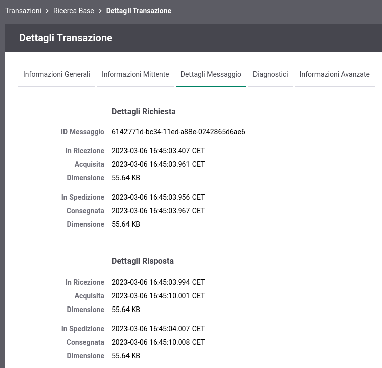

.. _mon_dettaglio_transazione:

Dettaglio Transazione
----------------------

Dal risutalto di una ricerca transazioni, sia in modalità "live" (:ref:`mon_live`) che
in modalità "storico" (:ref:`mon_transazioni`), cliccando su un qualunque elemento in elenco, si accede
alla pagina di dettaglio, organizzata quest'ultima in quattro distinte sezioni accessibili su altrettanti tab:

-  Informazioni Generali

-  Informazioni Mittente

-  Dettagli Messaggio

-  Diagnostici

-  Informazioni Avanzate

La sezione **Informazioni Generali** (:numref:`mon_DettaglioTransazioneInfo_fig`) mostra:

- le *Informazioni Generali*, contenente i dati principali relativi alla richiesta comprensivi di identificativo della transazione ed esito:

    -  Data: data della richiesta

    -  ID Transazione: identificativo univoco associato alla richiesta dal Gateway
 
    -  ID Cluster: identificativo del nodo che ha gestito la richiesta

    -  Tipologia: indica se l'API invocata riguarda una erogazione o fruizione, e riporta il profilo di utilizzo

    -  Esito: indica se la richiesta è stata gestite con successo dal Gateway; maggiori dettagli sui possibili esiti vengono forniti nella sezione :ref:`mon_esito_transazione`
    
    -  Dettaglio Errore: in caso di anomalie viene riportato l'errore principale che ha causato il fallimento della gestione (per maggiori informazioni vedere la sezione :ref:`mon_dettaglioErrore`)

    -  Fruitore: soggetto mittente della richiesta; rappresenta il dominio di appartenenza del client che ha generato la richiesta verso il gateway

    -  Richiedente: indica l'identità del client che ha effettuato la richiesta (per maggiori informazioni vedere la sezione :ref:`mon_richiedente`)

    -  IP Richiedente: indirizzo IP del client che ha effettuato la richiesta (per maggiori informazioni vedere la sezione :ref:`mon_richiedente`)

    -  Profilo di Collaborazione: per api SOAP viene indicato il profilo di gestione (oneway o sincrono)

    -  ID Conversazione e/o Riferimento ID Richiesta: informazioni opzionali presenti solamente se attivati nella API

    -  ID Applicativo Richiesta e/o Risposta: contiene l'identificativo di correlazione applicativa estratto dal Gateway, se configurato nella API

    -  Latenza Totale: rappresenta l'intervallo temporale trascorso dalla ricezione della richiesta alla consegna della risposta al client

- la sezione *Invocazione API* riporta i dati relativi all'API invocata:

    -  Tags: se associati all'API vengono riportati i tags

    -  Erogatore: soggetto erogatore; rappresenta il dominio che eroga l'API

    -  API: identificativo dell'API invocata

    -  Azione o Risorsa: rappresenta l'identificativo dell'operazione invocata

    -  Connettore: specifica l'endpoint utilizzato per l'inoltro verso il backend applicativo (nel caso di erogazione) o verso il dominio esterno (nel caso di fruizione)

    -  Codice Risposta: il codice HTTP ricevuto dal connettore invocato

    -  Tempo Risposta: intervallo temporale trascorso dall'invocazione dell'endpoint indicato nel connettore, prima di ricevere una risposta

.. figure:: ../_figure_monitoraggio/DettaglioTransazione_Info.png
    :scale: 100%
    :align: center
    :name: mon_DettaglioTransazioneInfo_fig

    Dettaglio Transazione: Informazioni Generali

La sezione **Informazioni Mittente** (:numref:`mon_DettaglioTransazioneMittente_fig`) mostra:

- le *Informazioni Mittente* contengono i dati di riferimento relativi alla provenienza della richiesta

    -  Applicativo Fruitore: identificativo dell'applicativo mittente

    -  ID Autenticato: credenziali presentate nella richiesta ed utilizzate per completare il processo di autenticazione

    -  Metodo HTTP: il metodo http relativo alla richiesta inviata dal mittente

    -  URL Invocazione: la url di invocazione utilizzata dal mittente per contattare il gateway

    -  Client IP: l'indirizzo di provenienza della richiesta pervenuta

    -  X-Forwarded-For: presente solamente se viene rilevato tra gli header http della richiesta un header appartenente alla classe "Forwarded-For" o "Client-IP"

    -  Codice Risposta Client: codice http restituito al mittente

    -  Credenziali: Le credenziali presenti nella richiesta pervenuta al gateway

- la sezione *Token Info* è presente solamente se nella richiesta è presente un token e riporta:

    -  Issuer: rappresenta il dominio che ha emesso il token

    -  ClientId: indica l'identificativo del client che ha richiesto ed ottenuto il token

    -  Subject e/o Username: rappresenta l'utente, all'interno del dominio dell'Issuer, che ha richiesto il token

    -  eMail: indirizzo eMail dell'utente 

    -  Token Info: riporta il dettaglio delle informazioni estratte dal token ottenuto in fase di autenticazione della richiesta del mittente

.. figure:: ../_figure_monitoraggio/DettaglioTransazione_Mittente.png
    :scale: 100%
    :align: center
    :name: mon_DettaglioTransazioneMittente_fig

    Dettaglio Transazione: Informazioni Mittente

La sezione **Dettagli Messaggio** (:numref:`mon_DettaglioTransazioneMessaggio_fig`) mostra:

- i *Dettagli Richiesta*: dati relativi al messaggio di richiesta come i timestamp di ingresso e uscita, le dimensioni del payload.

- i *Dettagli Risposta*: dati relativi al messaggio di risposta come i timestamp di ingresso e uscita e le dimensioni del payload.

    Dettaglio Transazione: Dettagli Messaggio

In questa sezione saranno presenti, quando previste, le tracce applicative dei messaggi di richiesta e risposta (:numref:`mon_Traccia_fig`).

.. figure:: ../_figure_monitoraggio/Traccia.png
    :scale: 100%
    :align: center
    :name: mon_Traccia_fig

    Dettaglio della traccia

Quando prevista la registrazione dei messaggi in configurazione, di richiesta e risposta, si
troveranno in questo riquadro i collegamenti per visualizzare:

-  Contenuti: i contenuti di entrata ed uscita sul
   gateway. Sia in entrata che uscita comprendono (in base al tipo di
   configurazione attiva):

   -  Il messaggio veicolato

   -  Gli header di trasporto relativi alla richiesta

Per tutte queste voci sono presenti i link *Esporta* che consentono di
salvare tali informazioni sul proprio filesystem.

.. figure:: ../_figure_monitoraggio/Contenuti.png
    :scale: 100%
    :align: center
    :name: mon_Contenuti_fig

    Visualizzazione contenuti in ingresso per una richiesta

.. note::

   **Analisi Contenuti Multipart**

   Nel caso in cui il messaggio veicolato possieda una struttura multipart, e la dimensione complessiva dello stream risulti inferiore a 10MB (valore di soglia ridefinibile nella proprietà 'transazioni.dettaglio.analisiMultipart.threshold' all'interno del file monitor_local.properties), verrà fornita la possibilità di analizzare il contenuto multipart e/o di effettuare un download che estrae le singole parti degli allegati.

   .. figure:: ../_figure_monitoraggio/ContenutiMultipart1.png
       :scale: 100%
       :align: center
       :name: mon_ContenutiMultipart_fig1

       Pulsante di visualizzazione dei contenuti Multipart

   .. figure:: ../_figure_monitoraggio/ContenutiMultipart2.png
       :scale: 100%
       :align: center
       :name: mon_ContenutiMultipart_fig2

       Visualizzazione dei contenuti Multipart

   .. figure:: ../_figure_monitoraggio/ContenutiMultipart3.png
       :scale: 100%
       :align: center
       :name: mon_ContenutiMultipart_fig3

       Esportazione contenuti Multipart

Nei casi di esito "Fault Applicativo", cioè se il servizio erogatore ha
restituito un messaggio di fault, è possibile visualizzarne il contenuto
tramite il link Visualizza Fault (:numref:`mon_Fault_fig`).

.. figure:: ../_figure_monitoraggio/Fault.png
    :scale: 100%
    :align: center
    :name: mon_Fault_fig

    Dettaglio di un errore applicativo (fault)

La sezione **Diagnostici** (:numref:`mon_DettaglioTransazioneDiagnostici_fig`) mostra la sequenza
cronologica dei messaggi diagnostici emessi dal gateway, nel corso dell'elaborazione della transazione,
con la possibilità di effettuare un'esportazione degli stessi.

.. figure:: ../_figure_monitoraggio/DettaglioTransazione_Diagnostici.png
    :scale: 100%
    :align: center
    :name: mon_DettaglioTransazioneDiagnostici_fig

    Dettaglio dei messaggi diagnostici relativi ad una transazione

La sezione **Informazioni Avanzate** (:numref:`mon_DettaglioTransazioneAvanzate_fig`) riporta ulteriori dati della transazione
tra cui:

-  Dominio (ID e Soggetto): dominio del soggetto che ha gestito la
   transazione

-  Porta InBound o OutBound: indica il nome della porta del gateway invocata dal client (InBound nel caso di erogazione e OutBound per la fruizione)

-  Applicativo Erogatore: indica il nome dell'applicativo interno del gateway che contiene i dati di smistamento verso il backend

.. figure:: ../_figure_monitoraggio/DettaglioTransazione_Avanzate.png
    :scale: 100%
    :align: center
    :name: mon_DettaglioTransazioneAvanzate_fig

    Informazioni Avanzate di una Transazione

.. toctree::
    :maxdepth: 2

    dettagli_transazione/esitoTransazione
    dettagli_transazione/richiedente
    dettagli_transazione/errore
