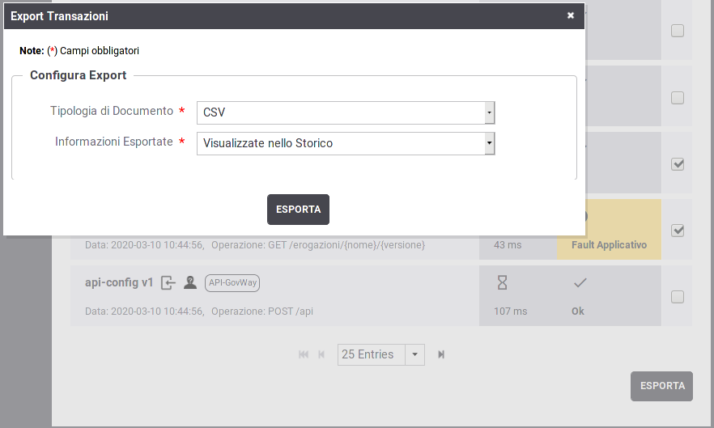
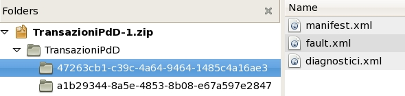

.. _mon_export:

Export Transazioni
~~~~~~~~~~~~~~~~~~~~~

Dopo aver effettuato una ricerca vi è la possibilità di selezionare le
transazioni desiderate ed effettuare un export su file.
Dopo aver selezionato le transazioni tramite il checkbox posto a fine riga
nell'elenco, si utilizza il pulsante "Esporta" per procedere  (:numref:`mon_elencoTransazioniExport_fig`).

    Lista delle transazioni risultanti da una ricerca

Il popup che si apre consente di procedere alla creazione del file di esportazione specificando le seguenti opzioni:

- *Tipologia di Documento*: indica il formato del file di esportazione da produrre. Sono disponibili le seguenti opzioni:

    - *CSV*

    - *XLS*

    - *ZIP*

- *Informazioni Esportate*: indica quali dati devono essere esportati nel file prodotto. Le scelte possibili sono:

    - Nel caso delle tipologie CSV e XLS:

        - *Visualizzate nello Storico*: opzione per includere le informazioni principali di ciascuna transazione, corrispondenti a quelle utilizzate per la visualizzazione in elenco

        - *Tutte*: opzione per includere tutte le informazioni presenti nelle transazioni

        - *Personalizza*: opzione che consente di selezionare puntualmente le proprietà da includere e il relativo ordine di apparizione (:numref:`mon_EsportaCSV_fig`)

    - Nel caso della tipologia ZIP, viene data la possibilità di selezionare cosa includere nell'archivio prodotto, a scelta tra:

        - *Tracce*: dati di tracciamento relativi alla richiesta ed alla risposta

        - *Diagnostici*: messaggi diagnostici emessi dal gateway nelle fasi di elaborazione

        - *Contenuti*: payload scambiati compresi eventuali allegati

.. figure:: ../_figure_monitoraggio/EsportaCSV.png
    :scale: 100%
    :align: center
    :name: mon_EsportaCSV_fig

    Export CSV personalizzato

Il formato di esportazione ZIP produce un archivio compresso zip contenente una
directory per ciascuna transazione esportata (:numref:`mon_esportaTransazioni_fig`). 
A loro volta le directory possono contenere una combinazione dei seguenti files, in base al tipo
dei dati esportati:

-  *manifest.xml*

   Sempre presente, contiene i dati descrittivi della transazione
   (mittente, destinatario, ora di registrazione, id-messaggio, ecc.);

-  *tracce.xml*

   In caso di esportazione delle tracce questo file contiene le tracce
   della richiesta e della risposta nel formato previsto dalla specifica
   del protocollo (es. SPCoop);

-  *diagnostici.xml*

   In caso di esportazione dei diagnostici questo file contiene i
   messaggi diagnostici associati alla transazione nel formato previsto
   dalla specifica del protocollo (es. SPCoop);

-  *fault.xml*

   In caso di esportazione dei contenuti questo file contiene il
   messaggio di soapFault restituito nei casi di errore.

-  *contenuti*

   Vengono inseriti in questa directory i contenuti registrati dal Gateway che possono interessare i seguenti messaggi:

   -  *dati_richiesta_ingresso*
   -  *dati_richiesta_uscita*
   -  *dati_risposta_ingresso*
   -  *dati_risposta_uscita*
   
   Per ogni tipo di messaggio sono presenti le seguenti informazioni:

   -  *manifest.txt*: informazioni principali sul messaggio (Content-Type, Content-Length ...)
   -  *headers.txt*: header HTTP associati alla richiesta in ingresso
   -  *message.bin*: payload della richiesta (l'estensione del file varierà in funzione del Content-Type)

-  *consegne*

   In caso di consegne con connettori multipli saranno presenti una directory per ogni connettore contenente:

   -  *manifest-xml*: contiene i dati descrittivi del connettore
   -  *diagnostici.xml*: diagnostica relativa alla consegna verso il connettore
   -  *contenuti*: vengono inseriti in questa directory gli eventuali contenuti registrati dal Gateway che possono interessare le seguenti comunicazioni:

      -  *dati_richiesta_uscita*
      -  *dati_risposta_ingresso*
   
      Per ogni tipo di messaggio sono presenti le medesime informazioni descritte in precedenza per i contenuti (*manifest.txt*, *headers.txt* e *message.bin*).

    Struttura dello ZIP di esportazione delle transazioni

