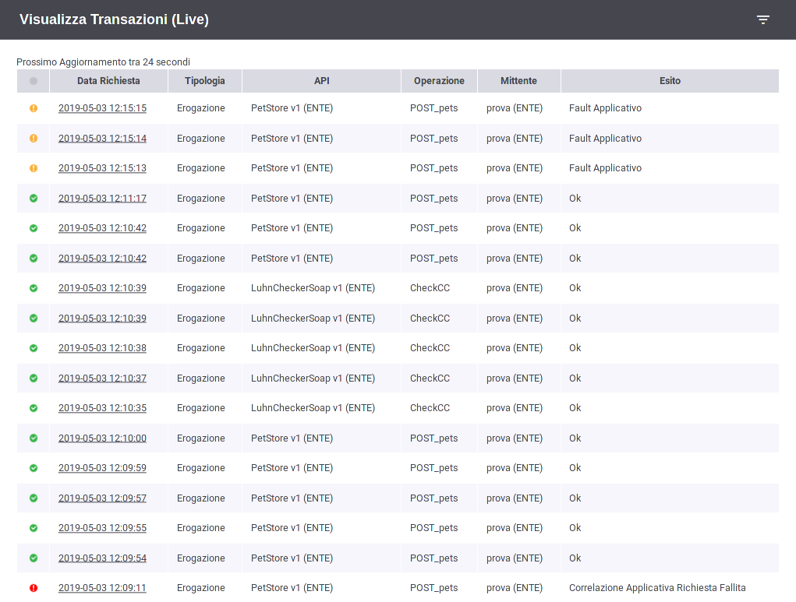
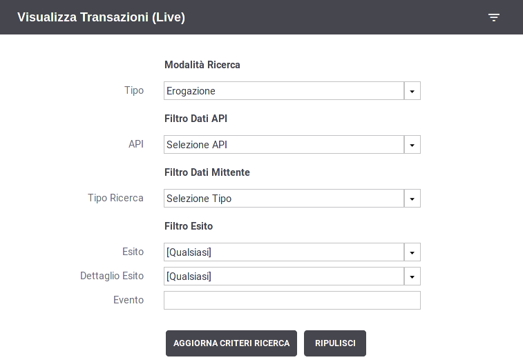

.. _mon_live:

Ricerca delle Transazioni in modalità "Live"
--------------------------------------------

La pagina di monitoraggio in modalità "live" presenta le ultime 25
transazioni che sono state gestite. La lista delle transazioni mostrata
si aggiorna automaticamente (:numref:`mon_live_fig`).

    Visualizzazione live transazioni

È possibile impostare un filtro di ricerca per mostrare nel riquadro
live solo le transazioni con determinate caratteristiche (:numref:`mon_filtroLive_fig`).

    Criteri di filtro per la Visualizzazione live

Vediamo in dettaglio le opzioni di selezione per la modalità live:

-  Modalità Ricerca

   -  **Profilo Interoperabilità**: elemento presente solo quando il profilo
      di interoperabilità selezionato nella testata della console è
      "Tutti". In questo caso è richiesto che l'utente indichi il
      profilo su cui filtrare le transazioni.

   -  **Soggetto Locale**: opzione, disponibile se attiva la modalità
      multi-tenant, che consente di filtrare rispetto al soggetto del
      dominio interno che partecipa nella transazione. L'elemento è visibile se in testata il soggetto selezionato è "Tutti".

   -  **Tipo**: Indica se le transazioni da visualizzare riguardano
      "erogazioni", "fruizioni".

-  Filtro Dati API

   -  **Soggetto Erogatore**: in modalità Fruizione consente di filtrare rispetto al soggetto erogatore selezionandolo dall'elenco.

   -  **API**: permette di filtrare su una specifica API.

   -  **Azione/Risorsa**: permette di selezionare una tra le
      azioni/risorse della API precedentemente selezionata.

-  Filtro Dati Mittente

   -  **Tipo Ricerca**: consente di filtrare i dati sulla base di quattro criteri
      alternativi:

        - **Soggetto**: modalità che consente di filtrare in base all'identità del soggetto mittente. Una volta selezionata l'opzione sarà possibile selezionare il soggetto da una lista a discesa.

      -  **Applicativo**: modalità che consente di filtrare rispetto all'applicativo mittente da cui proviene la richiesta. L'applicativo viene selezionato dalla lista dove vengono visualizzati tutti quelli appartenenti al soggetto mittente indicato.

      -  **Identificativo Autenticato**: filtro rispetto all'identità
         del mittente ricavata dal processo di autenticazione livello
         trasporto. Una volta scelto il tipo di autenticazione
         (http-basic, https, principal) si fornisce la stringa da
         confrontare con l'identità del mittente. È possibile indicare
         inoltre:

         -  *Case Sensitive*: indica se il confronto deve considerare le
            maiuscole/minuscole

         -  *Ricerca Esatta*: indica se l'operatore di confronto è
            l'uguaglianza tra stringhe oppure se si tratta di
            un'operazione di pattern matching.

      -  **Token Info**: filtro rispetto ad un dato presente nel token
         ottenuto nel processo di autenticazione. Si deve indicare quale
         "claim" del token deve essere utilizzato per il confronto. È
         possibile indicare inoltre:

         -  *Case Sensitive*: indica se il confronto deve considerare le
            maiuscole/minuscole;

         -  *Ricerca Esatta*: indica se l'operatore di confronto è
            l'uguaglianza tra stringhe oppure se si tratta di
            un'operazione di pattern matching.

-  Filtro Esito
   -  **Esito**: permette di selezionare una categoria di esiti a cui le transazioni appartengono, a scelta tra:

      -  *Completate con successo*: sono tutte le transazioni per cui
         non si hanno avuto errori che hanno comportato un fallimento
         dell'elaborazione della richiesta. In questa casistica
         rientrano anche transazioni per cui durante la gestione è stato
         sollevato un diagnostico di livello error dovuto a funzionalità
         impostate al livello 'warning-only' (es. validazione dei
         contenuti)

      -  *Fallite*: sono tutte le transazioni per cui si hanno avuto
         errori che hanno comportato un fallimento dell'elaborazione
         della richiesta.

      -  *Fault Applicativo*: identifica le transazioni per cui
         l'applicativo erogatore ha generato un SOAPFault come risposta,
         per le API Soap, oppure ha restituito un errore applicativo, in
         accordo al protocollo REST, nel formato standard RFC 7807
         "Problem Details for HTTP APIs - IETF Tools".

      -  *Fallite - Fault Applicativo*: sono tutte le transazioni che
         rientrano nei due gruppi descritti in precedenza.

      -  *Personalizzato*: permette di selezionare puntualmente tutti
         gli esiti delle transazioni che si desidera visualizzare. La
         selezione potrà essere effettuata tramite l'elemento 'Dettaglio
         Esito'.

   -  **Dettaglio Esito**: i valori selezionabili cambiano in base alla
      scelta effettuata al punto precedente.

      Nel caso esito = "Completate con successo":

      -  *OK:* le transazioni con esito regolare

      -  *OK (Presenza Anomalie)*: le transazioni con esito regolare dove però
         vi è la presenza di messaggi diagnostici con severità error che
         non ha inciso sul buon fine dell'operazione.

      -  *Risposta HTTP 3XX*: le transazioni che, in assenza di errori,
         hanno riportato una risposta dal dominio esterno con un codice
         HTTP 3XX.

      -  *Violazione Rate Limiting WarningOnly*: Esito delle transazioni
         che hanno violato policy del controllo traffico senza alcuna
         restrizione poiché in modalità WarningOnly.

      -  *Superamento Limite Richieste WarningOnly*: Esito delle
         transazioni che hanno violato la soglia relativa al numero
         massimo di richieste concorrenti prevista dal sistema di
         controllo del traffico. In questo caso non è stata applicata
         alcuna restrizione poiché è attiva la modalità WarningOnly.

      -  *CORS Preflight Gestione Gateway*: Transazioni che
         rappresentano richieste *OPTIONS* generate da un browser
         durante la gestione del *cross-origin HTTP request (CORS)*.
         Questo esito indica che il CORS è stato gestito direttamente da
         GovWay.

      -  *CORS Preflight Gestione Applicativa*: transazioni simili a
         quelle descritti in precedenza dove però il CORS è stato
         gestito dall'applicazione.

      Nel caso esito = "Fallite":

      -  *Risposta HTTP 4XX*: le transazioni che hanno prodotto una
         regolare risposta di errore applicativo dal dominio esterno con
         un codice HTTP 4XX.

      -  *Risposta HTTP 5XX*: le transazioni che hanno prodotto una
         regolare risposta di errore applicativo dal dominio esterno con
         un codice HTTP 5XX.

      -  *Gestione Token Fallita*: le transazioni che hanno riportato un
         fallimento relativo alle politiche di accesso basate
         sull'elaborazione del token.

      -  *Autenticazione Fallita*: transazioni terminate con un
         errore dovuto al fallimento del processo di autenticazione del
         chiamante (es. credenziali fornite errate);

      -  *Autorizzazione Negata*: transazioni terminate con un
         errore dovuto al fallimento del processo di autorizzazione del
         chiamante;

      -  *Errore di Connessione*: transazioni che hanno ottenuto un
         errore legato a problemi di connessione al servizio remoto;

      -  *Errore SPCoop/SDI/eDelivery*: Errore specifico per ciascun profilo di interoperabilità che indica le transazioni che hanno generato
         errori a livello del protocollo (es. SPCoop) specifico della
         comunicazione con il dominio esterno;

      -  *API Sospesa*: Errore dovuto al fatto che l'API invocata risulta sospesa in configurazione;

      -  *Trasformazione Richiesta Fallita*: La trasformazione da applicare al messaggio di richiesta ha prodotto un errore;

      -  *Trasformazione Risposta Fallita*: La trasformazione da applicare al messaggio di risposta ha prodotto un errore;

      -  *Violazione Rate Limiting*: Esito delle transazioni che hanno
         violato policy del controllo traffico con applicazione di
         restrizioni sull'esecuzione.

      -  *Superamento Limite Richieste*: Esito delle transazioni che
         hanno violato la soglia relativa al numero massimo di richieste
         concorrenti prevista dal sistema di controllo del traffico.

      -  *Sicurezza Messaggio Richiesta Fallita*: Esito della
         transazioni i cui controlli di sicurezza a livello del
         messaggio di richiesta hanno riportato un errore.

      -  *Sicurezza Messaggio Risposta Fallita*: Esito della transazioni
         i cui controlli di sicurezza a livello del messaggio di
         risposta hanno riportato un errore.

      -  *Validazione Richiesta Fallita*: Esito della transazioni i cui
         controlli di validazione del messaggio di richiesta hanno
         riportato un errore.

      -  *Validazione Risposta Fallita*: Esito della transazioni i cui
         controlli di validazione del messaggio di risposta hanno
         riportato un errore.

      -  *Gestione Allegati Richiesta Fallita*: Esito delle transazioni
         che hanno prodotto un errore durante la fase di elaborazione
         degli allegati alla richiesta (ad esempio durante la gestione
         del protocollo MTOM).

      -  *Gestione Allegati Risposta Fallita*: Esito delle transazioni
         che hanno prodotto un errore durante la fase di elaborazione
         degli allegati alla risposta (ad esempio durante la gestione
         del protocollo MTOM).

      -  *Correlazione Applicativa Richiesta Fallita*: Esito delle
         transazioni in cui l'applicazione della regola di correlazione
         applicativa, prevista sul messaggio di richiesta, ha prodotto
         un fallimento.

      -  *Correlazione Applicativa Risposta Fallita*: Esito delle
         transazioni in cui l'applicazione della regola di correlazione
         applicativa, prevista sul messaggio di risposta, ha prodotto un
         fallimento.

      -  *Fault PdD Esterna:* (Solo per il profilo SPCoop) transazioni
         che hanno ottenuto un fault non applicativo nel quale non è
         presente l'intestazione di protocollo. L'errore potrebbe essere
         stato generato dalla PdD Esterna come anche da un firewall xml;

      -  *Contenuto Richiesta non Riconosciuto:*\ transazioni la cui
         richiesta applicativa pervenuta non è risultata processabile
         (es. xml non valido sintatticamente)

      -  *Contenuto Risposta non Riconosciuto:*\ transazioni la cui
         risposta applicativa ritornata dal servizio remoto non è
         risultata processabile (es. xml non valido sintatticamente)

      -  *Richiesta Client Rifiutata da GovWay:*\ transazioni sulle
         quali il gateway ha rifiutato la richiesta inviata
         dall'applicativo mittente a causa di un errore di invocazione;

      -  *Connessione Client Interrotta:*\ rientrano in questa casistica
         le transazioni per cui il gateway non è riuscito a restituire
         la risposta al chiamante poiché quest'ultimo ha interrotto la
         connessione;

      -  *Errore Generico:* transazioni che hanno riportato un qualunque
         tipo di errore che non rientri nella casistica precedente;

   -  **ID Cluster**: Permette di filtrare le transazioni in base al
      nodo del cluster che le ha gestite.

   -  **Evento**: Seleziona le sole transazioni associate ad un
      determinato evento.
