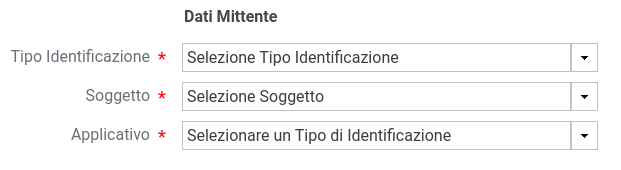

.. _mon_transazioni_mittente:

Ricerca per Mittente
~~~~~~~~~~~~~~~~~~~~

Questo gruppo comprende le modalità di ricerca basate sulle informazioni del mittente, e comprende:

- Token Info
- Soggetto
- Applicativo
- Principal
- Indirizzo IP

La modalità **Token Info** consente di effettuare la ricerca delle transazioni basata sui valori dei claim estratti dal token, 
durante il processo di autenticazione (:numref:`mon_ricercaTokenInfo_fig`). Il form consente di scegliere uno dei claim e specificare il valore per il confronto. Come già visto in precedenza, vi sono le opzioni per utilizzare pattern di ricerca, o valori esatti, case sensitive o insensitive.

.. figure:: ../../_figure_monitoraggio/RicercaTokenInfo.png
    :scale: 100%
    :align: center
    :name: mon_ricercaTokenInfo_fig

    Filtro ricerca "Token Info"

La modalità **Soggetto** consente di effettuare la ricerca di transazioni stabilendo il soggetto interlocutore (:numref:`mon_ricercaSoggetto_fig`).

.. figure:: ../../_figure_monitoraggio/RicercaSoggetto.png
    :scale: 100%
    :align: center
    :name: mon_ricercaSoggetto_fig

    Filtro ricerca "Soggetto"

La modalità **Applicativo** consente di effettuare la ricerca di transazioni stabilendo l'applicativo interlocutore tra quelli appartenenti ad un dato soggetto (:numref:`mon_ricercaApplicativo_fig`).

    Filtro ricerca "Applicativo"

La modalità **Principal** consente di effettuare la ricerca di transazioni stabilendo l'identificativo del mittente ottenuto dal processo di autenticazione (:numref:`mon_ricercaPrincipal_fig`). Il form comprende la possibilità di indicare il tipo di autenticazione effettuata (http, https, ...) oltre all'identificativo da confrontare.

.. figure:: ../../_figure_monitoraggio/RicercaPrincipal.png
    :scale: 100%
    :align: center
    :name: mon_ricercaPrincipal_fig

    Filtro ricerca "Principal"

La modalità **Indirizzo IP** consente di effettuare la ricerca di transazioni filtrando in base all'indirizzo IP di provenienza (:numref:`mon_ricercaIndirizzoIP_fig`).
Gli elementi presenti nel form consentono di decidere se l'IP fornito debba essere confrontato con:

- **Client IP**: indirizzo client di provenienza

- **X-Forwarded-For**: header http utilizzato per il mantenimento dell'IP di origine nel caso di nodi intermedi

- **Qualsiasi**: confronto su entrambe le situazioni precedenti

.. figure:: ../../_figure_monitoraggio/RicercaIndirizzoIP.png
    :scale: 100%
    :align: center
    :name: mon_ricercaIndirizzoIP_fig

    Filtro ricerca "Indirizzo IP"

