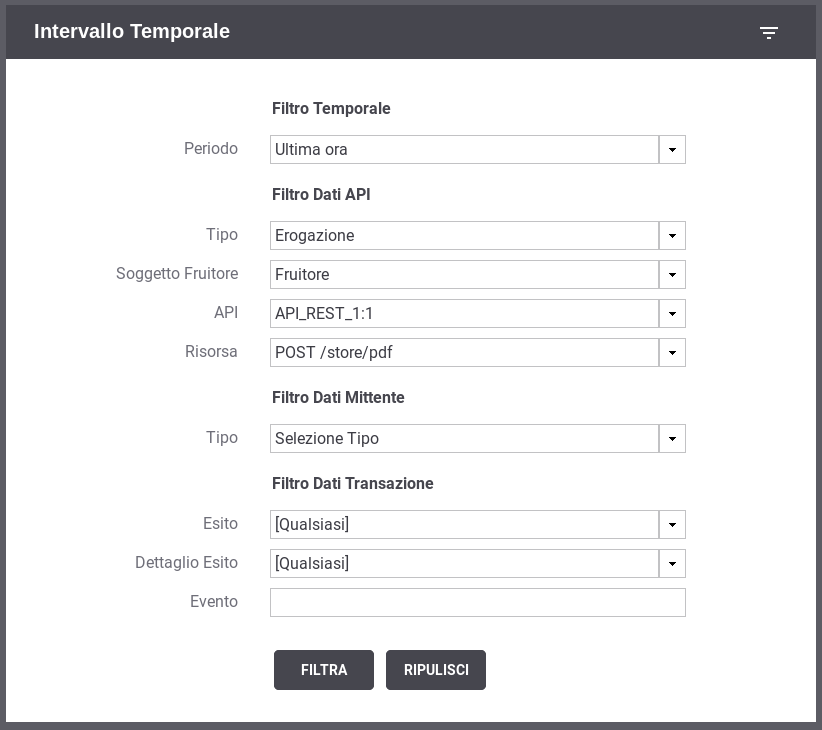
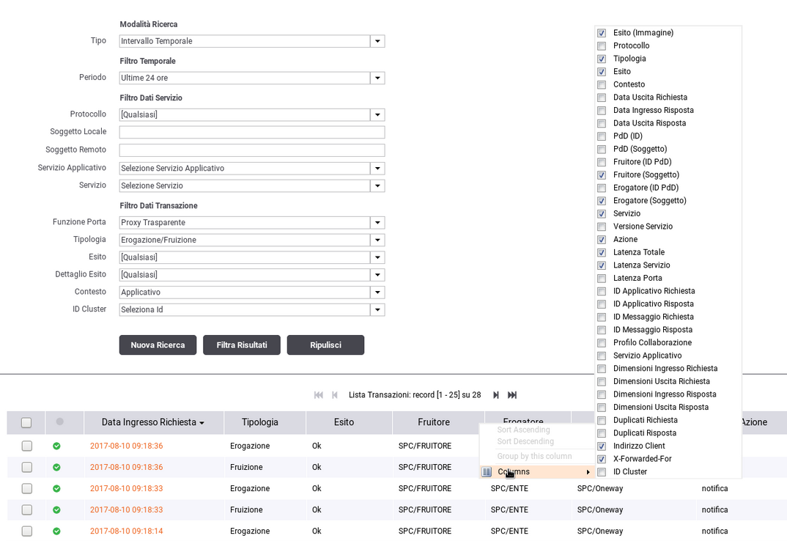
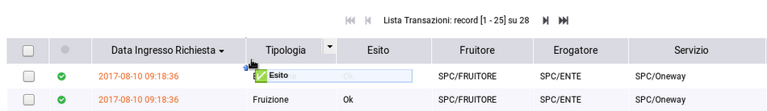
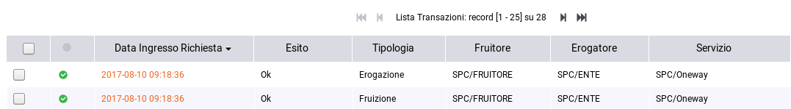

.. _mon_storico:

Ricerca delle Transazioni in modalità "Storico"
-----------------------------------------------

La modalità "storico" fornisce all'utente differenti tipologie di
ricerca. L'utente seleziona il tipo di ricerca che vuole effettuare
tramite la prima maschera che gli si presenta all'ingresso della
relativa sezione (:numref:`mon_indiceStorico_fig`).

.. figure:: ../_figure_monitoraggio/IndiceStorico.png
    :scale: 100%
    :align: center
    :name: mon_indiceStorico_fig

    Maschera di selezione per la ricerca delle transazioni in modalità "storico"

Vediamo nel dettaglio quali sono le funzionalità offerte da ogni
modalità di ricerca:

-  **Intervallo Temporale**. Questa modalità consente di effettuare
   ricerche di transazioni selezionando l'intervallo temporale di
   interesse (:numref:`mon_filtroIntervalloTemporale_fig`). I campi utilizzati per filtrare le transazioni da visualizzare sono i medesimi descritti nella sezione :ref:`mon_live`.

    Filtro di Ricerca delle Transazioni in modalità "Intervallo Temporale"

-  **Identificativo Applicativo.**\ Modalità che consente di effettuare
   ricerche di transazioni contenente uno specifico identificativo
   applicativo estratto dalle comunicazioni in transito tramite la
   funzionalità di Correlazione Applicativa. In questa modalità si deve
   comunque selezionare anche l'intervallo temporale di interesse (:numref:`mon_idApplicativo_fig`). I
   restanti filtri sono i medesimi descritti nella sezione :ref:`mon_live` arricchiti con una
   nuova sezione "Filtro Identificativo Applicativo" che consente di
   filtrare specificando il valore dell'identificativo applicativo:

   -  **Ricerca esatta**: opzione si/no per indicare se il confronto
      sugli identificativi deve essere basato sull'eguaglianza o se si
      utilizza il pattern matching.

   -  **Case Sensitive**: opzione si/no per indicare se il confronto
      deve considerare differenti lettere maiuscole e minuscole.

   -  **ID Applicativo**: testo da confrontare con l'identificativo
      applicativo.

.. figure:: ../_figure_monitoraggio/FiltroIdentificativoApplicativo.png
    :scale: 100%
    :align: center
    :name: mon_idApplicativo_fig

    Filtro di Ricerca delle Transazioni in modalità "Identificativo Applicativo"

-  **Identificativo Messaggio**. Modalità che consente di effettuare
   ricerche sulla base dell'identificativo del messaggio assegnato dal
   gateway. La maschera di ricerca si compone dei seguenti campi (:numref:`mon_idMessaggio_fig`):

   -  **Tipo**: indica se l'identificativo è da ricercare in un
      messaggio di richiesta o risposta.

   -  **ID**: identificativo da cercare.

.. figure:: ../_figure_monitoraggio/FiltroIdentificativoMessaggio.png
    :scale: 100%
    :align: center
    :name: mon_idMessaggio_fig

    Filtro di Ricerca delle Transazioni in modalità "Identificativo Messaggio"

-  **Identificativo Transazione**. Modalità che consente di effettuare
   ricerche tramite l'identificativo di transazione (:numref:`mon_idTransazione_fig`).

.. figure:: ../_figure_monitoraggio/FiltroIdentificativoTransazione.png
    :scale: 100%
    :align: center
    :name: mon_idTransazione_fig

    Filtro di Ricerca delle Transazioni in modalità "Identificativo Transazione"

Una volta impostati i criteri di ricerca desiderati, per procedere con
la ricerca si deve utilizzare il pulsante 'Filtra'. Se si vogliono
riportare i criteri di ricerca ai valori iniziali è possibile utilizzare
il pulsante 'Ripulisci'.

Nelle modalità di ricerca 'Andamento Temporale' e 'Identificativo
Applicativo', effettuata la prima ricerca (tramite il pulsante 'Filtra')
saranno disponibili due nuovi pulsanti:

-  'Nuova Ricerca': utilizzando questo pulsante verrà effettuata una
   nuova ricerca utilizzando i criteri impostati nel filtro di ricerca.

-  'Filtra Risultati': utilizzando questo pulsante la ricerca effettuata
   non conterrà eventuali nuove transazioni occorse dopo la prima
   ricerca.

Le colonne visualizzate nella modalità "storico" sono personalizzabili.
È possibile configurare le colonne che si desiderano visualizzare
accedendo al menù dedicato accessibile sull'header di una qualsiasi
colonna come visualizzato nella :numref:`mon_colonne_fig`.

    Modifica delle colonne visualizzate nello storico

La posizione di una colonna, rispetto alle altre, la si può modificare
trascinandola nella posizione desiderata come visualizzato nelle :numref:`mon_colonnePrima_fig` e :numref:`mon_colonneDopo_fig`.

    Prima:

    Modifica della posizione di una colonna visualizzata nello storico

    Dopo:

    Modifica della posizione di una colonna visualizzata nello storico
