.. _mon_transazioni:

Monitoraggio delle Transazioni
------------------------------

La sezione "Monitoraggio > Transazioni" presenta inizialmente la scelta tra le diverse tipologie di
consultazione che l'utente può utilizzare (:numref:`mon_tipoRicerca_fig`).

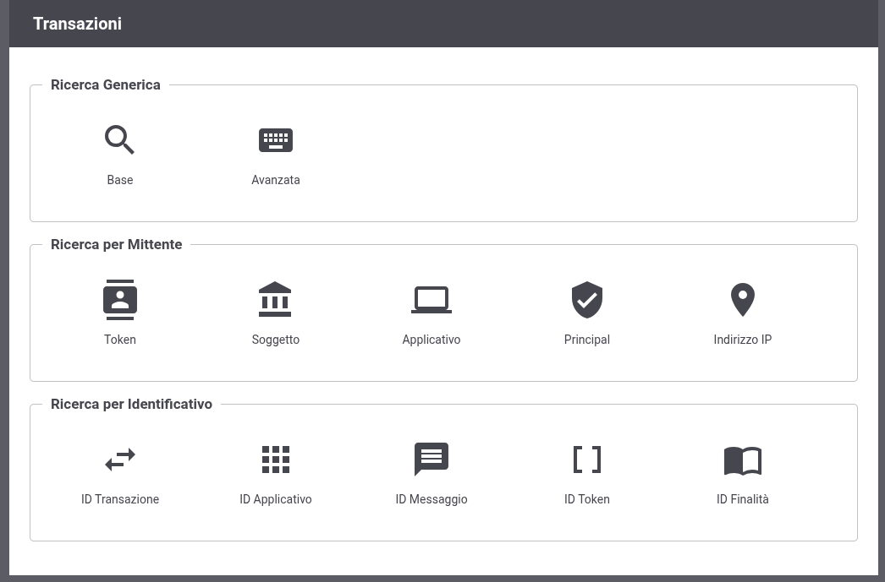

    Selezione modalità di ricerca delle transazioni

Vediamo quali sono le caratteristiche delle modalità di ricerca disponibili.

Ricerca Generica
~~~~~~~~~~~~~~~~
La ricerca generica è il meccanismo base per la consultazione delle transazioni al quale appartengono due diverse modalità:

- Base

- Avanzata

La **Ricerca Base** consente di effettuare in maniera semplice la ricerca delle transazioni, specificando l'API, l'intervallo temporale e l'esito (:numref:`mon_RicercaBase_fig`).

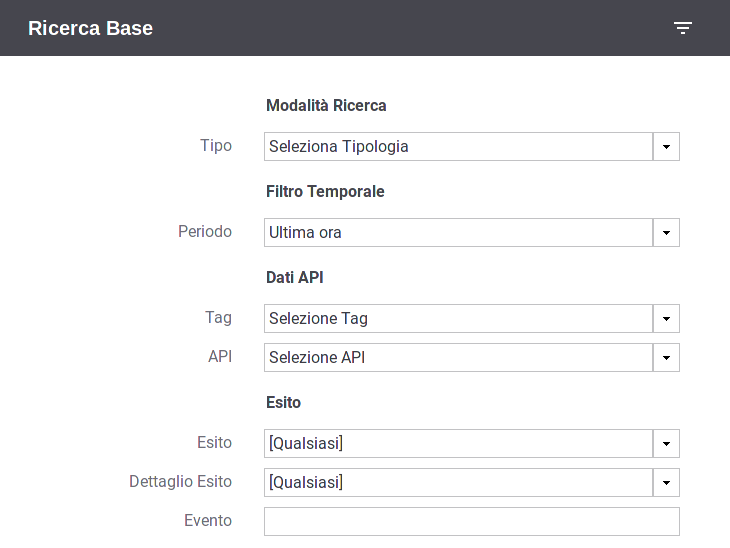

    Filtro per la Ricerca Base

Vediamo in dettaglio quali elementi contiene il form di ricerca:

-  Modalità Ricerca

   -  **Profilo Interoperabilità**: elemento presente solo quando il profilo
      di interoperabilità selezionato nella testata della console è
      "Tutti". In questo caso è richiesto che l'utente indichi il
      profilo su cui filtrare le transazioni.

   -  **Soggetto Locale**: opzione, disponibile se attiva la modalità
      multi-tenant, che consente di filtrare rispetto al soggetto del
      dominio interno che partecipa nella transazione. L'elemento è visibile se in testata il soggetto selezionato è "Tutti".

   -  **Tipo**: Indica se le transazioni da visualizzare riguardano
      "erogazioni", "fruizioni".

-  Filtro Temporale

   -  **Periodo**: elemento per indicare l'intervallo temporale in cui ricadono le transazioni da cercare. Sono disponibili le seguenti opzioni:

        - *ultima ora*
        - *ultime 24 ore*
        - *ultima settimana*
        - *ultimo mese*
        - *personalizzato*

    Selezionando l'opzione *personalizzato* verranno aggiunti i due elementi *Data Inizio* e *Data Fine* per poter fornire un intervallo temporale di propria preferenza.

-  Dati API

   -  **Soggetto Erogatore**: in modalità Fruizione consente di filtrare rispetto al soggetto erogatore selezionandolo dall'elenco.

   -  **Tag**: per filtrare rispetto a uno dei tag di classificazione dell'API.

   -  **API**: permette di filtrare su una specifica API.

   -  **Azione/Risorsa**: permette di selezionare una tra le
      azioni/risorse della API precedentemente selezionata.

-  Esito

   -  **Esito**: permette di selezionare una categoria di esiti a cui le transazioni appartengono, a scelta tra:

      -  *Completate con successo*: sono tutte le transazioni per cui
         non si hanno avuto errori che hanno comportato un fallimento
         dell'elaborazione della richiesta. In questa casistica
         rientrano anche transazioni per cui durante la gestione è stato
         sollevato un diagnostico di livello error dovuto a funzionalità
         impostate al livello 'warning-only' (es. validazione dei
         contenuti)

      -  *Fallite*: sono tutte le transazioni per cui si hanno avuto
         errori che hanno comportato un fallimento dell'elaborazione
         della richiesta.

      -  *Fault Applicativo*: identifica le transazioni per cui
         l'applicativo erogatore ha generato un SOAPFault come risposta,
         per le API Soap, oppure ha restituito un errore applicativo, in
         accordo al protocollo REST, nel formato standard RFC 7807
         "Problem Details for HTTP APIs - IETF Tools".

      -  *Fallite - Fault Applicativo*: sono tutte le transazioni che
         rientrano nei due gruppi descritti in precedenza.

      -  *Errori di Consegna*: identifica le transazioni con esiti che
         individuano un errore generato dal backend applicativo (Fault Applicativi
         e/o codici di ritorno 4xx e 5xx) o un errore di connettività verso il backend.

      -  *Richieste Scartate*: identifica le transazioni le cui richieste non
         sono state accettate dal gateway e che quindi hanno comportato un'interruzione
         dell'elaborazione nella fase iniziale (invocazione malformata, credenziali errate,
         servizio non esistente, ecc.)

      -  *Personalizzato*: permette di selezionare puntualmente tutti
         gli esiti delle transazioni che si desidera visualizzare. La
         selezione potrà essere effettuata tramite l'elemento 'Dettaglio
         Esito'.

   -  **Dettaglio Esito**: i valori selezionabili cambiano in base alla
      scelta effettuata al punto precedente.

      Nel caso esito = "Completate con successo":

      -  *OK:* le transazioni con esito regolare

      -  *OK (Presenza Anomalie)*: le transazioni con esito regolare dove però
         vi è la presenza di messaggi diagnostici con severità error che
         non ha inciso sul buon fine dell'operazione.

      -  *Risposta HTTP 3XX*: le transazioni che, in assenza di errori,
         hanno riportato una risposta dal dominio esterno con un codice
         HTTP 3XX.

      -  *Violazione Rate Limiting WarningOnly*: Esito delle transazioni
         che hanno violato policy del controllo traffico senza alcuna
         restrizione poiché in modalità WarningOnly.

      -  *Superamento Limite Richieste WarningOnly*: Esito delle
         transazioni che hanno violato la soglia relativa al numero
         massimo di richieste concorrenti prevista dal sistema di
         controllo del traffico. In questo caso non è stata applicata
         alcuna restrizione poiché è attiva la modalità WarningOnly.

      -  *CORS Preflight Gestione Gateway*: Transazioni che
         rappresentano richieste *OPTIONS* generate da un browser
         durante la gestione del *cross-origin HTTP request (CORS)*.
         Questo esito indica che il CORS è stato gestito direttamente da
         GovWay.

      -  *CORS Preflight Gestione Applicativa*: transazioni simili a
         quelle descritti in precedenza dove però il CORS è stato
         gestito dall'applicazione.

      Nel caso esito = "Richieste Scartate" o "Fallite" con la checbox "Escludi Scartate" non selezionata:

      -  *Token non Presente:* la richiesta non presenta un token;

      -  *Autenticazione Token Fallita:* nel token ricevuto non sono presenti dei claim configurati come obbligatori per l’accesso alla API;

      -  *Gestione Token Fallita*: le transazioni che hanno riportato un
         fallimento relativo alle politiche di accesso basate
         sull'elaborazione del token.

      -  *Autenticazione Fallita*: transazioni terminate con un
         errore dovuto al fallimento del processo di autenticazione del
         chiamante (es. credenziali fornite errate);

      -  *API non Individuata:* la richiesta non indirizza una API registrata sul Gateway;

      -  *Operazione non Individuata:* la richiesta non indirizza un’operazione prevista sulla API invocata.

      -  *Contenuto Richiesta Malformato:* transazioni la cui
         richiesta applicativa pervenuta non è risultata processabile
         (es. xml non valido sintatticamente)

      -  *Richiesta Malformata:* la richiesta non è processabile per un'errata formulazione dell'invocazione;

      Nel caso esito = "Errori di Consegna" o "Fallite":

      -  *Risposta HTTP 4XX*: le transazioni che hanno prodotto una
         regolare risposta di errore applicativo dal dominio esterno con
         un codice HTTP 4XX.

      -  *Risposta HTTP 5XX*: le transazioni che hanno prodotto una
         regolare risposta di errore applicativo dal dominio esterno con
         un codice HTTP 5XX.

      -  *Errore di Connessione*: transazioni che hanno ottenuto un
         errore legato a problemi di connessione al servizio remoto;

      -  *Fault PdD Esterna:* (Solo per il profilo SPCoop) transazioni
         che hanno ottenuto un fault non applicativo nel quale non è
         presente l'intestazione di protocollo. L'errore potrebbe essere
         stato generato dalla PdD Esterna come anche da un firewall xml;

      Nel caso esito = "Fallite" sono presenti anche i seguenti dettagli di esito:

      -  *Autorizzazione Negata*: transazioni terminate con un
         errore dovuto al fallimento del processo di autorizzazione del
         chiamante;

      -  *Errore ModI PA/SPCoop/SDI/eDelivery*: Errore specifico per ciascun profilo di interoperabilità che indica le transazioni che hanno generato
         errori a livello del protocollo (es. ModI PA) specifico della
         comunicazione con il dominio esterno;

      -  *API Sospesa*: Errore dovuto al fatto che l'API invocata risulta sospesa in configurazione;

      -  *Trasformazione Richiesta Fallita*: La trasformazione da applicare al messaggio di richiesta ha prodotto un errore;

      -  *Trasformazione Risposta Fallita*: La trasformazione da applicare al messaggio di risposta ha prodotto un errore;

      -  *Violazione Rate Limiting*: Esito delle transazioni che hanno
         violato policy del controllo traffico con applicazione di
         restrizioni sull'esecuzione.

      -  *Superamento Limite Richieste*: Esito delle transazioni che
         hanno violato la soglia relativa al numero massimo di richieste
         concorrenti prevista dal sistema di controllo del traffico.

      -  *Sicurezza Messaggio Richiesta Fallita*: Esito della
         transazioni i cui controlli di sicurezza a livello del
         messaggio di richiesta hanno riportato un errore.

      -  *Sicurezza Messaggio Risposta Fallita*: Esito della transazioni
         i cui controlli di sicurezza a livello del messaggio di
         risposta hanno riportato un errore.

      -  *Validazione Richiesta Fallita*: Esito della transazioni i cui
         controlli di validazione del messaggio di richiesta hanno
         riportato un errore.

      -  *Validazione Risposta Fallita*: Esito della transazioni i cui
         controlli di validazione del messaggio di risposta hanno
         riportato un errore.

      -  *Gestione Allegati Richiesta Fallita*: Esito delle transazioni
         che hanno prodotto un errore durante la fase di elaborazione
         degli allegati alla richiesta (ad esempio durante la gestione
         del protocollo MTOM).

      -  *Gestione Allegati Risposta Fallita*: Esito delle transazioni
         che hanno prodotto un errore durante la fase di elaborazione
         degli allegati alla risposta (ad esempio durante la gestione
         del protocollo MTOM).

      -  *Correlazione Applicativa Richiesta Fallita*: Esito delle
         transazioni in cui l'applicazione della regola di correlazione
         applicativa, prevista sul messaggio di richiesta, ha prodotto
         un fallimento.

      -  *Correlazione Applicativa Risposta Fallita*: Esito delle
         transazioni in cui l'applicazione della regola di correlazione
         applicativa, prevista sul messaggio di risposta, ha prodotto un
         fallimento.

      -  *Richiesta già elaborata*: la richiesta risulta essere già stata elaborata. 

      -  *Risposta già elaborata*: la risposta risulta essere già stata elaborata. 

      -  *Contenuto Risposta Malformato*: transazioni la cui
         risposta applicativa ritornata dal servizio remoto non è
         risultata processabile (es. xml non valido sintatticamente)

      -  *Connessione Client Interrotta*: rientrano in questa casistica
         le transazioni per cui il gateway non è riuscito a restituire
         la risposta al chiamante poiché quest'ultimo ha interrotto la
         connessione;

      -  *Errore Generico:* transazioni che hanno riportato un qualunque
         tipo di errore che non rientri nella casistica precedente;

   -  **ID Cluster**: Permette di filtrare le transazioni in base al
      nodo del cluster che le ha gestite.

   -  **Evento**: Seleziona le sole transazioni associate ad un
      determinato evento.

   -  **Escludi Scartate**: Permette di escludere dall'elenco dei risultati le richieste di erogazione o fruizione scartate dal gateway (richieste malformate, api non individuate, operazioni non individuate, errori di autenticazione,…)

Una volta impostati i criteri di ricerca desiderati, per procedere con
la ricerca si deve utilizzare il pulsante **Cerca**. Se si vogliono
riportare i criteri di ricerca ai valori iniziali è possibile utilizzare
il pulsante **Ripulisci**.

Ad eccezione delle ricerche in modalità "Identificativo", dopo aver effettuato una ricerca (tramite il pulsante 'Filtra'),
saranno disponibili due nuovi pulsanti:

-  **Nuova Ricerca**: per effettuare una nuova ricerca utilizzando i parametri presenti nel form.

-  **Filtra Risultati**: per effettuare una ricerca usando come insieme di partenza le transazioni restituite dalla precedente ricerca.

L'elenco delle transazioni risultato di una ricerca comprende una rappresentazione sintetica delle informazioni principali (:numref:`mon_ElencoTransazioni_fig`):

- API, nome e versione

- Tipo Erogazione o Fruizione

- Identità del chiamante

- Tags

- Data Ingresso Richiesta

- Operazione/Risorsa coinvolta

- Tempo di latenza totale

- Esito

Ciascuna delle informazioni visualizzate in elenco, al passaggio del mouse, causa l'apertura di un tooltip che riporta ulteriori informazioni ad integrazione.

In fondo all'elenco, nell'area dedicata alla gestione delle pagine, è possibile selezionare il numero massimo di elementi visualizzati per singola pagina (valore minimo 25).

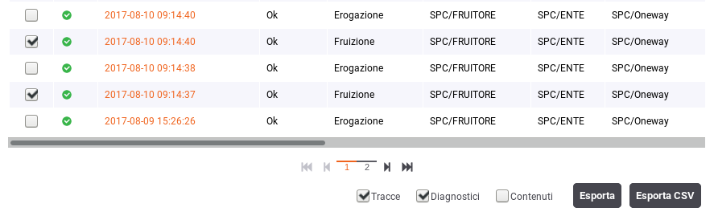

    Elenco delle transazioni esito della ricerca

La **Ricerca Avanzata** è quella che lascia all'utente la massima flessibilità nell'impostazione dei parametri di ricerca (:numref:`mon_RicercaAvanzata_fig`).

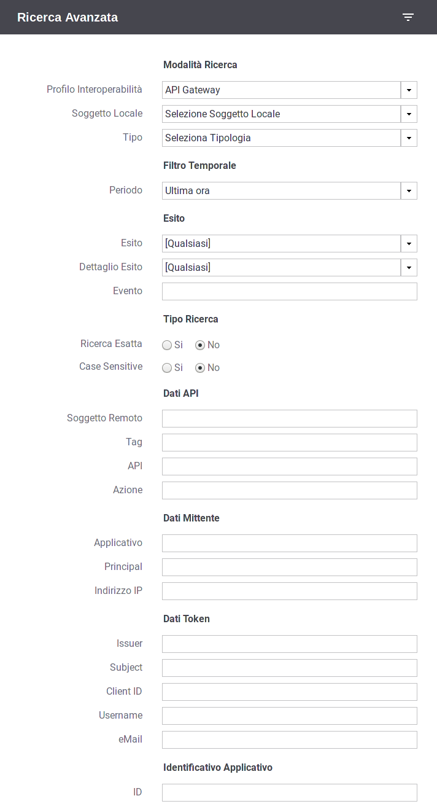

    Filtro per la Ricerca Avanzata

Rispetto alla ricerca base sono previsti i seguenti ulteriori elementi di filtro:

- Tipo Ricerca

   -  **Ricerca esatta**: opzione si/no per indicare se il confronto
      con i valori forniti nei campi di testo deve essere basato sull'eguaglianza o se si
      utilizza il pattern matching.

   -  **Case Sensitive**: opzione si/no per indicare se il confronto
      con i valori forniti nei campi di testo deve considerare differenti lettere maiuscole e minuscole.

- Dati Mittente

    - **Applicativo**: elemento per filtrare rispetto all'applicativo mittente da cui proviene la richiesta.

    - **Principal**: elemento per filtrare rispetto all'identità del mittente ricavata dal processo di autenticazione livello trasporto.

    - **Indirizzo IP**: elemento per filtrare rispetto all'indirizzo IP di provenienza della richiesta associata alla transazione.

- Dati Token

    - Elemento che consente di filtrare le transazioni rispetto al valore di uno tra cinque claim presenti nel token ottenuto dal processo di autenticazione. I claim previsti sono:

        - **Issuer**
        - **Subject**
        - **Client ID**
        - **Username**
        - **eMail**

- Identificativo Applicativo

    - **ID**: Modalità che consente di effettuare ricerche di transazioni contenenti uno specifico identificativo applicativo estratto dalle comunicazioni in transito tramite la funzionalità di Correlazione Applicativa.

Ricerca per Mittente
~~~~~~~~~~~~~~~~~~~~

Questo gruppo comprende le modalità di ricerca basate sulle informazioni del mittente, e comprende:

- Token Info
- Soggetto
- Applicativo
- Principal
- Indirizzo IP

La modalità **Token Info** consente di effettuare la ricerca delle transazioni basata sui valori dei claim estratti dal token, 
durante il processo di autenticazione (:numref:`mon_ricercaTokenInfo_fig`). Il form consente di scegliere uno dei claim e specificare il valore per il confronto. Come già visto in precedenza, vi sono le opzioni per utilizzare pattern di ricerca, o valori esatti, case sensitive o insensitive.

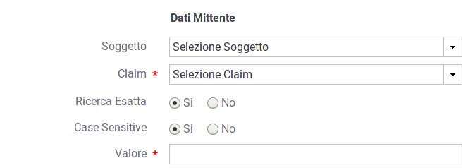

    Filtro ricerca "Token Info"

La modalità **Soggetto** consente di effettuare la ricerca di transazioni stabilendo il soggetto interlocutore (:numref:`mon_ricercaSoggetto_fig`).

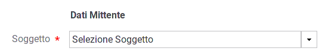

    Filtro ricerca "Soggetto"

La modalità **Applicativo** consente di effettuare la ricerca di transazioni stabilendo l'applicativo interlocutore tra quelli appartenenti ad un dato soggetto (:numref:`mon_ricercaApplicativo_fig`).

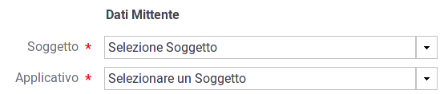

    Filtro ricerca "Applicativo"

La modalità **Principal** consente di effettuare la ricerca di transazioni stabilendo l'identificativo del mittente ottenuto dal processo di autenticazione (:numref:`mon_ricercaPrincipal_fig`). Il form comprende la possibilità di indicare il tipo di autenticazione effettuata (http, https, ...) oltre all'identificativo da confrontare.

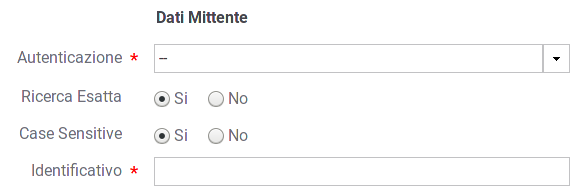

    Filtro ricerca "Principal"

La modalità **Indirizzo IP** consente di effettuare la ricerca di transazioni filtrando in base all'indirizzo IP di provenienza (:numref:`mon_ricercaIndirizzoIP_fig`).
Gli elementi presenti nel form consentono di decidere se l'IP fornito debba essere confrontato con:

- **Client IP**: indirizzo client di provenienza

- **X-Forwarded-For**: header http utilizzato per il mantenimento dell'IP di origine nel caso di nodi intermedi

- **Qualsiasi**: confronto su entrambe le situazioni precedenti

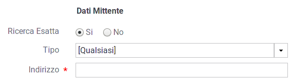

    Filtro ricerca "Indirizzo IP"

Ricerca per Identificativo
~~~~~~~~~~~~~~~~~~~~~~~~~~

Questo gruppo comprende le modalità di ricerca basate sull'identificativo della comunicazione, e comprende:

- ID Applicativo
- ID Messaggio
- ID Transazione

La modalità **ID Applicativo** consente di effettuare ricerche di transazioni contenenti uno specifico identificativo applicativo estratto dalle comunicazioni in transito tramite la funzionalità di Correlazione Applicativa (:numref:`mon_idApplicativo_fig`).

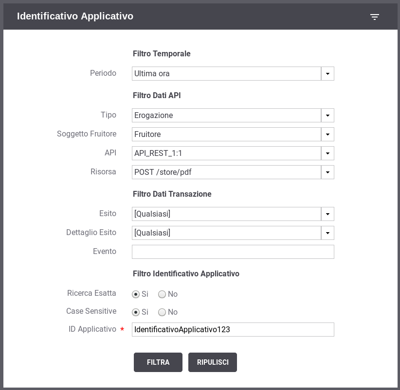

    Filtro di ricerca delle transazioni per ID Applicativo

La modalità **ID Messaggio** che consente di effettuare ricerche sulla base dell'identificativo del messaggio assegnato dal
   gateway. La maschera di ricerca si compone dei seguenti campi (:numref:`mon_idMessaggio_fig`):

   -  **Tipo**: indica il tipo di identificativo da ricercare:
	   - *Richiesta*: identifica un messaggio di richiesta
	   - *Risposta*: identifica un messaggio di risposta
	   - *Collaborazione*: è possibile effettuare una ricerca per invidivuare tutte le transazioni che sono correlate attraverso il medesimo identificativo di collaborazione.
	   - *Riferimento Richiesta*: consente di invidivuare una transazione che è correlata ad una precedente richiesta.

   -  **ID**: identificativo da cercare.

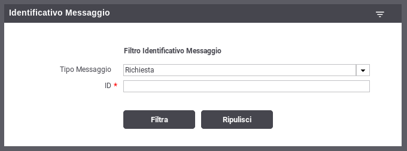

    Filtro di ricerca delle transazioni per ID Messaggio

-  La modalità **ID Transazione** consente di effettuare ricerche tramite l'identificativo della transazione (:numref:`mon_idTransazione_fig`).

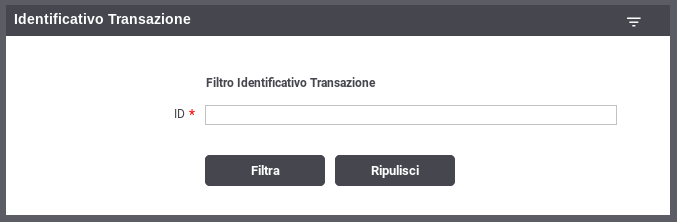

    Filtro di ricerca delle transazioni per ID Transazione
