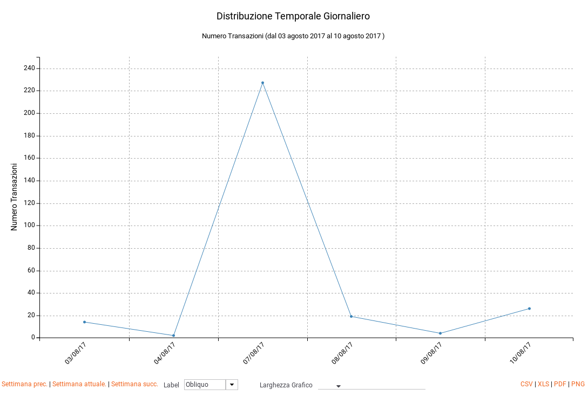
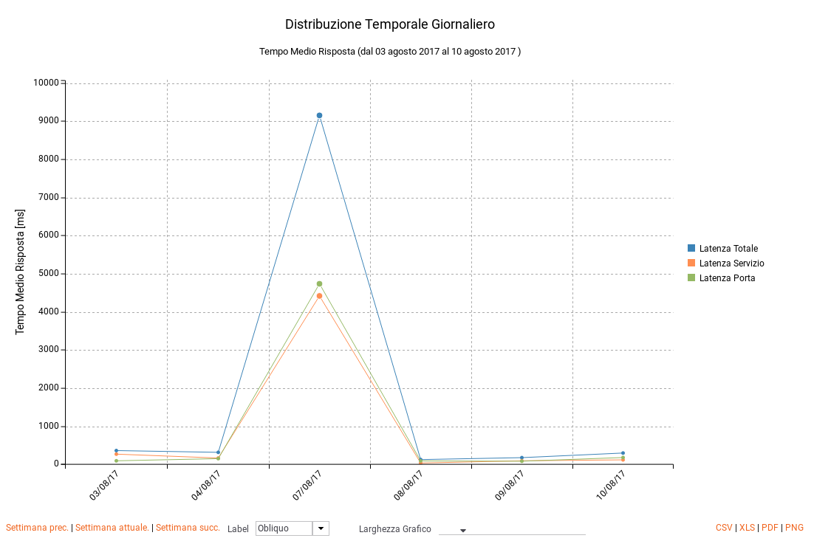
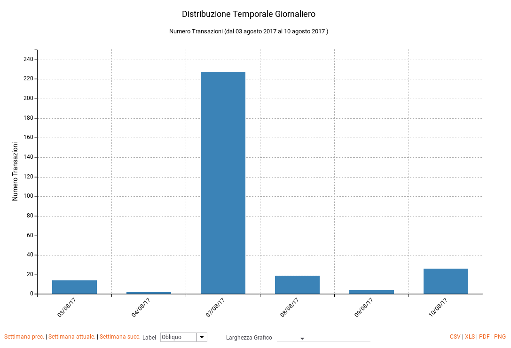
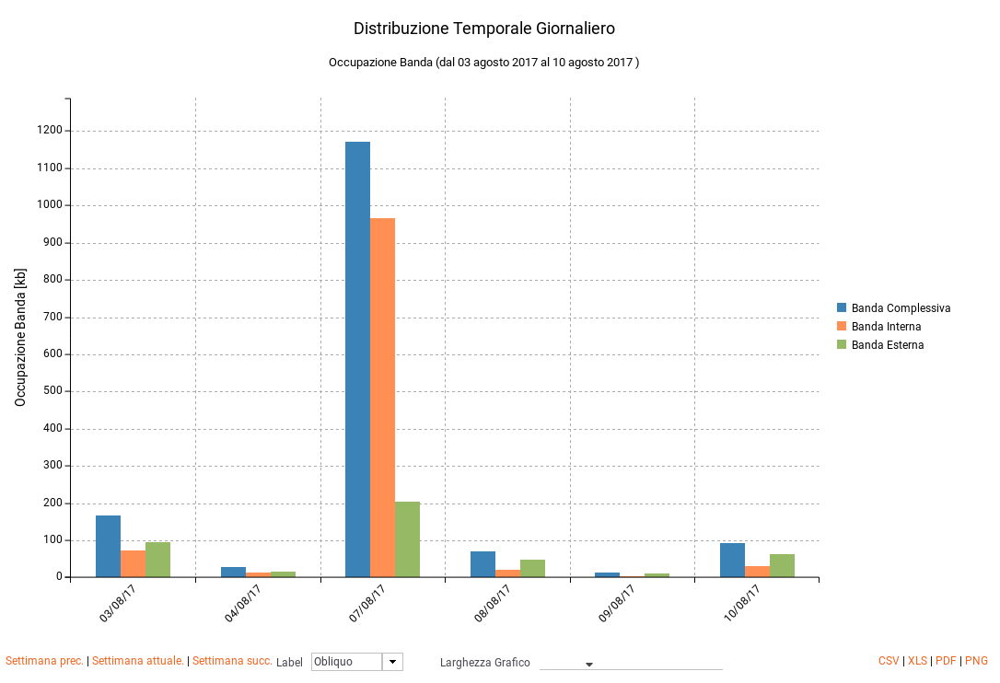
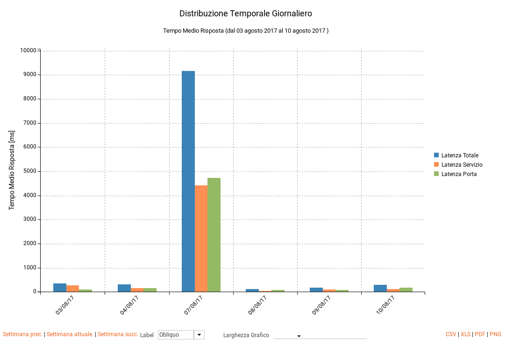
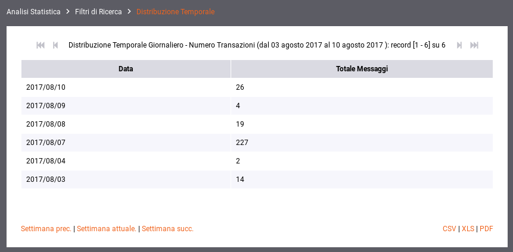

.. _mon_stats_andamentoTemporale:

Andamento Temporale
~~~~~~~~~~~~~~~~~~~

Fornisce statistiche riguardo l'andamento temporale delle transazioni
che sono transitate sul gateway. Di seguito alcuni esempi di reports
generabili.

**Grafico 'Line Chart' sul numero di transazioni:**

    Esempio di report grafico di andamento temporale (Line Chart sul numero di transazioni)

**Grafico 'Line Chart' sull'occupazione di banda:**

.. figure:: ../../_figure_monitoraggio/AndamentoTemporaleBanda.png
    :scale: 100%
    :align: center
    :name: mon_andamentoTemporaleBanda_fig

    Esempio di report grafico di andamento temporale (Line Chart sull’occupazione di banda)

Grafico 'Line Chart' sul tempo medio di risposta:

    Esempio di report grafico di andamento temporale (Line Chart sul tempo medio di risposta)

Grafico 'Bar Chart' sul numero di transazioni:

    Esempio di report grafico di andamento temporale (Bar Chart sul numero di transazioni)

Grafico 'Bar Chart' sull'occupazione di banda:

    Esempio di report grafico di andamento temporale (Bar Chart sull’occupazione di banda)

Grafico 'Bar Chart' sul tempo medio di risposta:

    Esempio di report grafico di andamento temporale (Bar Chart sul tempo medio di risposta)

Tabella:

    Esempio di report tabellare di andamento temporale
