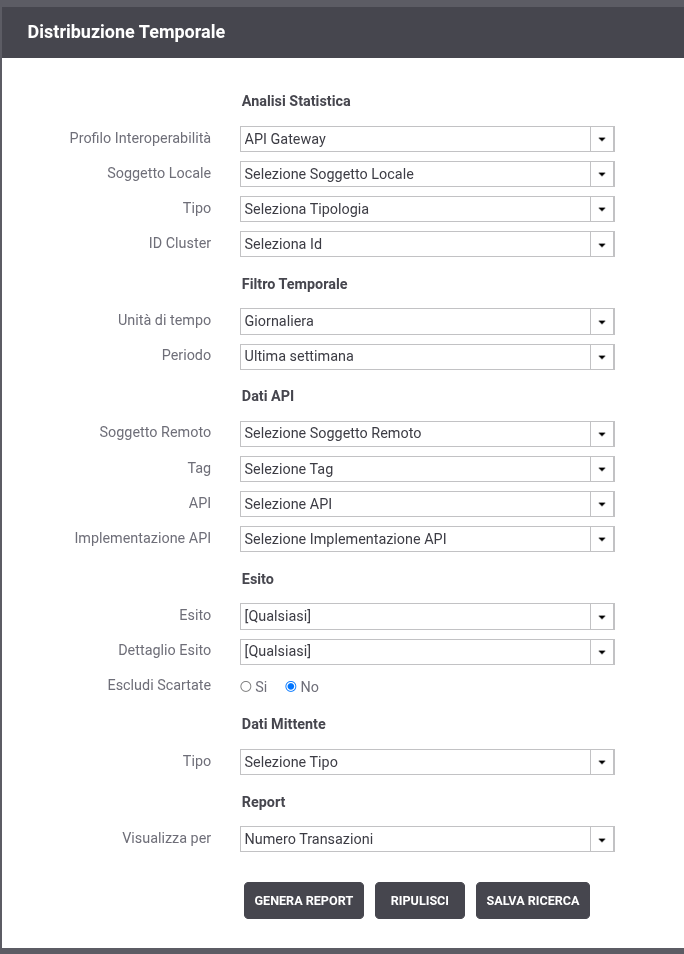

.. _mon_stats_filtri:

Criteri di Filtro
~~~~~~~~~~~~~~~~~~~

Per ogni report è possibile specificare dei criteri di filtro, per
limitare i dati da presentare (:numref:`mon_filtroStatistiche_fig`). I criteri di filtro selezionabili
variano in funzione del tipo di report selezionato.

    Maschera di selezione per la generazione dei report statistici

I dati da indicare per generare un report sono:

-  Profilo Interoperabilità: visibile solo quando il profilo di
   interoperabilità, sulla testata dell'applicazione, è stato impostato
   a "Tutti". Il campo permette di selezionare il profilo con cui
   effettuare la ricerca delle transazioni. Questa scelta è
   obbligatoria.

-  Filtro Temporale

   -  **Unità di Tempo:**\ consente di scegliere su quale unità
      temporale basare il dato numerico relativo alle transazioni
      (oraria, giornaliera, settimanale, mensile)

   -  **Periodo:**\ consente di indicare un intervallo temporale di
      interesse

-  Filtro Dati API

   -  **Tipologia:**\ indica il "ruolo" che svolge il "Soggetto in
      Gestione". Ad esempio selezionando "Erogazione" verranno
      visualizzate solo le transazioni in cui il "Soggetto in Gestione"
      è l'erogatore.

   -  **Soggetto Locale**: nel caso in cui l'utente abbia in gestione
      più soggetti sarà possibile inserire un filtro su di essi.

   -  **Soggetto Remoto**: rappresenta il soggetto interlocutore del
      soggetto in gestione. Questo si traduce nel fatto che sarà il
      mittente se stiamo cercando transazioni con tipologia
      "Erogazione", destinatario nell'altro caso.

   -  **API**: permette di filtrare su una specifica API, individuata
      tramite il pattern 'API\_nome:API\_versione (Soggetto)'.

   -  **Azione/Risorsa**: permette di selezionare una tra le
      azioni/risorse della API selezionata.

-  Filtro Dati Mittente: permette di filtrare le transazioni da
   includere nel report sulla base dei dati legati alla richiesta
   inviata dal mittente.

   -  **Tipo**: consente di scegliere su quale dato applicare il filtro
      tra:

      -  Applicativo: si seleziona l'applicativo mittente delle
         transazioni

      -  Identificativo Autenticato: si seleziona il metodo di
         autenticazione e si specifica il criterio di confronto con
         l'identificativo ricavato dal processo di autenticazione.

      -  Token Info: si seleziona il claim del token e si specifica il
         criterio per il confronto con il token ricavato durante il
         processo di autenticazione.

-  Filtro Dati Transazione

   -  **Esito**: permette di selezionare una categoria di esiti a cui le
      transazioni appartengono. Valgono le medesime considerazioni
      effettuate nella sezione :ref:`mon_live` relativamente allo stesso campo presente tra i
      criteri di ricerca.

   -  **Dettaglio Esito**: i valori selezionabili cambiano in base alla
      scelta effettuata al punto precedente. Valgono le medesime
      considerazioni effettuate nella sezione :ref:`mon_live` relativamente allo stesso campo
      presente tra i criteri di ricerca.

-  Report

   -  **Visualizza Per**: è possibile scegliere se si vuole visualizzare
      le *Dimensioni*, in termini di KB gestiti, il *Numero* delle
      Transazioni o il *Tempo Medio di Risposta*;

Dopo aver selezionato i parametri di interesse si genera il report
utilizzando il pulsante "Genera Report". L'area di visualizzazione del
report, grafico o tabellare, si trova sotto il form di selezione e
presenta alla base i seguenti elementi fissi:

-  Alcuni link che consentono lo spostamento dell'intervallo temporale
   senza dover tornare alla maschera di selezione (ad es. mese
   successivo o precedente, ecc.)

-  I link per l'esportazione dei dati visualizzati nei formati CSV, XLS,
   PDF e PNG.

Sono inoltre presenti alcuni elementi di personalizzazione che dipendono
dal tipo di grafico generato:

-  Nel caso di rappresentazione grafica a torta o istogramma (denominate
   rispettivamente pie chart o bar chart) è consentito impostare il
   numero massimo di elementi visualizzabili (ordinati per cardinalità
   decrescente). Gli elementi rimanenti saranno raggruppati in un unico
   altro elemento riportante l'etichetta "Altri".

-  Nel caso di rappresentazione grafica a linea o istogramma (denominate
   rispettivamente line chart o bar chart) è possibile decidere
   l'orientamento delle etichette dei risultati visualizzati.

-  In tutte le rappresentazioni grafiche è possibile allargare o
   restringere il grafico se la pagina del browser (e la risoluzione) lo
   permette.

Vediamo adesso con maggior dettaglio le singole tipologie di report.
