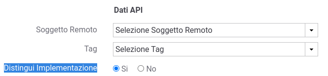
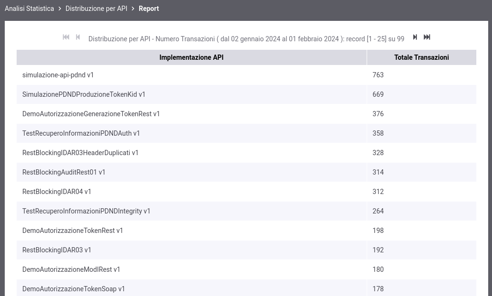
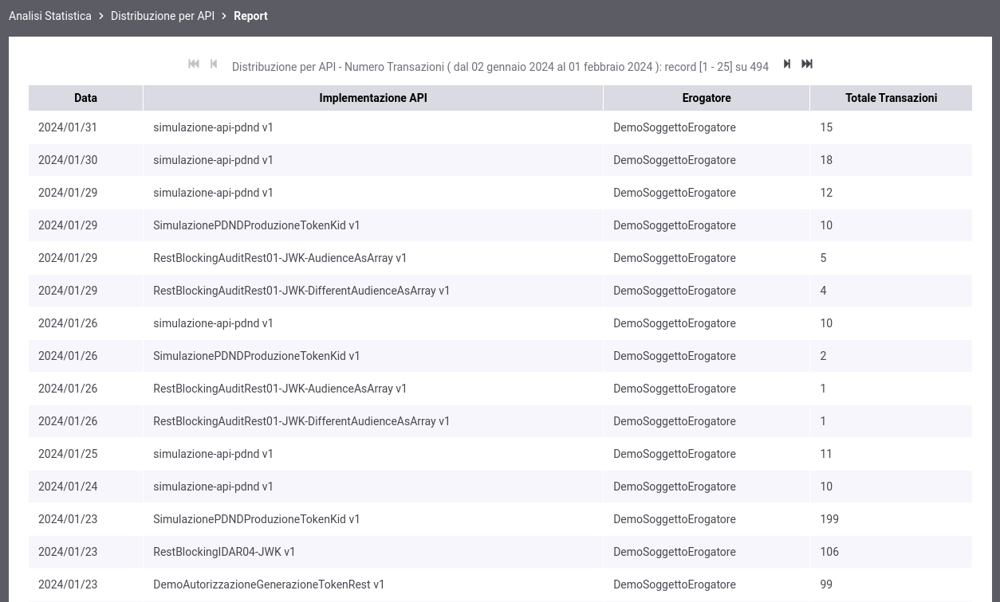
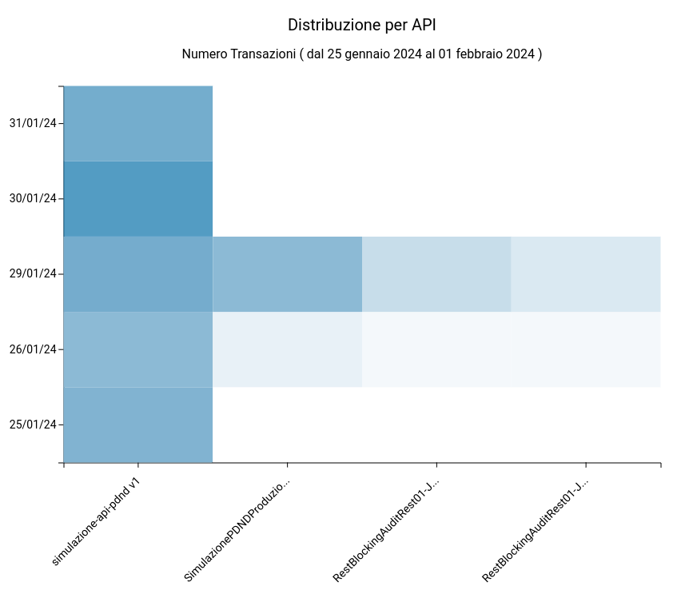
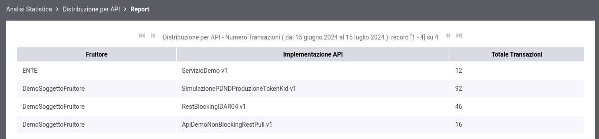
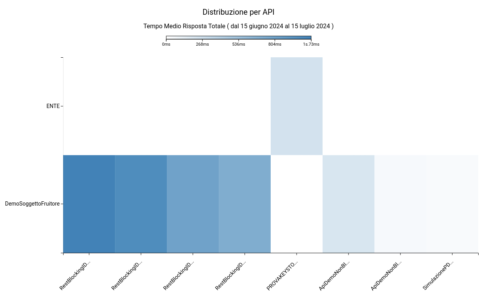

.. _mon_stats_api:

Distribuzione per API
~~~~~~~~~~~~~~~~~~~~~

Fornisce informazioni sulla ripartizione delle richieste Da/Per le API.

Tra i filtri disponibili è presente anche la possibilità di indicare se il report deve distinguere le implementazioni di una API o meno, considerando che una API può essere implementata da tenant differenti. Nel caso venga indicato di distinguere le implementazioni delle API nel report verrà riportato anche il nome del soggetto erogatore (tenant). (:numref:`mon_distribuzioneAPIdistinguiImplementazione_fig`):

    Report di distribuzione per API; opzione per distinguire le implementazioni di una API

Di seguito alcuni esempi di report generabili.

**Tabella (distingue l'implementazione dell'API)**

.. figure:: ../../_figure_monitoraggio/DistribuzioneAPITabella.png
    :scale: 50%
    :align: center
    :name: mon_distribuzioneApiTabella_fig

    Esempio di report tabellare di distribuzione per API con distinzione per implementazione

**Tabella (non distingue l'implementazione dell'API)**

    Esempio di report tabellare di distribuzione per API senza distinzione dell'implementazione

**Grafico 'Pie Chart' sul numero di transazioni**

.. figure:: ../../_figure_monitoraggio/DistribuzioneAPIPie.png
    :scale: 50%
    :align: center
    :name: mon_distribuzioneApiPie_fig

    Esempio di report grafico di distribuzione per API (Pie Chart sul numero di transazioni)

**Grafico 'Bar Chart' sul numero di transazioni**

.. figure:: ../../_figure_monitoraggio/DistribuzioneAPIBar.png
    :scale: 50%
    :align: center
    :name: mon_distribuzioneApiBar_fig

    Esempio di report grafico di distribuzione per API (Bar Chart sul numero di transazioni)

**Tabella 3D**

    Esempio di report tabellare di distribuzione per API comprensivo di date

**Grafico 'Bar Chart 3D' sul tempo medio di risposta**

    Esempio di report grafico di distribuzione per API (Bar Chart 3D sul tempo medio di risposta e sulle date)

**Tabella 3D personalizzata per soggetto fruitore**

    Esempio di report tabellare di distribuzione per API comprensivo di una distribuzione per soggetto fruitore

**Grafico 'Bar Chart 3D' sul tempo medio di risposta personalizzato per soggetto fruitore**

    Esempio di report grafico di distribuzione per API (Bar Chart 3D sul tempo medio di risposta e sui soggetti fruitori)
