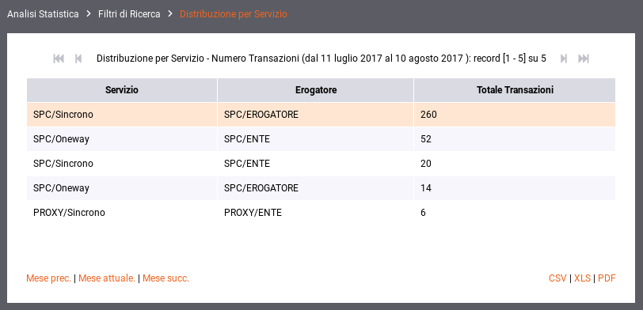
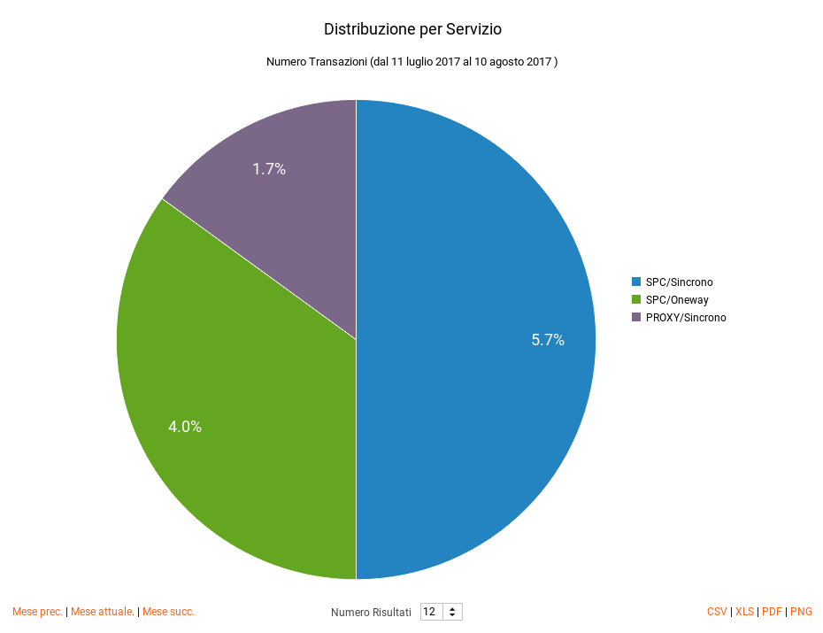
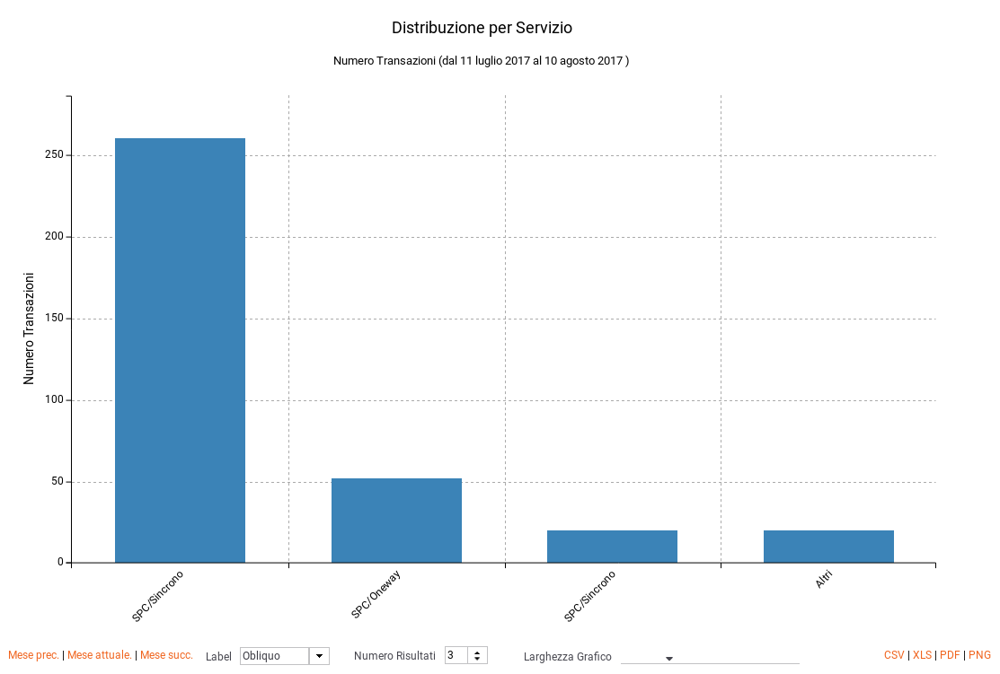

.. _mon_stats_api:

Distribuzione per API
~~~~~~~~~~~~~~~~~~~~~

Fornisce informazioni sulla ripartizione delle richieste Da/Per le API.
Di seguito alcuni esempi di reports generabili.

Tabella:

    Esempio di report tabellare di distribuzione per API

**Grafico 'Pie Chart' sul numero di transazioni:**

    Esempio di report grafico di distribuzione per API (Pie Chart sul numero di transazioni)

**Grafico 'Bar Chart' sul tempo medio di risposta:**

    Esempio di report grafico di distribuzione per API (Bar Chart sul tempo medio di risposta)
