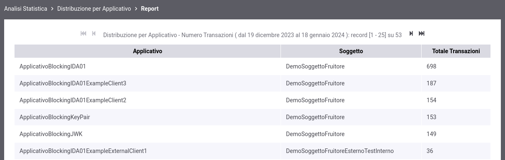

.. _mon_stats_applicativo:

Distribuzione per Applicativo
~~~~~~~~~~~~~~~~~~~~~~~~~~~~~

Fornisce statistiche sulle transazioni sulla base della loro
ripartizione tra gli applicativi dei soggetti interni al dominio GovWay
che hanno inviato le richieste (di fruizione o erogazione).

Per procedere alla generazione del report deve essere selezionata la modalità di identificazione dell'applicativo (:numref:`mon_distribuzioneApplicativoModalitaIdentificazione_fig`):

- trasporto: credenziali ottenute tramite autenticazione trasporto (es. certificato X.509 o credenziali http-basic);
- token: identificativo client letto dal token ricevuto (es. claim 'client_id' o 'azp').

    Report di distribuzione per applicativo; modalità di identificazione

Di seguito alcuni esempi di report generabili.

**Tabella degli applicativi identificati tramite credenziali di tipo 'trasporto'**

    Esempio di report tabellare di distribuzione per applicativo identificato tramite credenziali di tipo 'trasporto'

**Tabella degli applicativi identificati tramite credenziali di tipo 'token'**

    Esempio di report tabellare di distribuzione per applicativo identificato tramite credenziali di tipo 'token'

**Grafico 'Pie Chart' sul numero di transazioni**

.. figure:: ../../_figure_monitoraggio/DistribuzioneApplicativoPie.png
    :scale: 50%
    :align: center
    :name: mon_distribuzioneApplicativoPie_fig

    Esempio di report grafico di distribuzione per applicativo (Pie Chart sul numero di transazioni)

**Grafico 'Bar Chart' sul numero di transazioni**

    Esempio di report grafico di distribuzione per applicativo (Bar Chart sul numero di transazioni)

**Tabella 3D degli applicativi identificati tramite credenziali di tipo 'trasporto'**

    Esempio di report tabellare di distribuzione per applicativo, comprensivo di date, identificato tramite credenziali di tipo 'trasporto'

**Tabella 3D degli applicativi identificati tramite credenziali di tipo 'token'**

    Esempio di report tabellare di distribuzione per applicativo, comprensivo di date, identificato tramite credenziali di tipo 'token'

**Grafico 'Bar Chart 3D' sul numero di transazioni**

    Esempio di report grafico di distribuzione per applicativo (Bar Chart 3D sul numero di transazioni e sulle date)

