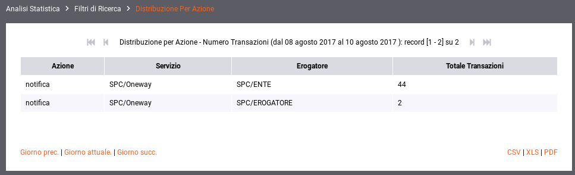
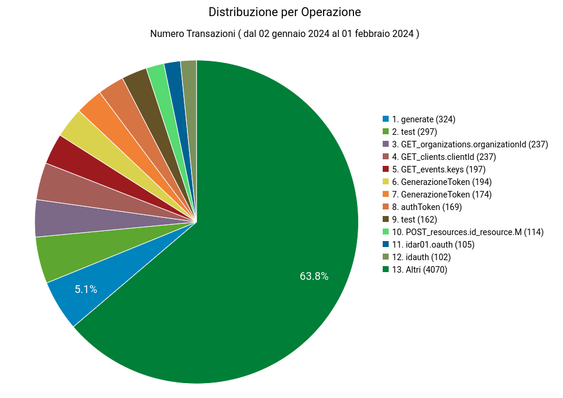
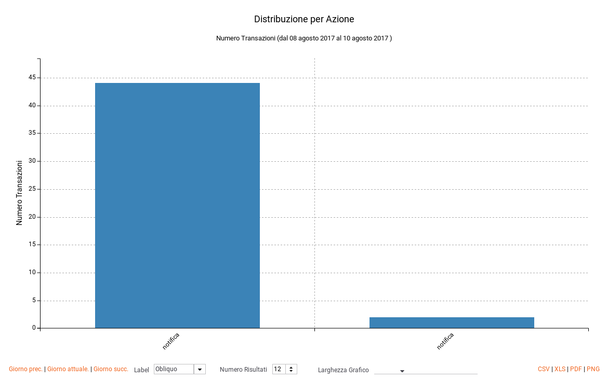
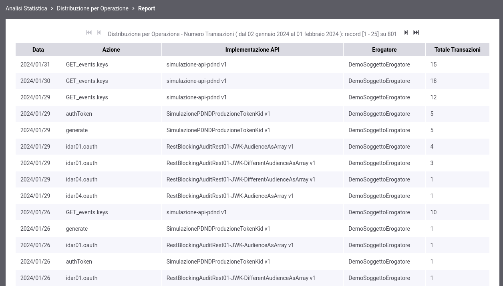
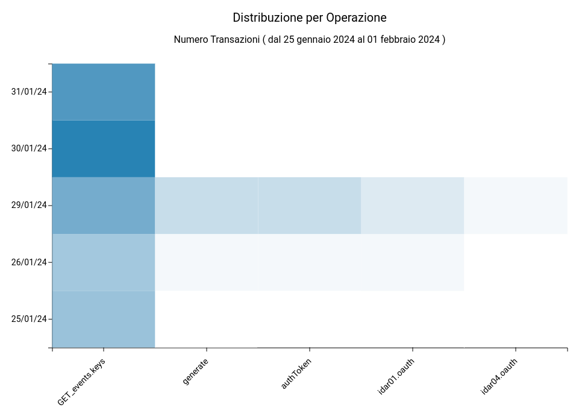
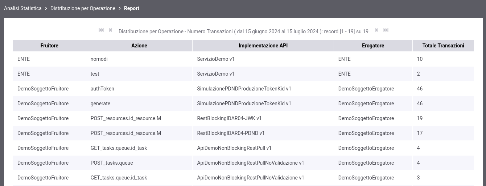
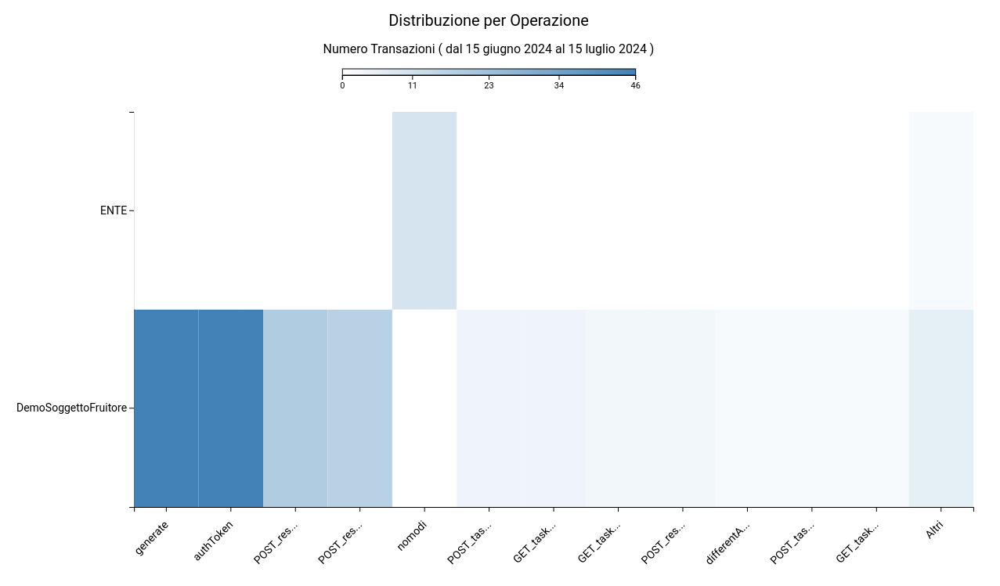

.. _mon_stats_azione:

Distribuzione per Azione
~~~~~~~~~~~~~~~~~~~~~~~~

Fornisce informazioni sulla ripartizione delle richieste Da/Per
Azioni/Risorse. Di seguito alcuni esempi di reports generabili.

**Tabella**

    Esempio di report tabellare di distribuzione per azione

**Grafico 'Pie Chart' sul numero di transazioni**

    Esempio di report grafico di distribuzione per azione (Pie Chart sul numero di transazioni)

**Grafico 'Bar Chart' sul numero di transazioni**

    Esempio di report grafico di distribuzione per azione (Bar Chart sul numero di transazioni)

**Tabella 3D**

    Esempio di report tabellare di distribuzione per azione comprensivo di date

**Grafico 'Bar Chart 3D' sul numero di transazioni**

    Esempio di report grafico di distribuzione per azione (Bar Chart 3D sul numero di transazioni e sulle date)

**Tabella 3D personalizzata per soggetto fruitore**

    Esempio di report tabellare di distribuzione per azione comprensivo di una distribuzione per soggetto fruitore

**Grafico 'Bar Chart 3D' sul numero di transazioni personalizzato per soggetto fruitore**

    Esempio di report grafico di distribuzione per azione (Bar Chart 3D sul numero di transazioni e sui soggetti fruitori)
