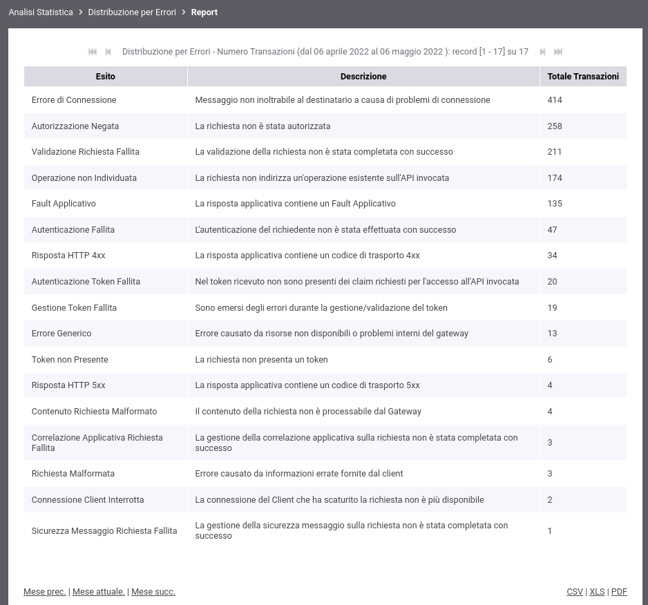
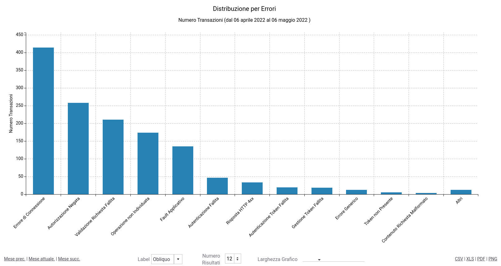
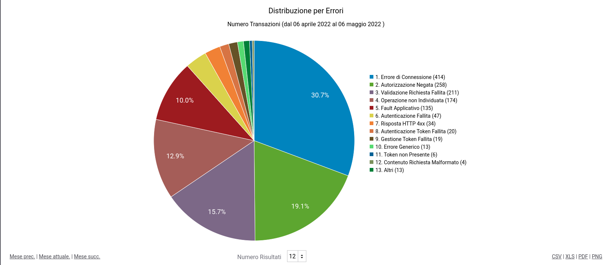

.. _mon_stats_errori:

Distribuzione per Errori
~~~~~~~~~~~~~~~~~~~~~~~~~

Fornisce statistiche riguardo l'andamento delle transazioni sul periodo
mantenendo la suddivisione rispetto alla tipologia di errori. Di seguito alcuni esempi
di reports generabili.

**Tabella:**

    Esempio di Report di Distribuzione per Errori in formato tabellare

**Grafico 'Bar Chart' sul numero di transazioni:**

    Esempio di Report di Distribuzione per Errori (Bar Chart sul numero di transazioni)

**Grafico 'Pie Chart' sul numero di transazioni:**

    Esempio di Report di Distribuzione per Errori (Pie Chart sul numero di transazioni)
