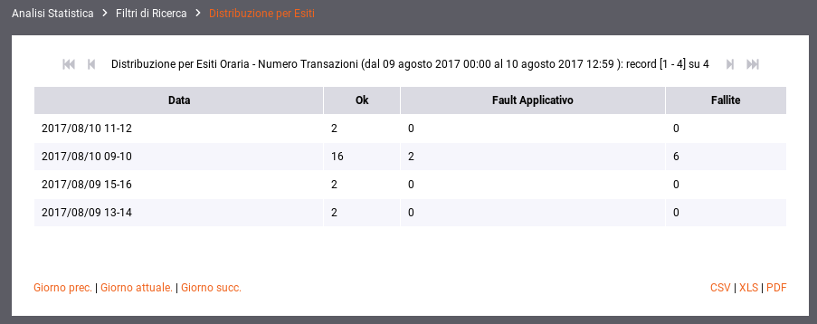
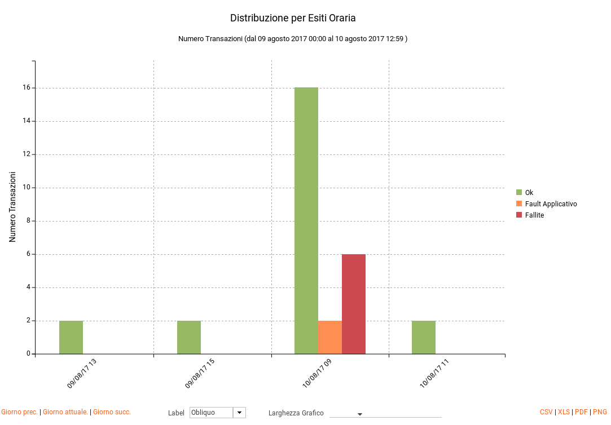
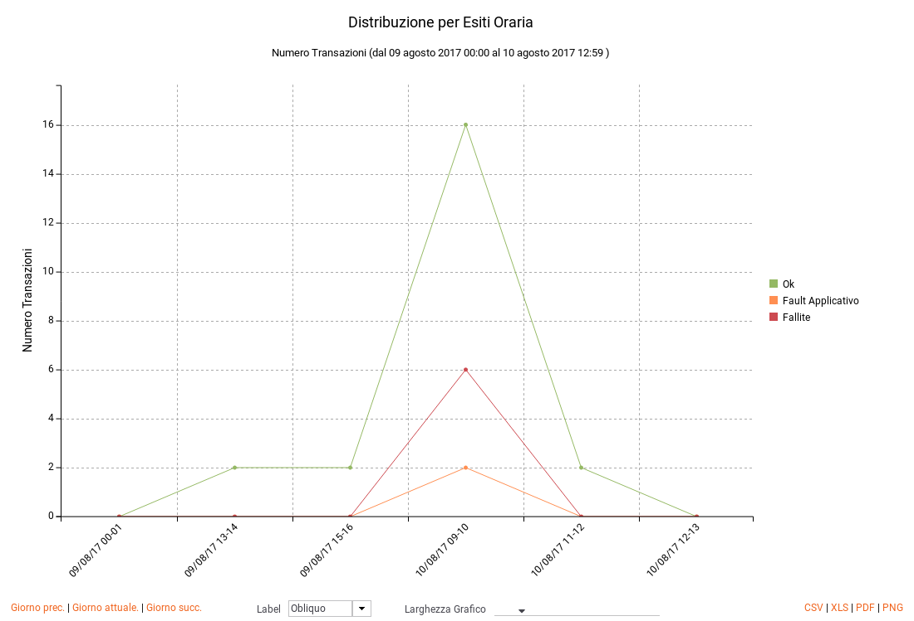

.. _mon_stats_esito:

Distribuzione per Esito
~~~~~~~~~~~~~~~~~~~~~~~

Fornisce statistiche riguardo l'andamento delle transazioni sul periodo
mantenendo la suddivisione rispetto all'esito. Di seguito alcuni esempi
di reports generabili.

**Tabella:**

    Esempio di Report di Distribuzione per Esiti in formato tabellare

**Grafico 'Bar Chart' sul numero di transazioni:**

    Esempio di Report di Distribuzione per Esito (Bar Chart sul numero di transazioni)

**Grafico 'Line Chart' sul numero di transazioni:**

    Esempio di Report di Distribuzione per Esito (Line Chart sul numero di transazioni)
