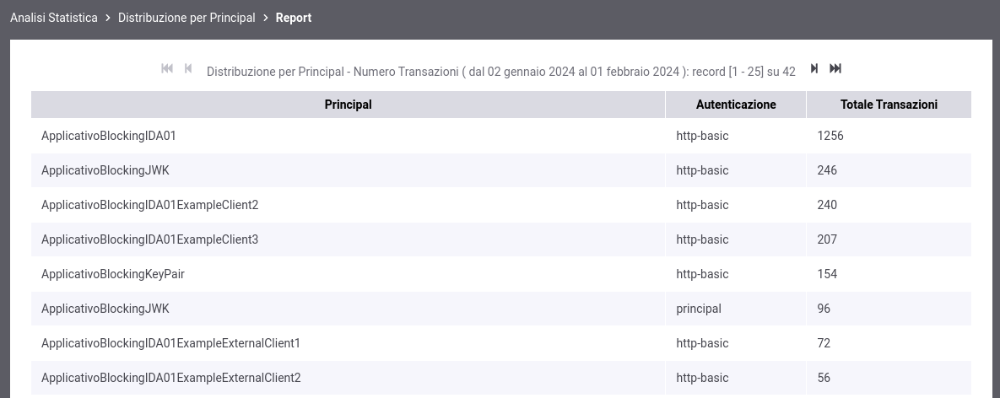
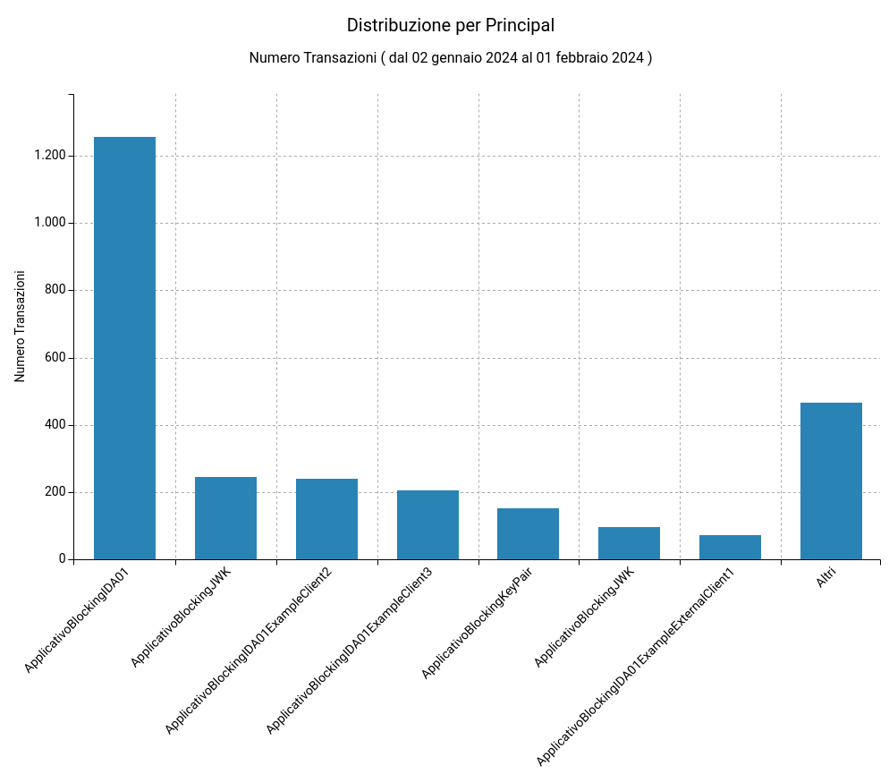
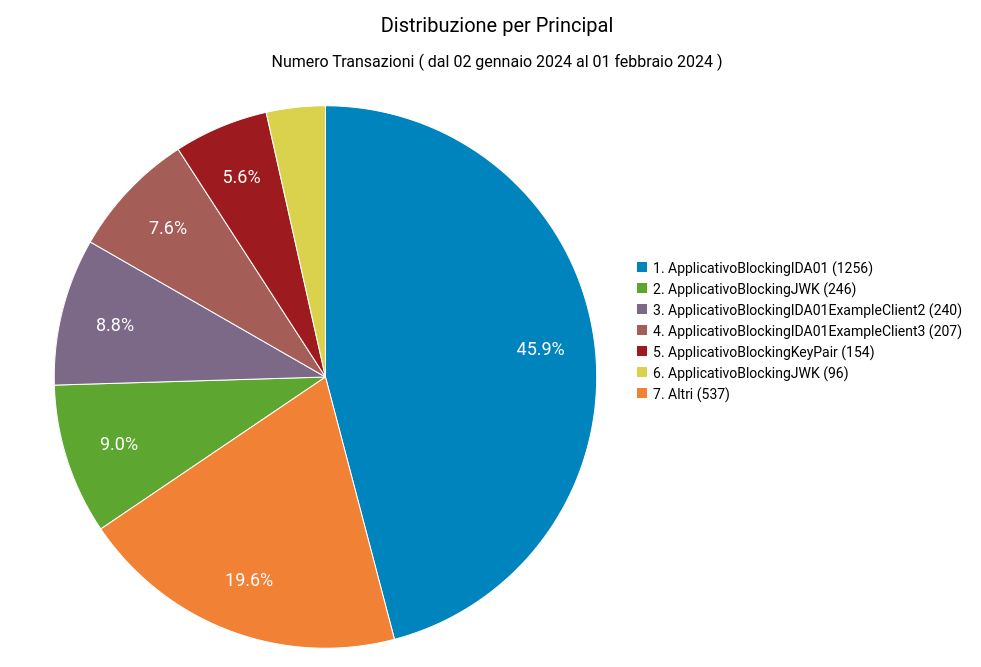
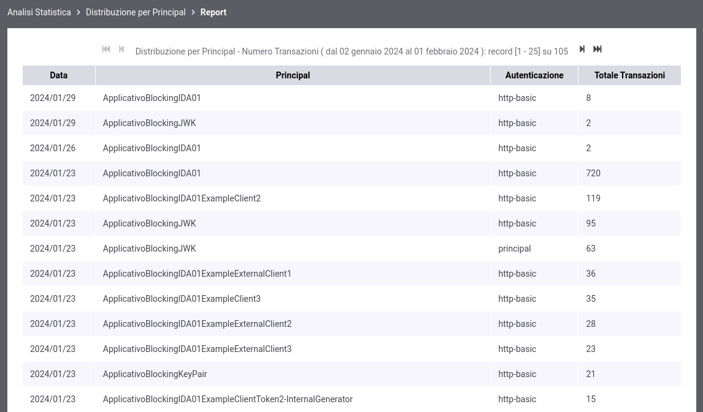
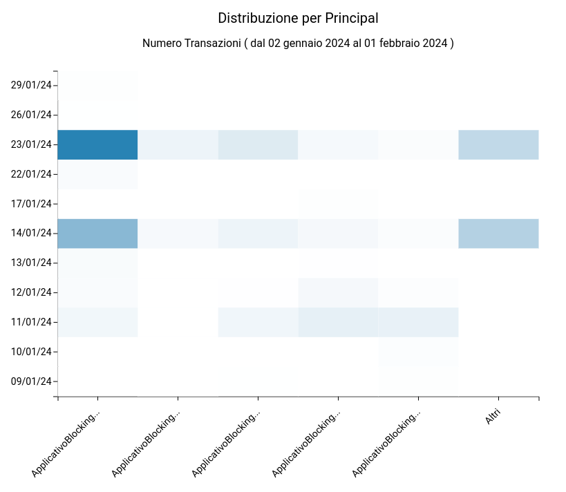

.. _mon_stats_id_autenticato:

Distribuzione per Principal
~~~~~~~~~~~~~~~~~~~~~~~~~~~~~~~~~~~~~~~~~~~~

Fornisce statistiche sulle transazioni sulla base della loro
ripartizione tra gli identificativi degli utenti rilevati con il
processo di autenticazione (principal, username, ecc).

**Tabella**

    Esempio di Report di Distribuzione per Principal in formato tabellare

**Grafico 'Bar Chart' sul numero di transazioni**

    Esempio di Report di Distribuzione per Principal (Bar Chart sul numero di transazioni)

**Grafico 'Pie Chart' sul numero di transazioni**

    Esempio di Report di Distribuzione per Principal (Pie Chart sul numero di transazioni)

**Tabella 3D**

    Esempio di Report di Distribuzione per Principal in formato tabellare comprensivo di date

**Grafico 'Bar Chart 3D' sul numero di transazioni**

    Esempio di Report di Distribuzione per Principal (Bar Chart 3D sul numero di transazioni e sulle date)
