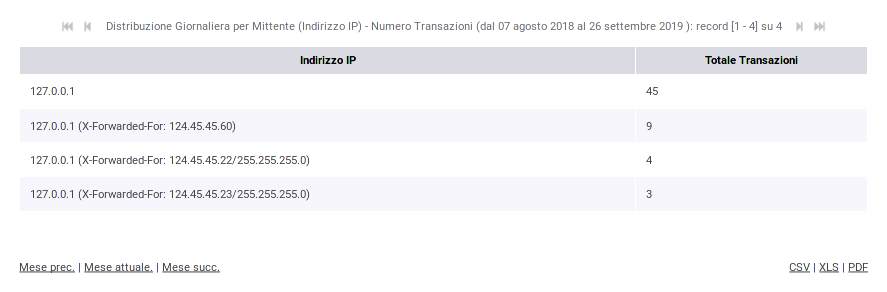
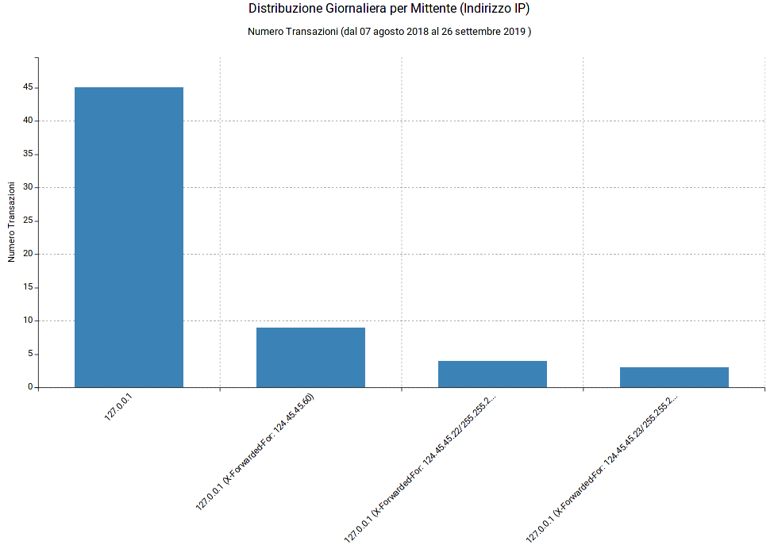
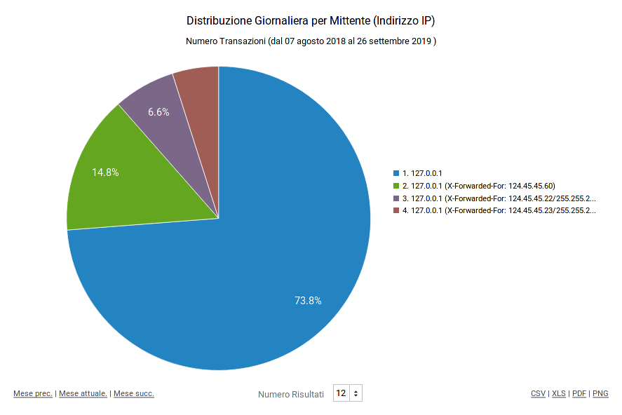

.. _mon_stats_ip:

Distribuzione per Indirizzo IP
~~~~~~~~~~~~~~~~~~~~~~~~~~~~~~

Fornisce statistiche riguardo l'andamento delle transazioni sul periodo
mantenendo la suddivisione rispetto all'indirizzo IP di provenienza delle richieste. Di seguito alcuni esempi
di reports generabili.

Tabella:

    Esempio di Report di Distribuzione per Indirizzo IP in formato tabellare

Grafico 'Bar Chart' sul numero di transazioni:

    Esempio di Report di Distribuzione per Indirizzo IP (Bar Chart sul numero di transazioni)

Grafico 'Pie Chart' sul numero di transazioni:

    Esempio di Report di Distribuzione per Indirizzo IP (Pie Chart sul numero di transazioni)
