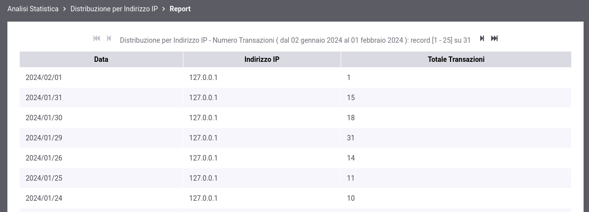

.. _mon_stats_ip:

Distribuzione per Indirizzo IP
~~~~~~~~~~~~~~~~~~~~~~~~~~~~~~

Fornisce statistiche riguardo l'andamento delle transazioni sul periodo
mantenendo la suddivisione rispetto all'indirizzo IP di provenienza delle richieste. Di seguito alcuni esempi
di reports generabili.

**Tabella**

.. figure:: ../../_figure_monitoraggio/DistribuzioneIPTabella.png
    :scale: 50%
    :align: center
    :name: mon_distribuzioneIPTabella_fig

    Esempio di Report di Distribuzione per Indirizzo IP in formato tabellare

**Grafico 'Bar Chart' sul numero di transazioni**

.. figure:: ../../_figure_monitoraggio/DistribuzioneIPBar.png
    :scale: 50%
    :align: center
    :name: mon_distribuzioneIPBar_fig

    Esempio di Report di Distribuzione per Indirizzo IP (Bar Chart sul numero di transazioni)

**Grafico 'Pie Chart' sul numero di transazioni**

.. figure:: ../../_figure_monitoraggio/DistribuzioneIPPie.png
    :scale: 50%
    :align: center
    :name: mon_distribuzioneIPPie_fig

    Esempio di Report di Distribuzione per Indirizzo IP (Pie Chart sul numero di transazioni)

**Tabella 3D**

    Esempio di Report di Distribuzione per Indirizzo IP in formato tabellare comprensivo di date

**Grafico 'Bar Chart 3D' sul numero di transazioni**

    Esempio di Report di Distribuzione per Indirizzo IP (Bar Chart 3D sul numero di transazioni e sulle date)

**Tabella 3D personalizzata per tipo di errore**

    Esempio di Report di Distribuzione per Indirizzo IP in formato tabellare, comprensivo di una distribuzione per tipo di errore

**Grafico 'Bar Chart 3D' sul numero di transazioni personalizzato per tipo di errore**

    Esempio di Report di Distribuzione per Indirizzo IP (Bar Chart 3D sul numero di transazioni e sul tipo di errore)
