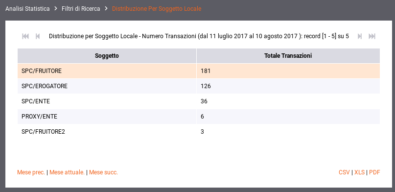
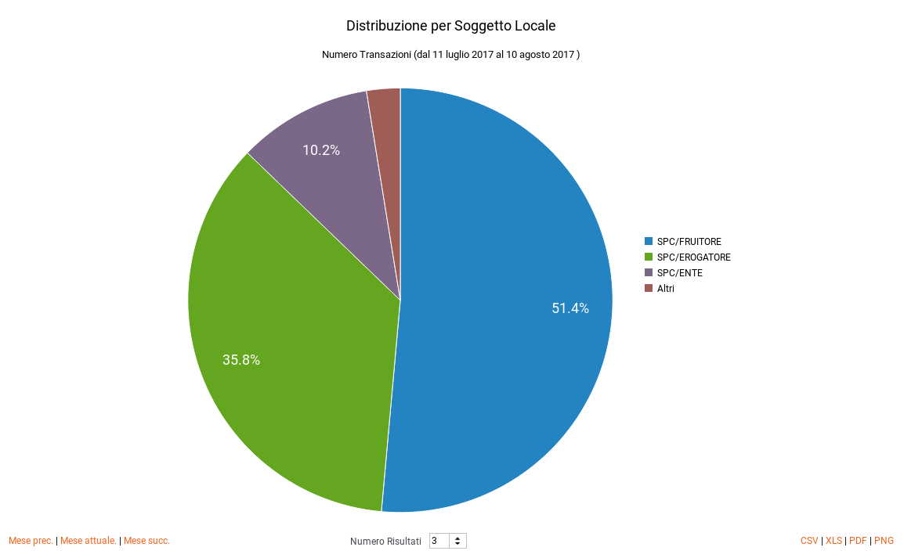
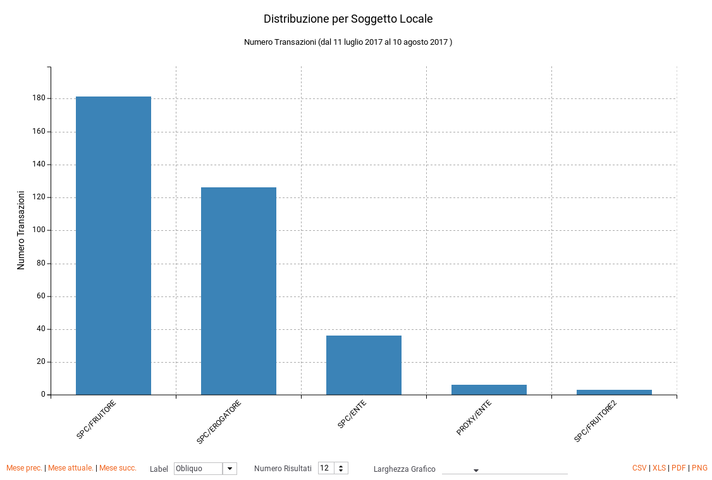

.. _mon_stats_soggettoLocale:

Distribuzione per Soggetto Locale
~~~~~~~~~~~~~~~~~~~~~~~~~~~~~~~~~

Questo report, disponibile se attiva la modalità multi-tenant, mostra
come si distribuiscono le transazioni registrate dal gateway sui
soggetti locali. Di seguito alcuni esempi di reports generabili.

**Tabella:**

    Esempio di report tabellare di distribuzione per soggetto locale

**Grafico 'Pie Chart' sul numero di transazioni**

    Esempio di report grafico di distribuzione per soggetto locale (Pie Chart sul numero di transazioni)

**Grafico 'Bar Chart' sul numero di transazioni:**

    Esempio di report grafico di distribuzione per soggetto locale (Bar Chart sul numero di transazioni)
