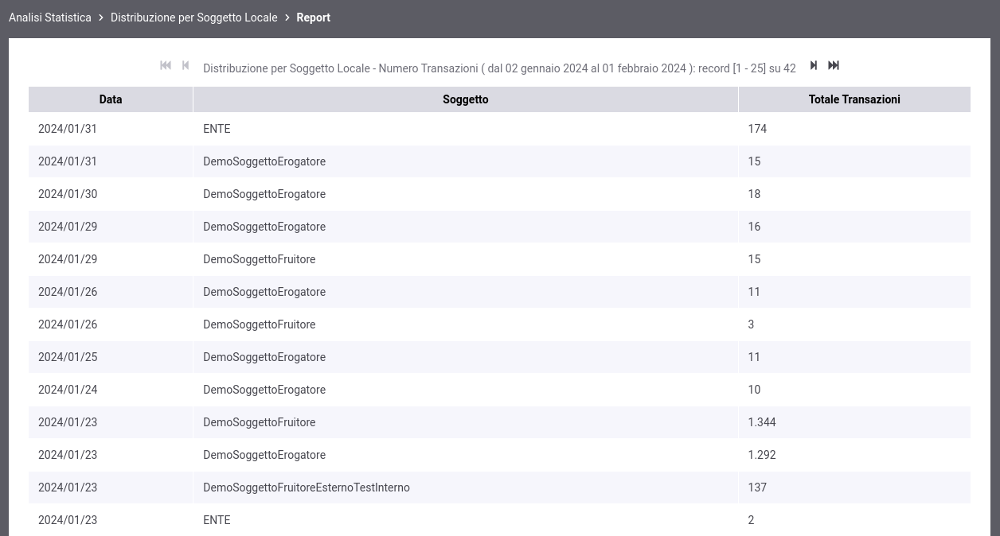
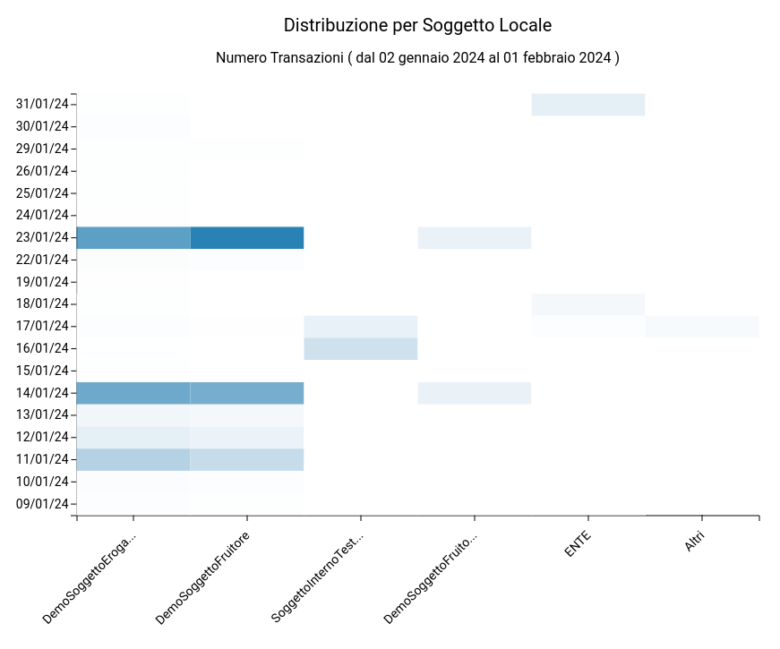

.. _mon_stats_soggettoLocale:

Distribuzione per Soggetto Locale
~~~~~~~~~~~~~~~~~~~~~~~~~~~~~~~~~

Questo report, disponibile se attiva la modalità multi-tenant, mostra
come si distribuiscono le transazioni registrate dal gateway sui
soggetti locali. Di seguito alcuni esempi di reports generabili.

**Tabella**

.. figure:: ../../_figure_monitoraggio/DistribuzioneSoggettoTabella.png
    :scale: 50%
    :align: center
    :name: mon_distribuzioneSoggettoTabella_fig

    Esempio di report tabellare di distribuzione per soggetto locale

**Grafico 'Pie Chart' sul numero di transazioni**

.. figure:: ../../_figure_monitoraggio/DistribuzioneSoggettoPie.png
    :scale: 50%
    :align: center
    :name: mon_distribuzioneSoggettoPie_fig

    Esempio di report grafico di distribuzione per soggetto locale (Pie Chart sul numero di transazioni)

**Grafico 'Bar Chart' sul numero di transazioni**

.. figure:: ../../_figure_monitoraggio/DistribuzioneSoggettoBar.png
    :scale: 50%
    :align: center
    :name: mon_distribuzioneSoggettoBar_fig

    Esempio di report grafico di distribuzione per soggetto locale (Bar Chart sul numero di transazioni)

**Tabella 3D**

    Esempio di report tabellare comprensivo di date che riporta la distribuzione per soggetto locale

**Grafico 'Bar Chart 3D' sul numero di transazioni**

    Esempio di report grafico di distribuzione per soggetto locale (Bar Chart 3D sul numero di transazioni e sulle date)
