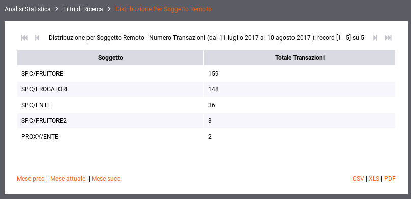
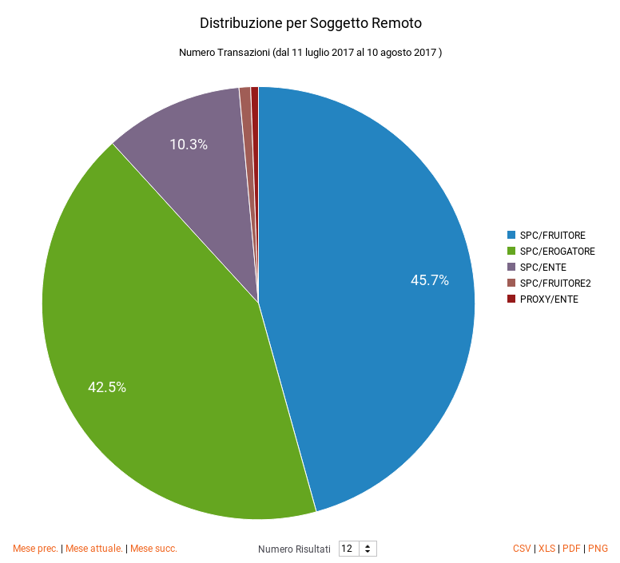
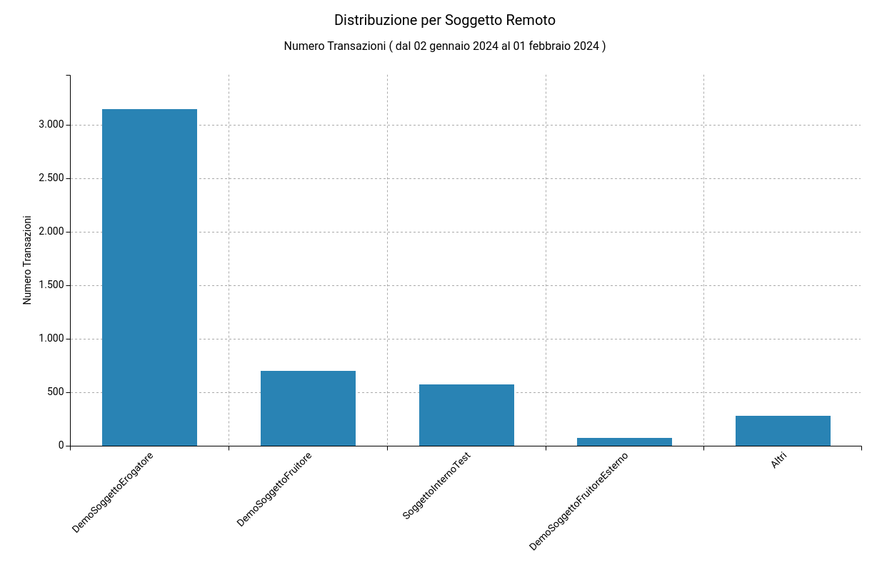
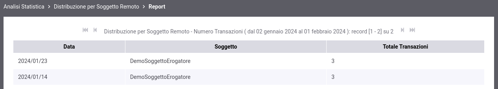
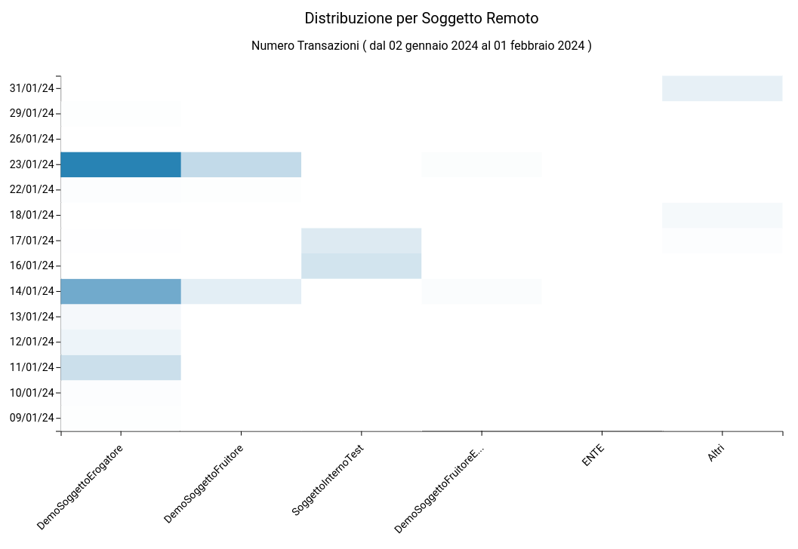
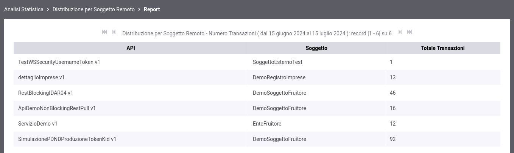
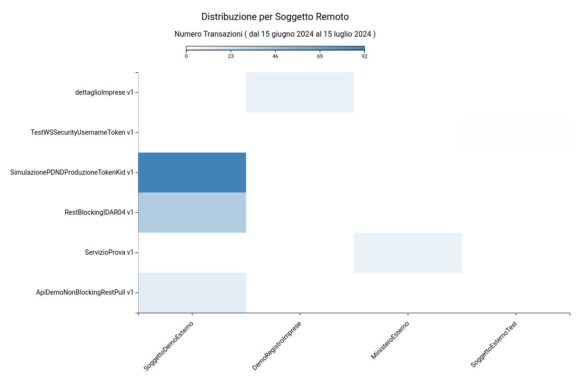

.. _mon_stats_soggettoRemoto:

Distribuzione per Soggetto Remoto
~~~~~~~~~~~~~~~~~~~~~~~~~~~~~~~~~

Questo report mostra come si distribuiscono le transazioni registrate
dal gateway sui soggetti remoti (gli interlocutori dei soggetti locali).
Di seguito alcuni esempi di reports generabili.

**Tabella**

    Esempio di report tabellare di distribuzione per soggetto remoto

**Grafico 'Pie Chart' sul numero di transazioni**

    Esempio di Report di Distribuzione per Soggetto Remoto (Pie Chart sul numero di transazioni)

**Grafico 'Bar Chart' sul numero di transazioni**

    Esempio di Report di Distribuzione per Soggetto Remoto (Bar Chart sul numero di transazioni)

**Tabella 3D**

    Esempio di report tabellare comprensivo di date che riporta la distribuzione per soggetto remoto

**Grafico 'Bar Chart 3D' sul numero di transazioni**

    Esempio di Report di Distribuzione per Soggetto Remoto (Bar Chart 3D sul numero di transazioni e sulle date)
    
**Tabella 3D personalizzata per API**

    Esempio di report tabellare che riporta la distribuzione per soggetto remoto comprensivo di una distribuzione per API

**Grafico 'Bar Chart 3D' sul numero di transazioni personalizzato per API**

    Esempio di report grafico di distribuzione per soggetto remoto (Bar Chart 3D sul numero di transazioni e sulla API)
