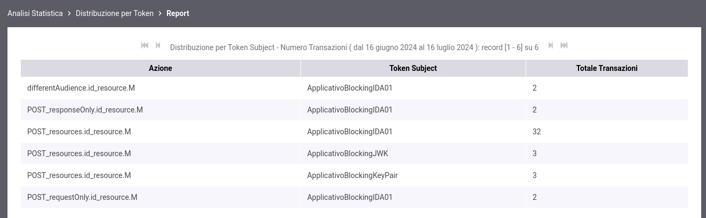
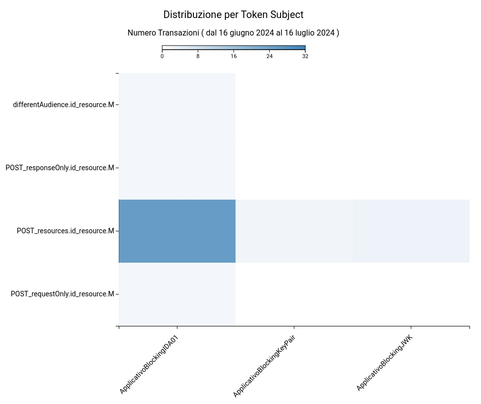

.. _mon_stats_tokenInfo:

Distribuzione per Token Info
~~~~~~~~~~~~~~~~~~~~~~~~~~~~

Fornisce statistiche sulle transazioni sulla base della loro
ripartizione rispetto ai valori assunti da uno specifico claim estratto
dai token ottenuti in fase di autenticazione (issuer, username, eMail,
ecc).

Per procedere alla generazione del report deve quindi essere selezionato il claim del token da usare come criterio di raggruppamento delle richieste ricevute (:numref:`mon_distribuzioneTokenModalitaIdentificazione_fig`).

.. figure:: ../../_figure_monitoraggio/DistribuzioneTokenInfoModalitaIdentificazione.png
    :scale: 80%
    :align: center
    :name: mon_distribuzioneTokenModalitaIdentificazione_fig

    Report di distribuzione per token; selezione del claim da utilizzare come criterio di raggruppamento delle richieste ricevute

Di seguito alcuni esempi di reports generabili.

**Tabella**

.. figure:: ../../_figure_monitoraggio/DistribuzioneTokenInfoTabellaIssuer.png
    :scale: 50%
    :align: center
    :name: mon_distribuzioneTokenInfoTabellaIssuer_fig

    Esempio di report tabellare di distribuzione per claim 'issuer' presente nei token ricevuti

**Grafico 'Pie Chart' sul numero di transazioni**

.. figure:: ../../_figure_monitoraggio/DistribuzioneTokenInfoPie.png
    :scale: 50%
    :align: center
    :name: mon_distribuzioneTokenInfoPie_fig

    Esempio di report grafico di distribuzione per API (Pie Chart sul numero di transazioni)

**Grafico 'Bar Chart' sul numero di transazioni**

.. figure:: ../../_figure_monitoraggio/DistribuzioneTokenInfoBar.png
    :scale: 50%
    :align: center
    :name: mon_distribuzioneTokenInfoBar_fig

    Esempio di report grafico di distribuzione per API (Bar Chart sul numero di transazioni)

**Tabella 3D**

.. figure:: ../../_figure_monitoraggio/DistribuzioneTokenInfoTabellaSubject3D.png
    :scale: 50%
    :align: center
    :name: mon_distribuzioneTokenInfoTabellaSubject3D_fig

    Esempio di report tabellare di distribuzione per claim 'subject', comprensivo di date, presente nei token ricevuti

**Grafico 'Bar Chart 3D' sul numero di transazioni**

.. figure:: ../../_figure_monitoraggio/DistribuzioneTokenInfoBar3D.png
    :scale: 70%
    :align: center
    :name: mon_distribuzioneTokenInfoBar3D_fig

    Esempio di report grafico di distribuzione per claim 'subject' (Bar Chart 3D sul numero di transazioni e sulle date)

**Tabella 3D personalizzata per azioni delle API**

    Esempio di report tabellare di distribuzione per claim 'subject' presente nei token ricevuti', comprensivo di una distribuzione per azioni delle API

**Grafico 'Bar Chart 3D' sul numero di transazioni personalizzato per azioni delle API**

    Esempio di report grafico di distribuzione per claim 'subject' (Bar Chart 3D sul numero di transazioni e sulle azioni delle API)
