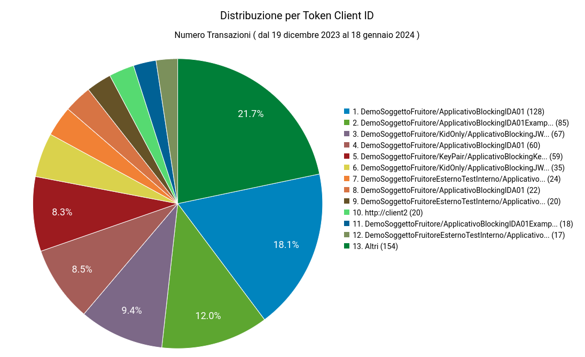

.. _mon_stats_tokenInfo:

Distribuzione per Token Info
~~~~~~~~~~~~~~~~~~~~~~~~~~~~

Fornisce statistiche sulle transazioni sulla base della loro
ripartizione rispetto ai valori assunti da uno specifico claim estratto
dai token ottenuti in fase di autenticazione (issuer, username, eMail,
ecc).

Per procedere alla generazione del report deve quindi essere selezionato il claim del token da usare come criterio di raggruppamento delle richieste ricevute (:numref:`mon_distribuzioneTokenModalitaIdentificazione_fig`).

.. figure:: ../../_figure_monitoraggio/DistribuzioneTokenInfoModalitaIdentificazione.png
    :scale: 80%
    :align: center
    :name: mon_distribuzioneTokenModalitaIdentificazione_fig

    Report di distribuzione per token; selezione del claim da utilizzare come criterio di raggruppamento delle richieste ricevute

Di seguito alcuni esempi di reports generabili.

**Tabella**

    Esempio di report tabellare di distribuzione per claim 'issuer' presente nei token ricevuti

**Grafico 'Pie Chart' sul numero di transazioni**

    Esempio di report grafico di distribuzione per API (Pie Chart sul numero di transazioni)

**Grafico 'Bar Chart' sul tempo medio di risposta**

    Esempio di report grafico di distribuzione per API (Bar Chart sul tempo medio di risposta)

**Tabella 3D**

    Esempio di report tabellare di distribuzione per claim 'subject', comprensivo di date, presente nei token ricevuti

**Grafico 'Bar Chart 3D' sul tempo medio di risposta**

.. figure:: ../../_figure_monitoraggio/DistribuzioneTokenInfoBar3D.png
    :scale: 70%
    :align: center
    :name: mon_distribuzioneTokenInfoBar3D_fig

    Esempio di report grafico di distribuzione per claim 'subject' (Bar Chart 3D sul numero di transazioni e sulle date)

**Informazioni PDND**

Selezionando il profilo di interoperabilità "ModI" e il tipo di transazione "Erogazione", tra i claim forniti come criterio di ricerca è possibile utilizzare anche la voce "Client ID + Informazioni PDND" che consente di ottenere un report basato sulle informazioni, relative al clientId, recuperate tramite le API PDND (:numref:`mon_distribuzioneTokenModalitaIdentificazionePDND_fig`).

.. figure:: ../../_figure_monitoraggio/DistribuzioneTokenInfoModalitaIdentificazionePDND.png
    :scale: 80%
    :align: center
    :name: mon_distribuzioneTokenModalitaIdentificazionePDND_fig

    Report di distribuzione per token; selezione del claim da utilizzare come criterio di raggruppamento delle richieste ricevute (Informazioni PDND)

Di seguito esempi di report che riportano le informazioni PDND (:numref:`mon_distribuzioneTokenInfoTabellaPDND_fig`).

.. figure:: ../../_figure_monitoraggio/DistribuzioneTokenInfoTabellaPDND.png
    :scale: 50%
    :align: center
    :name: mon_distribuzioneTokenInfoTabellaPDND_fig

    Esempio di report tabellare di distribuzione per claim 'clientID' arricchito di informazioni prelevate tramite API PDND

    Esempio di report tabellare di distribuzione 3D per claim 'clientID', comprensivo di date, arricchito di informazioni prelevate tramite API PDND

    Esempio di report grafico di distribuzione per claim 'clientID' arricchito di informazioni prelevate tramite API PDND (Bar Chart 3D sul numero di transazioni e sulle date)
