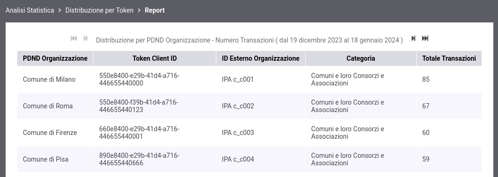

.. _mon_stats_tokenInfoPDND:

Distribuzione per Token Info + Informazioni PDND
~~~~~~~~~~~~~~~~~~~~~~~~~~~~~~~~~~~~~~~~~~~~~~~~~~~~~~~~

Fornisce statistiche sulle transazioni sulla base della loro ripartizione rispetto alle informazioni recuperate tramite le API PDND, relative al clientId presente nel token ottenuto durante l'autenticazione della richiesta.

Il report è disponibile solo selezionando il profilo di interoperabilità "ModI" e il tipo di transazione "Erogazione" tra i criteri di generazione del report. Una volta selezionati, tra i claim forniti è possibile utilizzare anche la voce "Client ID + Informazioni PDND".

Per procedere alla generazione del report, deve quindi essere selezionato il claim "Client ID + Informazioni PDND" da usare come criterio di raggruppamento delle richieste ricevute (:numref:`mon_distribuzioneTokenModalitaIdentificazionePDND_fig`).

.. figure:: ../../_figure_monitoraggio/DistribuzioneTokenInfoModalitaIdentificazionePDND.png
    :scale: 80%
    :align: center
    :name: mon_distribuzioneTokenModalitaIdentificazionePDND_fig

    Report di distribuzione per token; selezione del claim da utilizzare come criterio di raggruppamento delle richieste ricevute (Informazioni PDND)

Di seguito esempi di report che riportano le informazioni PDND (:numref:`mon_distribuzioneTokenInfoTabellaPDND_fig`).

**Tabella**

    Esempio di report tabellare di distribuzione per claim 'clientID' arricchito di informazioni prelevate tramite API PDND

**Tabella 3D**

.. figure:: ../../_figure_monitoraggio/DistribuzioneTokenInfoTabellaPDND3D.png
    :scale: 50%
    :align: center
    :name: mon_distribuzioneTokenInfoTabellaPDND3D_fig

    Esempio di report tabellare di distribuzione 3D per claim 'clientID', comprensivo di date, arricchito di informazioni prelevate tramite API PDND

**Grafico 'Bar Chart 3D' sul numero di transazioni**

.. figure:: ../../_figure_monitoraggio/DistribuzioneTokenInfoBarPDND3D.png
    :scale: 70%
    :align: center
    :name: mon_distribuzioneTokenInfoBarPDND3D_fig

    Esempio di report grafico di distribuzione per claim 'clientID' arricchito di informazioni prelevate tramite API PDND (Bar Chart 3D sul numero di transazioni e sulle date)

**Tabella 3D personalizzata per azioni delle API**

    Esempio di report tabellare di distribuzione 3D per claim 'clientID', arricchito di informazioni prelevate tramite API PDND, comprensivo di una distribuzione per azioni delle API
