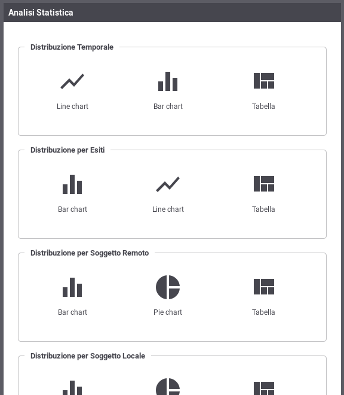

.. _mon_stats:

Analisi Statistica
------------------

Per accedere alla funzionalità di generazione di report statistici si
deve selezionare la voce 'Analisi Statistica' all'interno della sezione
'Reportistica' del menu di navigazione.

Il primo passo è quello di selezionare il tipo di report che si intende
generare e la relativa modalità di visualizzazione (:numref:`mon_statistiche_fig`). Una volta
individuato il tipo di report che si desidera generare si deve
selezionare il tipo di grafico o, in alternativa, il formato tabellare.

    Tipo di analisi statistica

I tipi di report che si possono generare sono:

-  Distribuzione Temporale

   Consente di visualizzare al variare del tempo i valori rilevati
   riguardo numero di richieste, KB transitati e tempi medi di risposta.

-  Distribuzione per Esiti

   Consente di visualizzare la distribuzione delle richieste, in un dato
   periodo, rispetto agli esiti riscontrati (OK, Errore, Fault
   Applicativo).

-  Distribuzione per Soggetto Remoto

   Consente di visualizzare la distribuzione del numero di richieste, KB
   transitati e tempi medi di risposta, aggregando i dati rispetto al
   soggetto interlocutore.

-  Distribuzione per Soggetto Locale

   Report disponibile in modalità multi-tenant, consente di visualizzare
   la distribuzione del numero di richieste, KB transitati e tempi medi
   di risposta, aggregando i dati rispetto al soggetto interno al
   dominio GovWay.

-  Distribuzione per API

   Consente di visualizzare la distribuzione del numero di richieste, KB
   transitati e tempi medi di risposta, aggregando i dati in base alla
   API invocata

-  Distribuzione per Operazione

   Consente di visualizzare la distribuzione del numero di richieste, KB
   transitati e tempi medi di risposta, aggregando i dati per l'operazione relativa alla API invocata

-  Distribuzione per Applicativo

   Consente di visualizzare la distribuzione del numero di richieste, KB
   transitati e tempi medi di risposta, aggregando i dati per
   applicativo client che ha inviato la richiesta

-  Distribuzione per Principal

   Consente di visualizzare la distribuzione delle transazioni rispetto
   all'identificativo dell'utente rilevato in fase di autenticazione

-  Distribuzione per Token Info

   Consente di visualizzare la distribuzione delle transazioni rispetto
   ad uno dei claim ricavati dal token ottenuto nel corso
   dell'autenticazione della richiesta

-  Distribuzione per Indirizzo IP

   Consente di visualizzare la distribuzione delle transazioni rispetto all'indirizzo IP di provenienza delle richieste

Per ogni report è possibile specificare dei criteri di filtro come descritto nella sezione :ref:`mon_stats_filtri`.

.. toctree::
        :maxdepth: 2

        criteriFiltro
	andamentoTemporale
	distribuzioneEsito
	distribuzioneSoggettoLocale
	distribuzioneSoggettoRemoto
	distribuzioneAPI
	distribuzioneAzione
	distribuzioneApplicativo
	distribuzioneIdAutenticato
	distribuzioneTokenInfo
	distribuzioneIndirizzoIP
