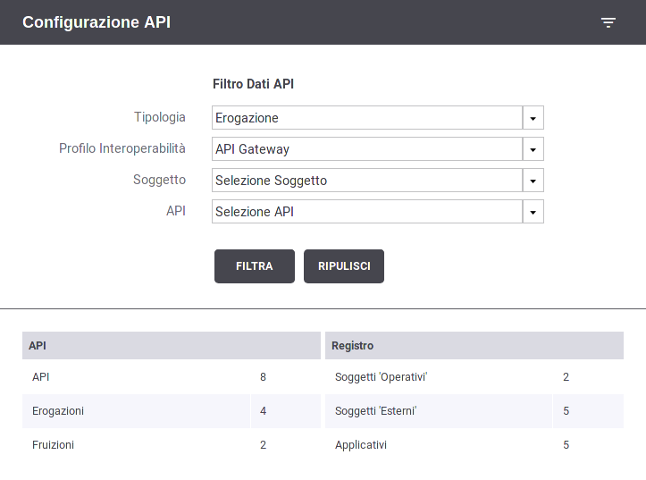
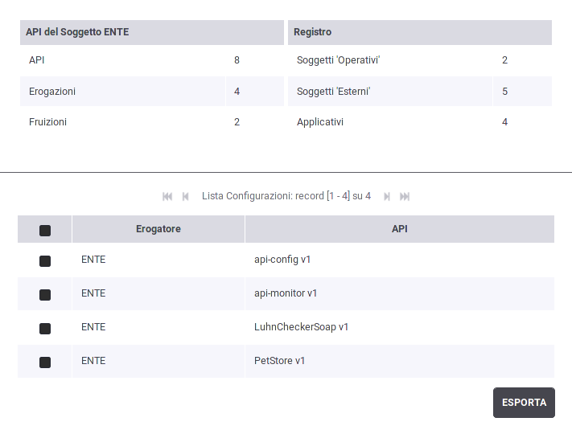
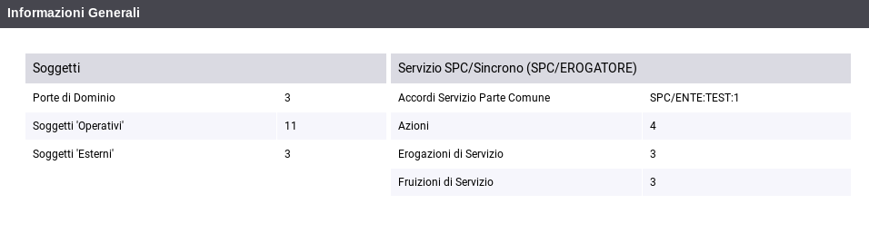

.. _mon_reportistica_config:

Report Configurazione API
-------------------------

Questo report consente di avere un quadro di sintesi riguardo le API
configurate nel registro di GovWay tramite la govwayConsole (api,
erogazioni, fruizioni, applicativi, ecc). Per accedere alla funzionalità
si deve selezionare la voce 'Configurazione API' all'interno della
sezione 'Reportistica'.

La funzionalità fornisce immediatamente un prospetto di conteggio degli
elementi di configurazione presenti nel registro di GovWay (:numref:`mon_reportConfigurazioni_fig`)
all'interno della sezione 'Informazioni Generali'. Tale sezione è
suddivisa nelle seguenti due parti:

-  API: fornisce informazioni relative alle API configurate.

   -  API

   -  Erogazioni

   -  Fruizioni

-  Registro:

   -  Soggetti Operativi

   -  Soggetti Esterni

   -  Applicativi

    Report sulle configurazioni dei servizi presenti nel registro GovWay

Oltre ad un prospetto riepilogativo del numero di configurazioni attive
è possibile effettuare una ricerca di tali configurazioni al fine di
esportarne i dettagli. Per poter effettuare la ricerca devono essere
definiti i criteri di tale ricerca agendo sul filtro.

I dati presenti nel filtro sono i seguenti:

-  Filtro Dati API

   -  **Tipologia:**\ indica se si desidera ricercare configurazioni
      relative a fruizioni o erogazioni;

   -  **Profilo Interoperabilità**: permette di filtrare le transazioni
      in base al profilo di interoperabilità;

   -  **Soggetto**: permette di filtrare rispetto al soggetto locale,
      tra quelli in gestione;

   -  **Tag**: consente di individuare le API appartenenti ad uno specifico tag;

   -  **API**: consente di individuare tutte le erogazioni o fruizioni che implementano l'API selezionata;

   -  **Implementazione API**: permette di selezionare puntualmente una erogazione o fruizione.

La sezione nel filtro di un determinato soggetto comporta
l'aggiornamento del prospetto riepilogativo del numero di configurazioni
della sezione 'API' aggiornano i contatori relativamente alle API di
competenza del soggetto selezionato (:numref:`mon_reportConfigurazioniSoggetto_fig`).
Un'ulteriore tabella mostra l'elenco delle API erogate dal soggetto selezionato.

    Prospetto riepilogativo con soggetto selezionato

La selezione di una API nel filtro comporta l'aggiornamento del
prospetto riepilogativo del numero di configurazioni della sezione 'API'
aggiornando i contatori relativamente alla API selezionata (:numref:`mon_reportConfigurazioniApi_fig`). Con la
selezione della API, tra le informazioni riportate vi sono anche il
numero di azioni/risorse presenti. Un'ulteriore tabella mostra l'elenco dei soggetti erogatori
per la API selezionata.

    Prospetto riepilogativo con API selezionata

Gli elementi di configurazione mostrati in elenco possono essere
selezionati ed esportati in formato CSV tramite il pulsante "Esporta". Le informazioni esportate con i dettagli sul formato utilizzato vengono fornite nella sezione :ref:`mon_reportistica_config_csv`.

.. toctree::
        :maxdepth: 1

        formatoCSV
