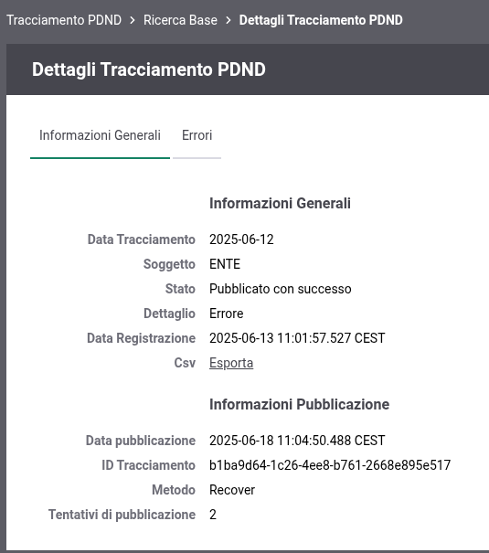

.. _tracciamento_pdnd:

Tracciamento PDND
------------------

Per accedere alla funzionalità di tracciamento PDND, è necessario selezionare la voce "Tracciamento PDND" all'interno della sezione "Reportistica" del menu di navigazione ':numref:`tracing_pdnd_box`'.

    Tipi di ricerca possibili
    
A questo punto, è possibile effettuare due tipi di ricerca:

 - **Ricerca base**: mostra tutti i tracciati prodotti e pubblicati dal sistema.
 - **Ricerca per Tracing ID**: se viene fornito un Tracing ID, saranno mostrati i tracciati corrispondenti a quell’identificativo.

**Ricerca base**

Nella ricerca base sara possibile filtrare i risultati mostrati nella figura ':numref:`tracing_pdnd_form`'

    Esempio della lista tracciati dopo una ricerca

In entrambi i casi, verrà visualizzata una lista di tracciati ':numref:`tracing_pdnd_list`'. Per ciascun tracciato, saranno disponibili informazioni quali:

 - stato del tracciato
 - data a cui si riferisce
 - soggetto interno associato
 - numero di tentativi di pubblicazione effettuati
 - identificativo del tracciato (se disponibile)

    Esempio della lista tracciati dopo una ricerca
    
In ogni caso, sarà possibile accedere ai dettagli del tracciato cliccando sulla data associata. ':numref:`tracing_pdnd_details`' ':numref:`tracing_pdnd_error`'.

    Dettagli tracciato
  

    Dettagli errore tracciato
 
Sarà inoltre possibile effettuare le seguenti operazione sia attraverso la pagina dedicata ai dettagli che selezionando i record relativi nella pagina di risultato di ricerca:

 - esportare il CSV dei record
 - forzare un nuovo invio in caso di pubblicazione fallita

