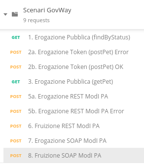
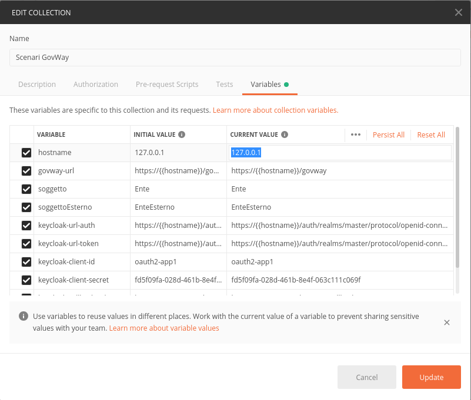
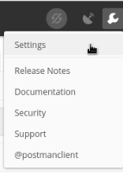
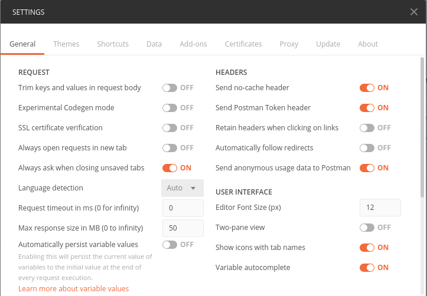
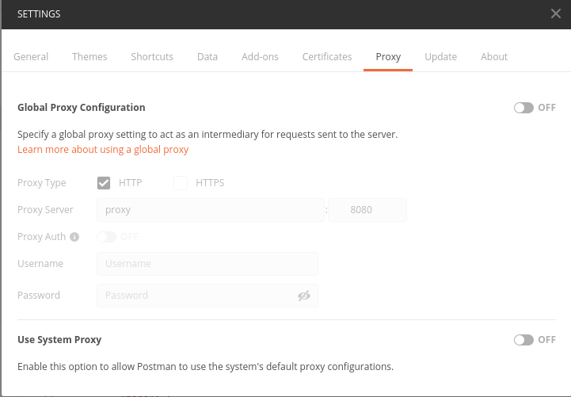

.. _scenari_ambiente_postman:

Progetto Postman
-----------------

La `collezione Postman <https://raw.githubusercontent.com/link-it/govway/master/resources/scenari/scenari-postman.json>`_ comprende tutte le configurazioni utilizzate nei vari scenari presentati (:numref:`postman_indice_fig`). La collection deve essere caricata sul proprio Postman tramite la funzionalità di import.

 Indice della collection Postman

Una volta effettuato il caricamento della collezione, modificare i parametri della collezione (:numref:`postman_edit_fig`) al fine di indicare nella variabile '*hostname*' (:numref:`postman_hostname_fig`) l'indirizzo ip su cui è stato attivato l'immagine docker compose (per default è presente 127.0.0.1).

.. figure:: ../_figure_scenari/postman_edit.png
 :scale: 80%
 :align: center
 :name: postman_edit_fig

 Configurazione Collection Postman

 Configurazione Hostname nella Collection Postman

Infine accedere alla configurazione generale di Postman (:numref:`postman_settings_fig`) ed assicurarsi che la voce '*SSL Certificate Verification*' nella maschera '*General*' sia disabilitata (:numref:`postman_ssl_fig`) e che non vi sia impostato un proxy nella maschera '*Proxy*' (:numref:`postman_proxy_fig`).

 Configurazione Generale Postman

 Configurazione SSL Postman

 Configurazione Proxy Postman
