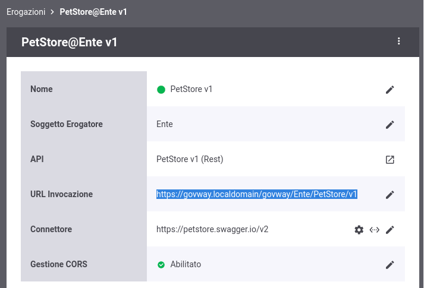
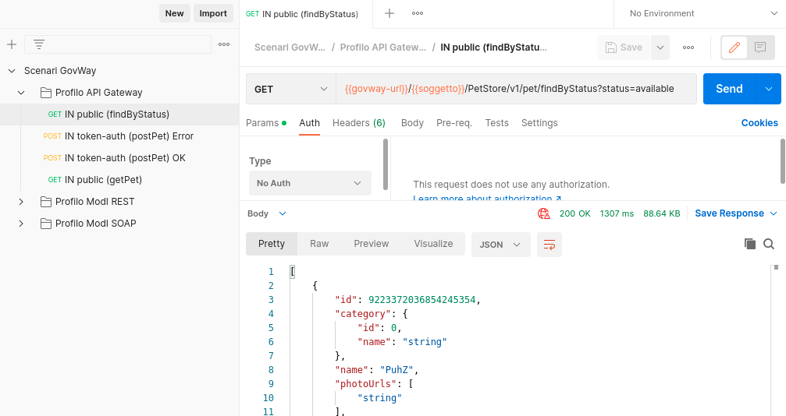

.. _scenari_erogazione_pubblica_esecuzione:

Esecuzione
----------

I fruitori del servizio "PetStore" invocano le operazioni disponibili tramite i propri client senza utilizzare alcuna forma di autenticazione, utilizzando come 'base-uri' la url di invocazione di GovWay

 Erogazione pubblica, url di invocazione

Avvalendosi del progetto Postman a corredo, eseguire *"IN public (findByStatus)"* per verificare l'esecuzione dell'erogazione del servizio PetStore con libero accesso.

 Erogazione pubblica, esecuzione da Postman

