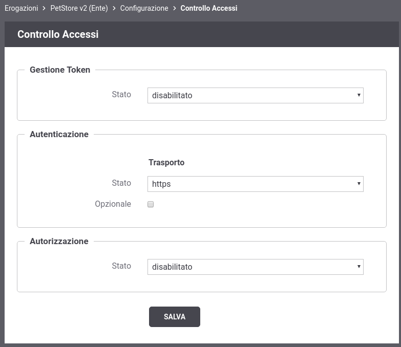
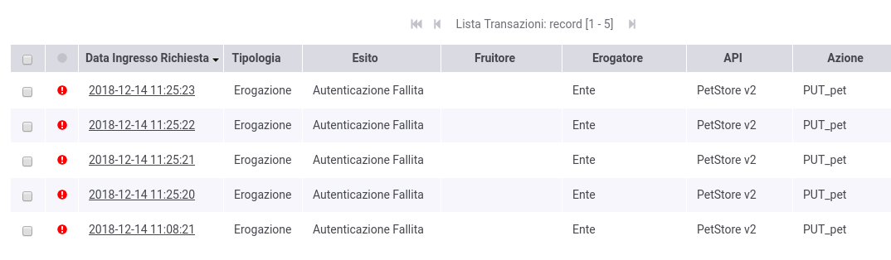

.. _authHTTPS:

Autenticazione Https
~~~~~~~~~~~~~~~~~~~~

Per tutte le richieste verso una erogazione o fruizione è possibile
abilitare l'autenticazione *'ssl'* del client in modo da accettare
solamente richieste in cui il client ha inviato il proprio certificato.

La terminazione ssl, con la configurazione dei certificati trusted, può
essere gestita direttamente sull'application server (es. wildfly,
tomcat) o può essere gestita da un frontend web (es. apache) il quale
deve però inoltrare le informazioni sui certificati client validati
all'application server (es. via mod\_jk).

.. figure:: ../../../_figure_scenari/oauth_scenario_ssl.png
    :scale: 100%
    :align: center
    :name: quick_oauthHTTPS_fig

    Scenario con autenticazione Https

-  **Configurazione Controllo degli Accessi**

   Per abilitare l'autenticazione *'ssl'* accedere alla sezione
   *'Erogazioni'* e selezionare l'API precedentemente registrata
   *'PetStore v2'*. Dopodichè accedere, dal dettaglio dell'erogazione,
   alla sezione *'Configurazione'* dove vengono visualizzate le
   funzionalità attive. Cliccare sulla voce presente nella colonna
   '*Controllo Accessi*\ ' e procedere con la modifica dello stato
   relativo all'\ *'Autenticazione'* con il valore *'https'*. Effettuata
   la configurazione salvarla cliccando sul pulsante 'Salva'.

    Configurazione Autenticazione Https

.. note:: **Reset Cache delle Configurazioni prima di un nuovo test**
       Le configurazioni accedute da GovWay vengono mantenute in una
       cache dopo il primo accesso per 2 ore, è quindi necessario
       forzare un reset della cache. Per farlo accedere alla sezione
       *'Strumenti' - 'Runtime'* e selezionare la voce
       *'ResetAllCaches'*.

   Di seguito replichiamo le invocazioni descritte nello scenario di :numref:`quick_oauthHTTPS_fig` e
   contestualmente vengono mostrate le funzionalità specifiche fornite
   da GovWay.

-  **Invocazione con certificato client ssl**

   Per effettuare una invocazione fornendo un certificato client è
   possibile utilizzare il seguente comando:

.. note:: **Docker**
       Nell'esempio si suppone di utilizzare l'installazione di GovWay
       realizzata tramite *'govway-docker'* disponibile su github
       all'indirizzo https://github.com/link-it/govway-docker.

       La directory indicata nei comandi *'DOCKER\_DIR'* corrisponde a
       quella indicata nel comando utilizzato per avviare il docker come
       descritto nel README del progetto.

       La password *'PASSWORD\_CHIAVE\_PRIVATA'* utilizzata nel comando
       deve corrispondere a quella presente nel file
       'DOCKER\_DIR/pki/esempi/test\_Client\_1/ee\_test\_Client\_1.README.txt'

   ::

       curl --resolve test.govway.org:8443:127.0.0.1 -v -X PUT "https://test.govway.org:8443/govway/Ente/PetStore/v2/pet" \
       --cacert DOCKER_DIR/pki/esempi/test_Client_1/ca_test.cert.pem \
       --pass 'PASSWORD_CHIAVE_PRIVATA' \
       --key DOCKER_DIR/pki/esempi/test_Client_1/ee_test_Client_1.key.pem \
       --key-type PEM \
       --cert DOCKER_DIR/pki/esempi/test_Client_1/ee_test_Client_1.cert.pem \
       --cert-type PEM \
       -H "accept: application/json" \
       -H "Content-Type: application/json" \
       -d '{
               "id": 3,
               "category": { "id": 22, "name": "dog" },
               "name": "doggie",
               "photoUrls": [ "http://image/dog.jpg" ],
               "tags": [ { "id": 23, "name": "white" } ],
               "status": "available"
       }'

   L'esito dell'aggiornamento termina con successo con un codice http
   200 e una risposta json equivalente alla richiesta.

   Attraverso la console *govwayMonitor* è possibile consultare lo
   storico delle transazioni che sono transitate nel gateway. Accedendo
   al dettaglio di una transazione, come mostrato dalla :numref:`quick_oauthTracciaSubjectCertificato_fig` si può
   vedere come il subject del certificato client utilizzato dal
   chiamante sia stato associato alla traccia.

.. figure:: ../../../_figure_scenari/oauthConsultazioneStoricoTransazioniSslInfo.png
    :scale: 100%
    :align: center
    :name: quick_oauthTracciaSubjectCertificato_fig

    Traccia dell'invocazione contenente il subject del certificato client

Sempre attraverso la console *govwayMonitor* è possibile ricercare
   tutte le transazioni che sono transitate sul gateway relative ad uno
   specifico certificato client. Per farlo si deve modificare i
   parametri relativi alla sezione 'Filtro Dati Mittente' presenti nel
   filtro di ricerca dello storico delle transazioni indicando:

   -  *Tipo*: selezionare l'opzione 'Identificativo Autenticato'

   -  *Autenticazione*: selezionare l'opzione 'https'

   -  *Ricerca Esatta*: se la ricerca la si vuole effettuare fornendo
      l'intero subject indicare 'si', se invece si fornisce una
      informazione parziale del subject indicare 'no'.

   -  *Case Sensitive*: indica se la ricerca deve essere effettuata
      considerando le maiuscole e minuscole.

   -  *Identificativo*: subject complessivo o porzione del subject da
      cercare

   I criteri di ricerca descritti nella :numref:`quick_oauthRicercaSubject_fig` ricercano le
   transazioni che contengono il subject utilizzato nell'esempio
   precedente. Per estrarre il subject dal certificato client è
   possibile utilizzare ad esempio il seguente comando:

   ::

       openssl x509 -in DOCKER_DIR/pki/esempi/test_Client_1/ee_test_Client_1.cert.pem -text -noout

   e si ottiene un output simile al seguente dove è possibile recuperare
   il subject *'C=it, O=govway.org, CN=test Client 1'*:

   ::

       Certificate:
           Data:
               Version: 3 (0x2)
               Serial Number: 203 (0xcb)
           Signature Algorithm: sha256WithRSAEncryption
               Issuer: C=it, O=govway.org, CN=GovWay CA
               Validity
                   Not Before: Dec 14 09:07:37 2018 GMT
                   Not After : Dec  3 09:07:37 2020 GMT
               Subject: C=it, O=govway.org, CN=test Client 1
               Subject Public Key Info:
                   Public Key Algorithm: rsaEncryption
                       Public-Key: (2048 bit)
                           ....

.. figure:: ../../../_figure_scenari/oauthConsultazioneStoricoTransazioniSslRicercaSubjectIntero.png
    :scale: 100%
    :align: center
    :name: quick_oauthRicercaSubject_fig

    Ricerca di transazioni con mittente identificato fornendo l'intero subject del certificato client

I criteri di ricerca descritti nella :numref:`quick_oauthRicercaSubjectParziale_fig` effettuano invece una
   ricerca che consente di ottenere le transazioni relative al subject
   utilizzato nell'esempio precedente, fornendo come criterio solamente
   il valore del 'CN'.

.. figure:: ../../../_figure_scenari/oauthConsultazioneStoricoTransazioniSslRicercaSubjectParziale.png
    :scale: 100%
    :align: center
    :name: quick_oauthRicercaSubjectParziale_fig

    Ricerca di transazioni con mittente identificato fornendo una parte del subject del certificato client

-  *Invocazione senza certificato ssl*.

   Con il seguente comando invochiamo sempre in https senza però fornire
   un certificato client e si otterrà un errore di autenticazione:

   ::

       curl --resolve test.govway.org:8443:127.0.0.1 -v -X PUT "https://test.govway.org:8443/govway/Ente/PetStore/v2/pet" \
       --cacert DOCKER_DIR/pki/esempi/test_Client_1/ca_test.cert.pem \
       -H "accept: application/json" \
       -H "Content-Type: application/json" \
       -d '{
               "id": 3,
               "category": { "id": 22, "name": "dog" },
               "name": "doggie",
               "photoUrls": [ "http://image/dog.jpg" ],
               "tags": [ { "id": 23, "name": "white" } ],
               "status": "available"
       }'

   L'esito dell'aggiornamento termina con un codice di errore http 401 e
   una risposta problem+json che riporta la motivazione:

   ::

       HTTP/1.1 401 Unauthorized
       Content-Type: application/problem+json
       Transfer-Encoding: chunked
       Server: GovWay
       GovWay-Transaction-ID: 6c13b9ac-3d60-45a6-9130-297a4d832824

       {
           "type":"https://httpstatuses.com/401",
           "title":"Unauthorized",
           "status":401,
           "detail":"Autenticazione fallita, credenziali non fornite",
           "govway_status":"protocol:GOVWAY-109"
       }

   Attraverso la console *govwayMonitor* è possibile consultare lo
   storico delle transazioni che sono transitate nel gateway. Dalla
   :numref:`quick_oauthRicercaAuthFallita_fig` si può vedere come le transazioni generate dopo la
   configurazione sopra indicata sono terminate con errore con esito
   *Autenticazione Fallita*.

    Tracce delle invocazioni terminate con errore 'Autenticazione Fallita'

Accedendo al dettaglio di una transazione terminata in errore, e
   visualizzandone i diagnostici è possibile comprendere l'errore che
   come atteso risulta essere riconducibile al fatto che non sono
   disponibili le credenziali del client.

.. figure:: ../../../_figure_scenari/oauthConsultazioneStoricoTransazioniErroreHttps_diagnostici.png
    :scale: 100%
    :align: center
    :name: quick_oauthDiagnosticiInvocazioneErrore_fig

    Diagnostici di una invocazione terminata con errore

-  *Invocazione in http*.

   Con il seguente comando invochiamo il servizio utilizzando http
   invece che https e si ottiene comunque un errore di autenticazione
   (sia che vengano generate o meno credenziali basic):

   ::

       curl -v -X PUT "http://127.0.0.1:8080/govway/Ente/PetStore/v2/pet" --basic --user test:123456  \
       -H "accept: application/json" \
       -H "Content-Type: application/json" \
       -d '{
               "id": 3,
               "category": { "id": 22, "name": "dog" },
               "name": "doggie",
               "photoUrls": [ "http://image/dog.jpg" ],
               "tags": [ { "id": 23, "name": "white" } ],
               "status": "available"
       }'

   L'esito dell'aggiornamento termina con un codice di errore http 401 e
   una risposta problem+json che riporta la motivazione:

   ::

       HTTP/1.1 401 Unauthorized
       Content-Type: application/problem+json
       Transfer-Encoding: chunked
       Server: GovWay
       GovWay-Transaction-ID: 6c13b9ac-3d60-45a6-9130-297a4d832824

       {
           "type":"https://httpstatuses.com/401",
           "title":"Unauthorized",
           "status":401,
           "detail":"Autenticazione fallita, credenziali non fornite",
           "govway_status":"protocol:GOVWAY-109"
       }

.. toctree::
        :maxdepth: 2

	mittenti
