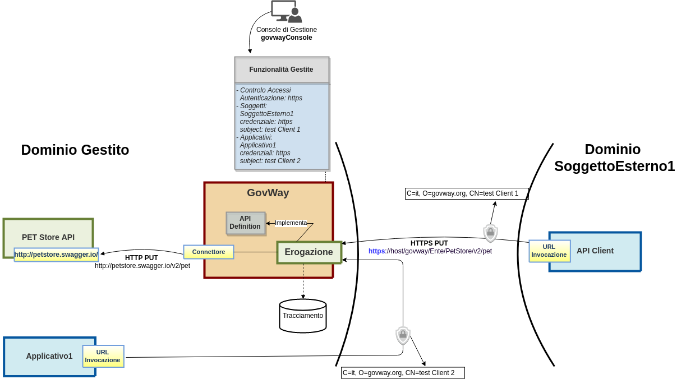
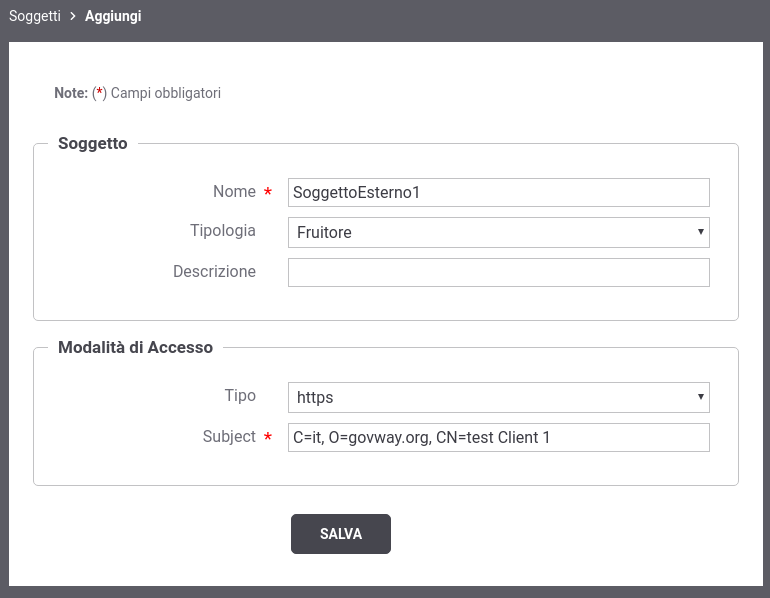
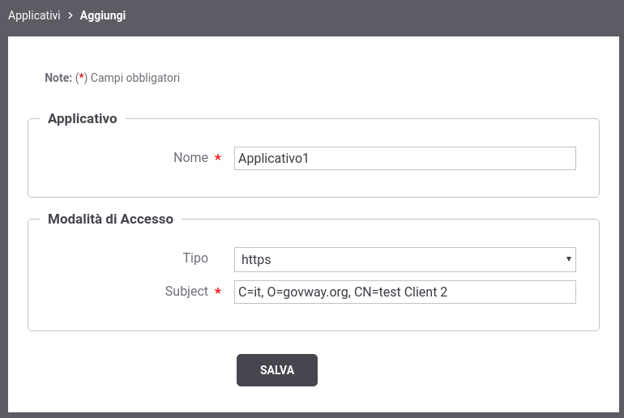
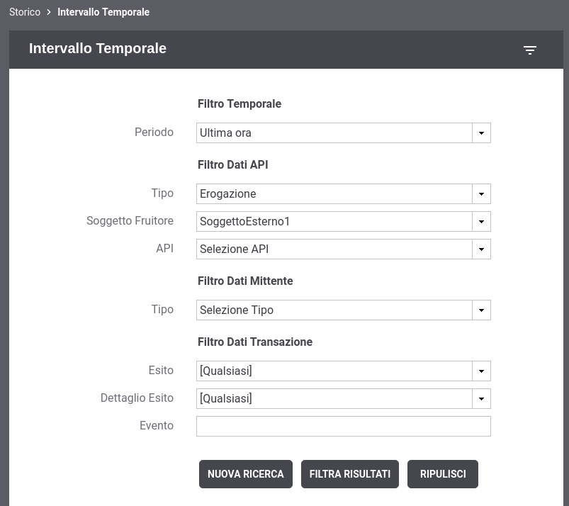
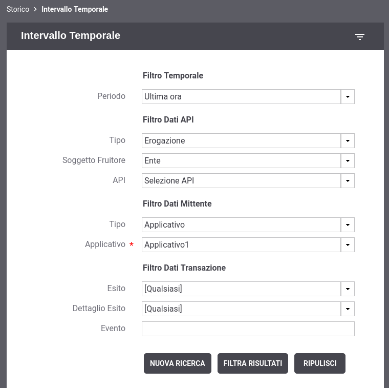

.. _authHTTPS_mittenti:

Identificazione dei Mittenti
^^^^^^^^^^^^^^^^^^^^^^^^^^^^

Il subject ottenuto grazie all'autenticazione 'https' può essere
utilizzato da GovWay per identificare un soggetto (client esterno al
dominio di gestione) o un applicativo (client interno al dominio di
gestione) registrato tramite la *'govwayConsole'*. Al momento della
registrazione, ad un soggetto o ad un applicativo gli viene associato il
subject.

L'identificazione puntuale di un mittente su GovWay permette di
beneficiare delle seguenti funzionalità:

-  *Tracciamento*: accedendo al dettaglio di una transazione, oltre alle
   credenziali utilizzate dal client verrà riportato l'identificativo
   con cui è stato registrato su GovWay.

-  *Ricerca*: nello storico delle transazioni è possibile cercare tutte
   le transazioni che possiedono il soggetto o l'applicativo mittente
   registrato su GovWay.

-  *Informazioni Statistiche*: sarà possibile ottenere distribuzioni
   temporali e reports statistici relativi ai soggetti o applicativi
   registrati 
   .. (per maggiori dettagli vedi sezione XXX analisiStatistica.

Nella :numref:`quick_oauthHTTPSIdMittenti_fig` viene mostrato un esempio di registrazione sia di un
soggetto, che rappresenta un client esterno al dominio di gestione, sia
di un applicativo interno al dominio gestito.

    Scenario con autenticazione Https e identificazione dei mittenti

Di seguito viene descritto come realizzare lo scenario di :numref:`quick_oauthHTTPSIdMittenti_fig`:

-  **Registrazione nuovo Soggetto del dominio esterno**

   Accedere alla sezione *'Soggetti'* e selezionare il pulsante
   *'Aggiungi'*. Fornire i seguenti dati:

   -  *Dominio*: selezionare la voce *'Esterno'*.

   -  *Nome*: indicare il nome del Soggetto che rappresenta il nuovo
      dominio esterno, ad esempio *'SoggettoEsterno1'*.

   -  *Tipologia*: selezionare la voce *'Fruitore'*.

   -  *Descrizione*: opzionalmente è possibile fornire una descrizione
      generica del soggetto.

   -  *Modalità Accesso - tipo*: indicare 'https'.

   -  *Modalità Accesso - subject*: deve essere indicato il Subject del
      certificato che il client esterno al dominio utilizzerà per
      invocare GovWay.

      Nel nostro esempio si suppone di utilizzare il certificato
      disponibile in
      *'DOCKER\_DIR/pki/esempi/test\_Client\_1/ee\_test\_Client\_1.cert.pem'*.
      Per estrarre il subject dal certificato client è possibile
      utilizzare ad esempio il seguente comando:

      ::

          openssl x509 -in DOCKER_DIR/pki/esempi/test_Client_1/ee_test_Client_1.cert.pem -text -noout

      e si ottiene un output simile al seguente dove è possibile
      recuperare il subject *'C=it, O=govway.org, CN=test Client 1'*:

      ::

          Certificate:
              Data:
                  Version: 3 (0x2)
                  Serial Number: 203 (0xcb)
              Signature Algorithm: sha256WithRSAEncryption
                  Issuer: C=it, O=govway.org, CN=GovWay CA
                  Validity
                      Not Before: Dec 14 09:07:37 2018 GMT
                      Not After : Dec  3 09:07:37 2020 GMT
                  Subject: C=it, O=govway.org, CN=test Client 1
                  Subject Public Key Info:
                      Public Key Algorithm: rsaEncryption
                          Public-Key: (2048 bit)
                              ....

    Registrazione nuovo Soggetto

-  **Registrazione Applicativo interno al dominio**

   Accedere alla sezione *'Applicativi'* e selezionare il pulsante
   *'Aggiungi'*. Fornire i seguenti dati:

   -  *Nome*: indicare il nome dell'applicativo che rappresenta
      l'applicazione client interna al dominio di gestione, ad esempio
      *'Applicativo1'*.

   -  *Modalità Accesso - tipo*: indicare 'https'.

   -  *Modalità Accesso - subject*: deve essere indicato il Subject del
      certificato che il client interno al dominio utilizzerà per
      invocare GovWay.

      Nel nostro esempio si suppone di utilizzare il certificato
      disponibile in
      *'DOCKER\_DIR/pki/esempi/test\_Client\_2/ee\_test\_Client\_2.cert.pem'*.
      Per estrarre il subject dal certificato client è possibile
      utilizzare ad esempio il seguente comando:

      ::

          openssl x509 -in DOCKER_DIR/pki/esempi/test_Client_2/ee_test_Client_2.cert.pem -text -noout

      e si ottiene un output simile al seguente dove è possibile
      recuperare il subject *'C=it, O=govway.org, CN=test Client 2'*:

      ::

          Certificate:
              Data:
                  Version: 3 (0x2)
                  Serial Number: 203 (0xcb)
              Signature Algorithm: sha256WithRSAEncryption
                  Issuer: C=it, O=govway.org, CN=GovWay CA
                  Validity
                      Not Before: Dec 14 09:07:37 2018 GMT
                      Not After : Dec  3 09:07:37 2020 GMT
                  Subject: C=it, O=govway.org, CN=test Client 2
                  Subject Public Key Info:
                      Public Key Algorithm: rsaEncryption
                          Public-Key: (2048 bit)
                              ....

    Registrazione nuovo Applicativo

-  *Invocazione con certificato ssl 'test Client 1'*.

   Simuliamo l'invocazione dell'api *PetStore* protetta da GovWay
   tramite autenticazione *'https'* tramite il seguente comando:

   ::

       curl --resolve test.govway.org:8443:127.0.0.1 -v -X PUT "https://test.govway.org:8443/govway/Ente/PetStore/v2/pet" \
       --cacert DOCKER_DIR/pki/esempi/test_Client_1/ca_test.cert.pem \
       --pass 'PASSWORD_CHIAVE_PRIVATA' \
       --key DOCKER_DIR/pki/esempi/test_Client_1/ee_test_Client_1.key.pem \
       --key-type PEM \
       --cert DOCKER_DIR/pki/esempi/test_Client_1/ee_test_Client_1.cert.pem \
       --cert-type PEM \
       -H "accept: application/json" \
       -H "Content-Type: application/json" \
       -d '{
               "id": 3,
               "category": { "id": 22, "name": "dog" },
               "name": "doggie",
               "photoUrls": [ "http://image/dog.jpg" ],
               "tags": [ { "id": 23, "name": "white" } ],
               "status": "available"
       }'

   L'esito dell'aggiornamento termina con successo con un codice http
   200 e una risposta json equivalente alla richiesta.

   Attraverso la console *govwayMonitor* è possibile consultare lo
   storico delle transazioni che sono transitate nel gateway. Accedendo
   al dettaglio di una transazione, come mostrato dalla :numref:`quick_oauthTracciaSoggettoMittente_fig` si può
   vedere come oltre al subject del certificato client utilizzato dal
   chiamante, alla traccia sia stato associato come mittente il soggetto
   identificato 'SoggettoEsterno1'.

.. figure:: ../../../_figure_scenari/oauthConsultazioneStoricoTransazioniSslInfoSoggetto.png
    :scale: 50%
    :align: center
    :name: quick_oauthTracciaSoggettoMittente_fig

    Traccia dell'invocazione contenente il soggetto mittente

Sempre attraverso la console *govwayMonitor* è possibile ricercare
   tutte le transazioni che sono transitate sul gateway relative ad uno
   specifico soggetto mittente. Per farlo si deve modificare i parametri
   relativi alla sezione 'Filtro Dati API' presenti nel filtro di
   ricerca dello storico delle transazioni indicando come soggetto
   mittente il soggetto 'SoggettoEsterno1'.

    Ricerca di transazioni di un soggetto mittente

-  *Invocazione con certificato ssl 'test Client 2'*.

   Simuliamo l'invocazione dell'api *PetStore* protetta da GovWay
   tramite autenticazione *'https'* tramite il seguente comando:

   ::

       curl --resolve test.govway.org:8443:127.0.0.1 -v -X PUT "https://test.govway.org:8443/govway/Ente/PetStore/v2/pet" \
       --cacert DOCKER_DIR/pki/esempi/test_Client_2/ca_test.cert.pem \
       --pass 'PASSWORD_CHIAVE_PRIVATA' \
       --key DOCKER_DIR/pki/esempi/test_Client_2/ee_test_Client_2.key.pem \
       --key-type PEM \
       --cert DOCKER_DIR/pki/esempi/test_Client_2/ee_test_Client_2.cert.pem \
       --cert-type PEM \
       -H "accept: application/json" \
       -H "Content-Type: application/json" \
       -d '{
               "id": 3,
               "category": { "id": 22, "name": "dog" },
               "name": "doggie",
               "photoUrls": [ "http://image/dog.jpg" ],
               "tags": [ { "id": 23, "name": "white" } ],
               "status": "available"
       }'

   La password *'PASSWORD\_CHIAVE\_PRIVATA'* utilizzata nel comando deve
   corrispondere a quella presente nel file
   'DOCKER\_DIR/pki/esempi/test\_Client\_2/ee\_test\_Client\_2.README.txt'

   L'esito dell'aggiornamento termina con successo con un codice http
   200 e una risposta json equivalente alla richiesta.

   Attraverso la console *govwayMonitor* è possibile consultare lo
   storico delle transazioni che sono transitate nel gateway. Accedendo
   al dettaglio di una transazione, come mostrato dalla :numref:`quick_oauthTracciaApplicativoMittente_fig` si può
   vedere come oltre al subject del certificato client utilizzato dal
   chiamante, alla traccia sia stato associato l'applicativo mittente
   identificato come 'Applicativo1'.

.. figure:: ../../../_figure_scenari/oauthConsultazioneStoricoTransazioniSslInfoApplicativo.png
    :scale: 100%
    :align: center
    :name: quick_oauthTracciaApplicativoMittente_fig

    Traccia dell'invocazione contenente l'applicativo mittente

Sempre attraverso la console *govwayMonitor* è possibile ricercare
   tutte le transazioni che sono transitate sul gateway relative ad uno
   specifico applicativo mittente. Per farlo si deve modificare i
   parametri relativi alla sezione 'Filtro Dati Mittente' presenti nel
   filtro di ricerca dello storico delle transazioni indicando:

   -  *Tipo*: selezionare l'opzione 'Applicativo'

   -  *Soggetto Fruitore* (sezione 'Filtro Dati API'): selezionare il
      soggetto del dominio gestito

   -  *Applicativo*: selezionare l'applicativo mittente delle
      transazioni che si desidera ricercare

    Ricerca di transazioni di un applicativo mittente
