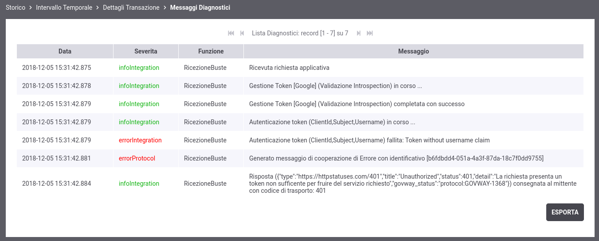
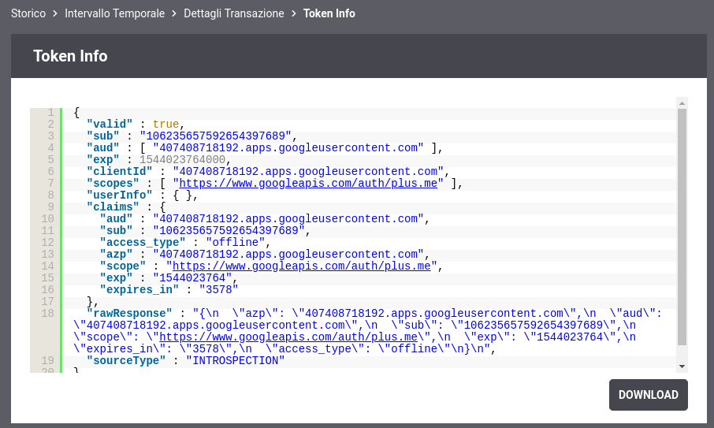
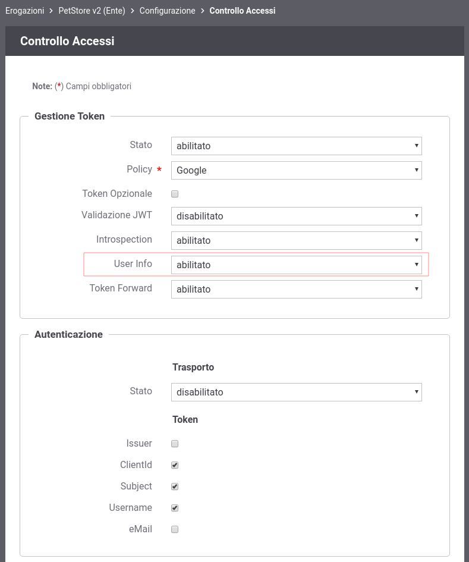
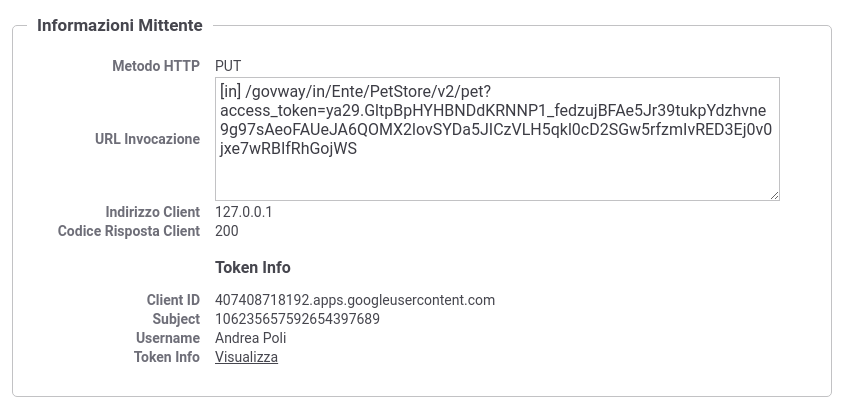
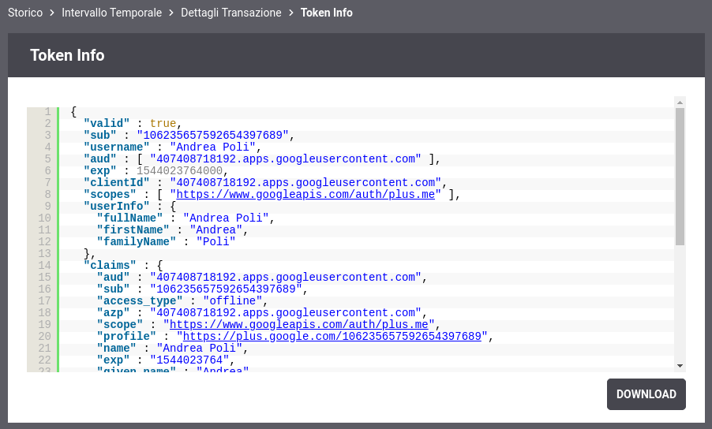

.. |br| raw:: html

     

.. _quickControlloAccessi_oauth_userInfo:

Autenticazione e OIDC UserInfo
~~~~~~~~~~~~~~~~~~~~~~~~~~~~~~

Nelle precedenti sezioni è stato mostrato come proteggere un'api in modo
che ogni richiesta debba possedere un *access token* valido rilasciato
da un *Authorization Server* censito su GovWay, nell'esempio Google. La
verifica di un *access token*, se opaco tramite il servizio di
Introspection (descritto nella sezione :ref:`validazioneIntrospection`), altrimenti tramite la
validazione JWT (sezione :ref:`quickValidazioneJWT`) permette a GovWay di conoscere i claims
associati al token come ad esempio il subject ('sub'), l'issuer ('iss')
etc e salvarli nella traccia come è stato mostrato nelle :numref:`quick_oauthStoricoTransazioniOKTokenInfo_fig` e :numref:`quick_oauthStoricoTransazioniOKTokenInfoJWT_fig`.

GovWay può essere configurato per verificare che un *access token*
presenti al suo interno alcuni claims che identificano i seguenti attori
principali nello scenario OAuth:

-  *Issuer* (claim 'iss'): identifica l'Authorization Server che ha
   generato il token (es. https://accounts.google.com).

-  *ClientId* (claim 'client\_id' o 'azp'): rappresenta l'applicazione,
   censita sull'Authorization Server, a cui è stato rilasciato il token
   (es. client Playground).

-  *Subject* (claim 'sub'): identifica l'utente, censito
   sull'Authorization Server (o IDP associato), che ha confermato le
   informazioni richiesti dall'applicazione e presenti nel token. Il
   Subject è presente se il rilascio di un token viene effettuato
   tramite dei flussi che prevedono l'interazione con l'utente il quale
   dovrà autenticarsi ed eventualmente autorizzare gli scope richiesti
   dall'applicazione. Il Subject è una informazione codificata (stringa
   o URI) che identifica univocamente l'utente nel dominio
   dell'Authorization Server (Issuer).

-  *Username* (claim 'username', 'preferred\_username' o 'name'):
   fornisce una rappresentazione 'human-readable' dell'utente.

-  *eMail* (claim 'email'): identifica l'indirizzo e-mail dell'utente.

Se viene abilitato un controllo e GovWay non rileva il claim dopo la
verifica dell'access token, la transazione termina con errore.

Le informazioni riguardanti l'\ *Username* e l'\ *eMail* potrebbero non
essere disponibili dopo la semplice validazione dell'access token (sia
introspection che jwt), e per ottenerle potrebbe essere necessario
richiedere maggiori informazioni sull'utente tramite il servizio *OIDC
UserInfo* dell'\ *Authorization Server*. Per maggiori informazioni a
riguardo si rimanda alla specifica `OIDC Connect -
UserInfo <https://openid.net/specs/openid-connect-core-1_0.html#UserInfo>`__.

.. figure:: ../../_figure_scenari/oauth_scenario_userInfo.png
    :scale: 100%
    :align: center
    :name: quick_oauthUserInfo_fig

    Scenario OAuth con accesso servizio UserInfo

Per simulare lo scenario utilizzeremo sempre il servizio *Playground* e
l'\ *Authorization Server di Google* descritto nella precedente sezione
:ref:`validazioneIntrospection`. Faremo un primo test in cui il Gateway non accede al servizio *User
Info* e vedremo come non è disponibile l'informazione sull'utente sotto
forma 'human-readable' che invece verrà recuperata abilitando
l'interazione con tale servizio.

-  **Configurazione Controllo degli Accessi**

   Accedere alla sezione *'Erogazioni'* e selezionare l'API
   precedentemente registrata *'PetStore v2'*. Dopodichè accedere, dal
   dettaglio dell'erogazione, alla sezione *'Configurazione'* dove
   vengono visualizzate le funzionalità attive. Cliccare sulla voce
   presente nella colonna '*Controllo Accessi*\ ' e procedere con la
   seguente configurazione all'interno della sezione *'Gestione Token'*:

   -  *Stato*: abilitato

   -  *Policy*: Google

   -  *Validazione JWT*: disabilitato

   -  *Introspection*: abilitato

   -  *User Info*: disabilitato

   -  *Token Forward*: abilitato

   Procedere inoltre con la seguente configurazione all'interno della
   sezione *'Autenticazione'*:

   -  *Trasporto - Stato*: disabilitato

   -  *Token - Issuer*: disabilitato

   -  *Token - ClientId*: abilitato

   -  *Token - Subject*: abilitato

   -  *Token - Username*: abilitato

   -  *Token - eMail*: disabilitato

   Effettuata la configurazione salvarla cliccando sul pulsante 'Salva'.

.. figure:: ../../_figure_scenari/oauthAutenticazioneConfig.png
    :scale: 100%
    :align: center
    :name: quick_oauthAutenticazione_fig

    Configurazione OAuth2 - Autenticazione

-  **Invocazione API**

.. note:: **Reset Cache delle Configurazioni prima di un nuovo test** 
       |br|
       Le configurazioni accedute da GovWay vengono mantenute in una
       cache dopo il primo accesso per 2 ore, è quindi necessario
       forzare un reset della cache. Per farlo accedere alla sezione
       *'Strumenti' - 'Runtime'* e selezionare la voce
       *'ResetAllCaches'*.

Per effettuare il test acquisire un token utilizzando l'applicazione
   *Playground* come descritto nella precedente sezione :ref:`validazioneIntrospection` e procedere
   con il seguente comando.

   ::

       curl -v -X PUT "http://127.0.0.1:8080/govway/Ente/PetStore/v2/pet?access_token=ACCESS_TOKEN" \
       -H "accept: application/json" \
       -H "Content-Type: application/json" \
       -d '{
               "id": 3,
               "category": { "id": 22, "name": "dog" },
               "name": "doggie",
               "photoUrls": [ "http://image/dog.jpg" ],
               "tags": [ { "id": 23, "name": "white" } ],
               "status": "available"
       }'

   L'esito dell'aggiornamento termina con un codice di errore http 401 e
   una risposta problem+json che riporta la motivazione:

   ::

       HTTP/1.1 401 Unauthorized
       WWW-Authenticate: Bearer realm="Google", error="insufficient_scope", error_description="The request requires higher privileges than provided by the access token"
       Content-Type: application/problem+json
       Transfer-Encoding: chunked
       Server: GovWay
       GovWay-Transaction-ID: 6c13b9ac-3d60-45a6-9130-297a4d832824

       {
           "type":"https://httpstatuses.com/401",
           "title":"Unauthorized",
           "status":401,
           "detail":"La richiesta presenta un token non sufficente per fruire del servizio richiesto",
           "govway_status":"protocol:GOVWAY-1368"
       }

-  **Consultazione Tracce in errore**

   Attraverso la console *govwayMonitor* è possibile consultare lo
   storico delle transazioni che sono transitate nel gateway. Dalla
   figura ? si può vedere come le transazioni generate dopo la
   configurazione sopra indicata sono terminate con errore con esito
   *Autenticazione Fallita*.

.. figure:: ../../_figure_scenari/oauthConsultazioneStoricoTransazioniErroreUserInfo.png
    :scale: 100%
    :align: center
    :name: quick_oauthAutenticazioneFallita_fig

    Tracce delle invocazioni terminate con errore 'Autenticazione Fallita'

Accedendo al dettaglio di una transazione terminata in errore, e
   visualizzandone i diagnostici è possibile comprendere l'errore che
   come atteso risulta essere la mancanza dell'informazione *Username*
   richiesta obbligatoriamente tramite la sezione *'Autenticazione'*
   precedentemente configurata

    Diagnostici di una invocazione terminata con errore

Cliccando sul link *'Visualizza'* della voce *'Token Info'* è
   possibile comunque vedere tutti i claims presenti nel token, dove si
   denota come non sia presente uno dei claim che rappresenta
   l'informazione 'Username'.

    Informazioni presenti nel Token

-  **Abilitazione UserInfo in Configurazione Controllo degli Accessi**

   Tramite la *govwayConsole* accedere nuovamente alla maschera di
   configurazione '*Controllo Accessi*\ ' dell'API *'PetStore v2'* ed
   abilitare stavolta anche il servizio *'User Info'*.

    Configurazione OAuth2 - Autenticazione

-  **Nuova invocazione API**

.. note:: **Reset Cache delle Configurazioni prima di un nuovo test**
       |br|
       Effettuare il reset della cache accedendo alla sezione
       *'Strumenti' - 'Runtime'* e selezionare la voce
       *'ResetAllCaches'*.

Per effettuare il test acquisire un token utilizzando l'applicazione
   *Playground* come descritto nella precedente sezione :ref:`validazioneIntrospection` e procedere
   con il seguente comando.

   ::

       curl -v -X PUT "http://127.0.0.1:8080/govway/Ente/PetStore/v2/pet?access_token=ACCESS_TOKEN" \
       -H "accept: application/json" \
       -H "Content-Type: application/json" \
       -d '{
               "id": 3,
               "category": { "id": 22, "name": "dog" },
               "name": "doggie",
               "photoUrls": [ "http://image/dog.jpg" ],
               "tags": [ { "id": 23, "name": "white" } ],
               "status": "available"
       }'

   L'esito dell'aggiornamento termina stavolta con successo con un
   codice http 200 e una risposta json equivalente alla richiesta.

-  **Consultazione Tracce**

   Attraverso la console *govwayMonitor* è possibile adesso vedere che
   le richieste transitano con successo sul gateway. Accedendo al
   dettaglio di una transazione, tra le varie informazioni presenti
   nella sezione *'Informazioni Mittente'*, sono presenti tutte e tre le
   informazioni principali attese: ClientId, Subject e Username.

    Traccia di una invocazione terminata con successo

Cliccando sul link *'Visualizza'* della voce *'Token Info'* è
   possibile vedere tutti i claims presenti nel token, tra cui è
   possibile constatare la presenza dei claims estratti grazie
   all'invocazione del servizio *'User Info'*.

    Informazioni presenti in un Token JWT
