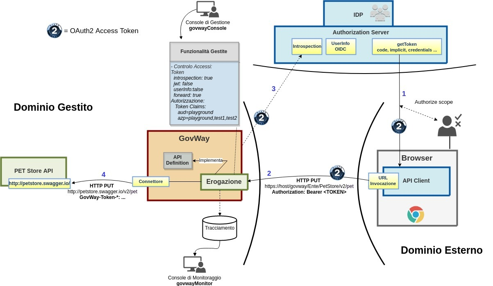
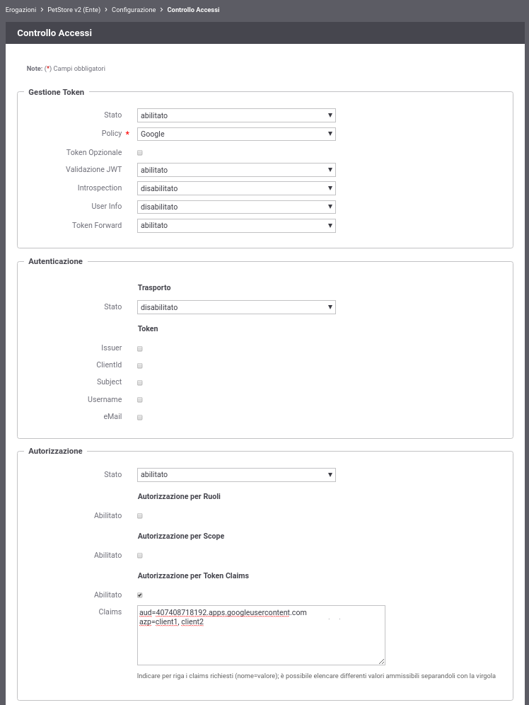

.. |br| raw:: html

     

.. _authClaims:

Autorizzazione sui Claims
~~~~~~~~~~~~~~~~~~~~~~~~~

Oltre ad una autorizzazione sugli scope, descritta nello scenario della sezione :ref:`scopeAuth`,
GovWay può essere configurato per verificare ulteriori claims ottenuti
tramite la validazione dell'access token. La validazione che verrà
descritta in questa sezione consiste in una validazione semplice la cui
logica si basa sulla semplice constatazione che uno o più claim siano
stati riscontrati all'interno del token e possiedano il valore atteso.
Per validazione più complesse si rimanda all'utilizzo di una policy
XACML descritta nello scenario della sezione :ref:`authXACML`.

Per simulare lo scenario utilizzeremo sempre il servizio *Playground* e
l'\ *Authorization Server di Google* descritto nella precedente sezione
:ref:`validazioneIntrospection`.

Verrà configurato GovWay al fine di effettuare le seguenti verifiche
all'interno del token:

-  *Audience* (claim 'aud'): contenga l'identificativo dell'applicazione
   *Playground* come destinatario del token

-  *Applicazione Client* (claim 'azp'): controlleremo che il client
   appartenga ad uno delle applicazioni conosciute. Nell'elenco,
   inseriremo l'identificativo di *Playground* in modo da completare con
   successo la verifica.

    Scenario OAuth con autorizzazione sui Claims

-  **Configurazione Controllo degli Accessi**

   Accedere alla sezione *'Erogazioni'* e selezionare l'API
   precedentemente registrata *'PetStore v2'*. Dopodichè accedere, dal
   dettaglio dell'erogazione, alla sezione *'Configurazione'* dove
   vengono visualizzate le funzionalità attive. Cliccare sulla voce
   presente nella colonna '*Controllo Accessi*\ ' e procedere con la
   seguente configurazione all'interno della sezione *'Gestione Token'*:

   -  *Stato*: abilitato

   -  *Policy*: Google

   -  *Validazione JWT*: disabilitato

   -  *Introspection*: abilitato

   -  *User Info*: disabilitato

   -  *Token Forward*: abilitato

   Procedere inoltre con la seguente configurazione all'interno della
   sezione *'Autorizzazione'*:

   -  *Autorizzazione - Stato*: abilitato

   -  *Autorizzazione per Token Claims - Stato*: abilitato

   -  *Claims*, configuriamo l'identificativo dell'applicazione
      Playground come valore atteso per il claim 'aud', mentre forniamo
      una lista di valori tra i quali non è presente l'applicazione
      Playground per il claim 'azp':

.. note:: **Per conoscere l’identificativo dell’applicazione Playground**
	 |br|
          È possibile vedere una precedente transazione terminata con
          successo per conoscere l'esatto valore associato
          all'applicazione *Playground* (es. :numref:`quick_oauthStoricoTransazioniOKTokenInfo_fig`).

      -  aud=407408718192.apps.googleusercontent.com

      -  azp=client1, client2

   Effettuata la configurazione salvarla cliccando sul pulsante 'Salva'.

    Configurazione OAuth2 - Autorizzazione

-  **Invocazione API**

.. note:: **Reset Cache delle Configurazioni prima di un nuovo test**
       |br|
       Le configurazioni accedute da GovWay vengono mantenute in una
       cache dopo il primo accesso per 2 ore, è quindi necessario
       forzare un reset della cache. Per farlo accedere alla sezione
       *'Strumenti' - 'Runtime'* e selezionare la voce
       *'ResetAllCaches'*.

   Per effettuare il test utilizzare il token ottenuto come descritto
   nella sezione :ref:`validazioneIntrospection`.

   ::

       curl -v -X PUT "http://127.0.0.1:8080/govway/Ente/PetStore/v2/pet?access_token=ACCESS_TOKEN" \
       -H "accept: application/json" \
       -H "Content-Type: application/json" \
       -d '{
               "id": 3,
               "category": { "id": 22, "name": "dog" },
               "name": "doggie",
               "photoUrls": [ "http://image/dog.jpg" ],
               "tags": [ { "id": 23, "name": "white" } ],
               "status": "available"
       }'

   L'esito dell'aggiornamento termina con un codice di errore http 403 e
   una risposta problem+json che riporta la motivazione:

   ::

       HTTP/1.1 403 Forbidden
       WWW-Authenticate: Bearer realm="Google", error="insufficient_scope", error_description="The request requires higher privileges than provided by the access token"
       Content-Type: application/problem+json
       Transfer-Encoding: chunked
       Server: GovWay
       GovWay-Transaction-ID: 6c13b9ac-3d60-45a6-9130-297a4d832824

       {
           "type":"https://httpstatuses.com/403",
           "title":"Forbidden",
           "status":403,
           "detail":"La richiesta presenta un token non sufficente per fruire del servizio richiesto",
           "govway_status":"protocol:GOVWAY-1368"
       }

-  **Consultazione Tracce in errore**

   Attraverso la console *govwayMonitor* è possibile consultare lo
   storico delle transazioni che sono transitate nel gateway. Dalla
   :numref:`quick_oauthTracceAutorizzazioneNegata_fig` si può vedere come le transazioni generate dopo la
   configurazione sopra indicata sono terminate con errore con esito
   *Autorizzazione Negata*.

.. figure:: ../../_figure_scenari/oauthConsultazioneStoricoTransazioniErroreClaim.png
    :scale: 100%
    :align: center
    :name: quick_oauthTracceAutorizzazioneNegata_fig

    Tracce delle invocazioni terminate con errore 'Autorizzazione Negata'

Accedendo al dettaglio di una transazione terminata in errore, e
   visualizzandone i diagnostici è possibile comprendere l'errore che
   come atteso risulta essere un valore sconosciuto per quanto concerne
   il claim 'azp'.

.. figure:: ../../_figure_scenari/oauthConsultazioneStoricoTransazioniErroreClaim_diagnostici.png
    :scale: 100%
    :align: center
    :name: quick_oauthDiagnosticiErrore2_fig

    Diagnostici di una invocazione terminata con errore

-  **Registrazione ClientId corretto in Controllo degli Accessi**

   Tramite la *govwayConsole* accedere nuovamente alla maschera di
   configurazione '*Controllo Accessi*\ ' dell'API *'PetStore v2'*;
   all'interno della sezione *'Autorizzare'* modificare il valore del
   claim 'azp' aggiungendo l'applicazione *Playground*:

   -  aud=407408718192.apps.googleusercontent.com

   -  azp=client1, client2, 407408718192.apps.googleusercontent.com

.. figure:: ../../_figure_scenari/oauthAutorizzazioneConfigClaim2red.png
    :scale: 100%
    :align: center
    :name: quick_oauthClaimsOK_fig

    Configurazione OAuth2 - Autorizzazione dei claims corretta

-  **Nuova invocazione API**

.. note:: **Reset Cache delle Configurazioni prima di un nuovo test**
       |br|
       Effettuare il reset della cache accedendo alla sezione
       *'Strumenti' - 'Runtime'* e selezionare la voce
       *'ResetAllCaches'*.

   Effettuare una nuova invocazione del test.

   ::

       curl -v -X PUT "http://127.0.0.1:8080/govway/Ente/PetStore/v2/pet?access_token=ACCESS_TOKEN" \
       -H "accept: application/json" \
       -H "Content-Type: application/json" \
       -d '{
               "id": 3,
               "category": { "id": 22, "name": "dog" },
               "name": "doggie",
               "photoUrls": [ "http://image/dog.jpg" ],
               "tags": [ { "id": 23, "name": "white" } ],
               "status": "available"
       }'

   L'esito dell'aggiornamento termina stavolta con successo con un
   codice http 200 e una risposta json equivalente alla richiesta.
