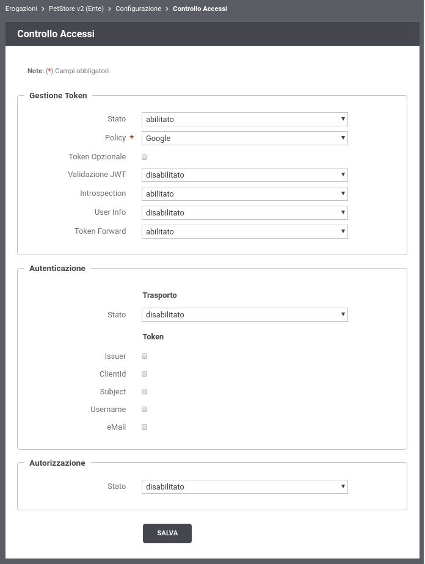
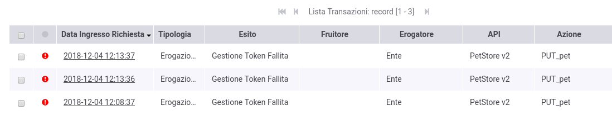
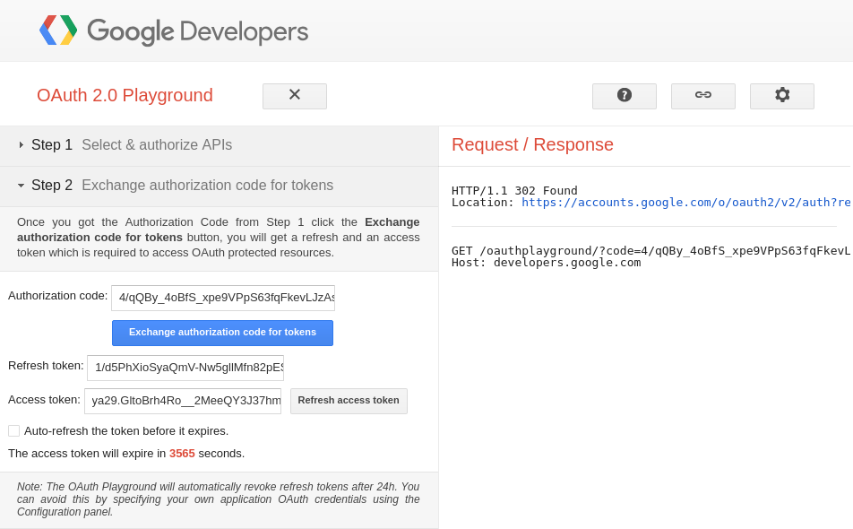
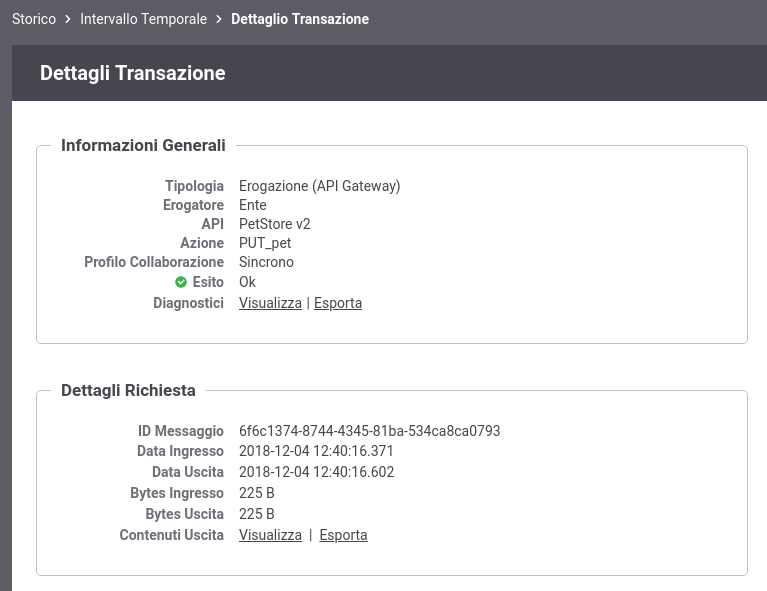
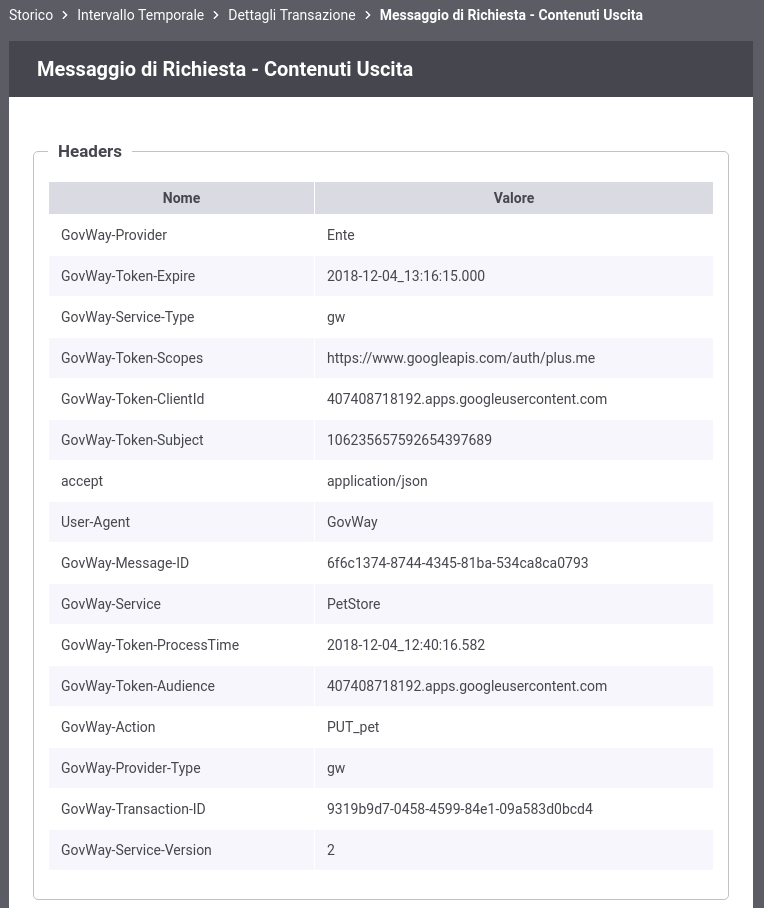

.. |br| raw:: html

     

.. _validazioneIntrospection:

Validazione tramite Introspection
~~~~~~~~~~~~~~~~~~~~~~~~~~~~~~~~~

In questa sezione viene descritto come realizzare lo scenario
raffigurato nella :numref:`quick_oauth_fig` dove GovWay utilizza il servizio
Introspection dell'\ *Authorization Server di Google* per validare
l'\ *access token* ricevuto.

-  **Configurazione Controllo degli Accessi**

   Accedere alla sezione *'Erogazioni'* e selezionare l'API
   precedentemente registrata *'PetStore v2'*. Dopodichè accedere, dal
   dettaglio dell'erogazione, alla sezione *'Configurazione'* dove
   vengono visualizzate le funzionalità attive. Per abilitare una
   protezione dell'api basata su *OAuth* cliccare sulla voce presente
   nella colonna '*Controllo Accessi*\ ' e procedere con la seguente
   configurazione all'interno della sezione *'Gestione Token'*:

   -  *Stato*: abilitato

   -  *Policy*: Google

   -  *Validazione JWT*: disabilitato

   -  *Introspection*: abilitato

   -  *User Info*: disabilitato

   -  *Token Forward*: abilitato

   Effettuata la configurazione salvarla cliccando sul pulsante 'Salva'.

    Configurazione OAuth2 per PetStore

-  **Invocazione API senza un access token**

.. note:: **Reset Cache delle Configurazioni prima di un nuovo test**
       |br|
       Le configurazioni accedute da GovWay vengono mantenute in una
       cache dopo il primo accesso per 2 ore, è quindi necessario
       forzare un reset della cache. Per farlo accedere alla sezione
       *'Strumenti' - 'Runtime'* e selezionare la voce
       *'ResetAllCaches'*.

Al termine di questi passi di configurazione il servizio REST sarà
invocabile solamente se viene fornito un *access token*. Con il
seguente comando è possibile constatare come una richiesta che non
possieda l'\ *access token* viene rifiutata da GovWay.

   ::

       curl -v -X PUT "http://127.0.0.1:8080/govway/Ente/PetStore/v2/pet" \
       -H "accept: application/json" \
       -H "Content-Type: application/json" \
       -d '{
               "id": 3,
               "category": { "id": 22, "name": "dog" },
               "name": "doggie",
               "photoUrls": [ "http://image/dog.jpg" ],
               "tags": [ { "id": 23, "name": "white" } ],
               "status": "available"
       }'

   L'esito dell'aggiornamento termina con un codice di errore http 400 e
   una risposta problem+json che riporta la motivazione:

   ::

       HTTP/1.1 400 Bad Request
       WWW-Authenticate: Bearer realm="Google", error="invalid_request", error_description="The request is missing a required token parameter"
       Content-Type: application/problem+json
       Transfer-Encoding: chunked
       Server: GovWay
       GovWay-Transaction-ID: 6c13b9ac-3d60-45a6-9130-297a4d832824

       {
           "type":"https://httpstatuses.com/400",
           "title":"Bad Request",
           "status":400,
           "detail":"Token non presente",
           "govway_status":"protocol:GOVWAY-1366"
       }

-  **Consultazione Tracce in errore**

   Attraverso la console *govwayMonitor* è possibile consultare lo
   storico delle transazioni che sono transitate nel gateway. Dalla
   :numref:`quick_oauthStoricoTransazioniErrore_fig` si può vedere come le transazioni generate dopo la
   configurazione sopra indicata sono terminate con errore con esito
   *Gestione Token Fallita*.

    Tracce delle invocazioni terminate con errore 'Gestione Token Fallita'

-  **Acquisizione Access Token**

   Per simulare l'acquisizione di un token è possibile utilizzare
   l'applicazione *Playground*, disponibile all'indirizzo
   ` <https://developers.google.com/oauthplayground/>`__, che consente
   di richiedere un *access token* all'\ *Authorization Server di
   Google*.

   L'applicazione *Playground* consente agevolmente di ottenere
   l'\ *access token*:

   1. *Selezione scope*

      Devono essere selezionati gli *scope* che un'applicazione client
      necessita per invocare poi effettivamente le API di Google. Ad
      esempio selezioniamo lo scope
      *'https://www.googleapis.com/auth/plus.me'* che permette
      all'applicazione di conoscere l'identità di un utente su google.
      Cliccando infine sul pulsante *'Authorize APIs'* si verrà
      rediretti alla pagina di autenticazione in google dove si dovrà
      procedere ad autenticarsi.

.. figure:: ../../_figure_scenari/oauthIntrospectionPlaygroundStep1.png
    :scale: 100%
    :align: center
    :name: quick_oauthPlaygroundStep1_fig

    Ottenimento Token: Playground Google, Step 1

    2. *Authorization Code*

      Effettuata l'autenticazione in Google si viene rediretti alla
      seconda fase prevista dall'applicazione *Playground* denominata
      *'Exchange authorization code for tokens'*.

    Ottenimento Token: Playground Google, Step 2

    3. *Access Token*

      Cliccando sul pulsante *'Exchange authorization code for tokens'*
      si ottiene infine un *access token* da estrarre nella risposta
      http visualizzata sulla destra dell'applicazione.

.. figure:: ../../_figure_scenari/oauthIntrospectionPlaygroundStep3.png
    :scale: 100%
    :align: center
    :name: quick_oauthPlaygroundStep3_fig

    Ottenimento Token: Playground Google, Step 3

-  **Invocazione API con un access token**

   Con il seguente comando è possibile effettuare una richiesta che
   possiede l'\ *access token* ottenuto nella precedente fase.

.. note:: **Bearer Token Usage**
       |br|
       Un *access token* può essere incluso nella richiesta tramite una
       delle modalità definite dalla specifica `RFC
       6750 <https://tools.ietf.org/html/rfc6750>`__.

::

       curl -v -X PUT "http://127.0.0.1:8080/govway/Ente/PetStore/v2/pet?access_token=ACCESS_TOKEN" \
       -H "accept: application/json" \
       -H "Content-Type: application/json" \
       -d '{
               "id": 3,
               "category": { "id": 22, "name": "dog" },
               "name": "doggie",
               "photoUrls": [ "http://image/dog.jpg" ],
               "tags": [ { "id": 23, "name": "white" } ],
               "status": "available"
       }'

   L'esito dell'aggiornamento viene confermato con un codice http 200 e
   una risposta json equivalente alla richiesta:

::

       HTTP/1.1 200 OK
       Access-Control-Allow-Origin: *
       Access-Control-Allow-Methods: GET, POST, DELETE, PUT
       Access-Control-Allow-Headers: Content-Type, api_key, Authorization
       Content-Type: application/json
       Transfer-Encoding: chunked
       Server: GovWay
       GovWay-Message-ID: 84e1d9a4-c181-436f-b7f0-4cabf55c370d
       GovWay-Transaction-ID: 6c13b9ac-3d60-45a6-9130-297a4d832824

       {
           "id":3,
           "category":{"id":22,"name":"dog"},
           "name":"doggie",
           "photoUrls":["http://image/dog.jpg"],
           "tags":[{"id":23,"name":"white"}],
           "status":"available"
       }

-  **Consultazione Tracce**

   Attraverso la console *govwayMonitor* è possibile adesso vedere che
   le richieste transitano con successo sul gateway. Accedendo al
   dettaglio di una transazione, tra le varie informazioni presenti
   nella sezione *'Informazioni Mittente'*, sono presenti le
   informazioni principali estratte dal token (es. Subject presente nel
   claim 'sub').

.. figure:: ../../_figure_scenari/oauthConsultazioneStoricoTransazioniOk.png
    :scale: 100%
    :align: center
    :name: quick_oauthStoricoTransazioniOK_fig

    Traccia di una invocazione terminata con successo

Cliccando sul link *'Visualizza'* della voce *'Token Info'* è
   possibile vedere tutti i claims presenti nel token, tra cui è
   possibile constatare la presenza del cliam *scope* valorizzato con
   quanto richiesto tramite l'applicazione Playground.

.. figure:: ../../_figure_scenari/oauthConsultazioneStoricoTransazioniOkTokenInfo.png
    :scale: 100%
    :align: center
    :name: quick_oauthStoricoTransazioniOKTokenInfo_fig

    Informazioni ottenute tramite Introspection del Token

-  **Invocazione API con un access token non valido**

   GovWay utilizza il servizio Introspection di Google per validatore
   l'\ *access token* ricevuto. E' possibile ottenere un errore di
   validazione attendendo che l'access token scada o falsificandolo
   modificando ad esempio i primi caratteri.

   ::

       curl -v -X PUT "http://127.0.0.1:8080/govway/Ente/PetStore/v2/pet?access_token=ERR_ACCESS_TOKEN" \
       -H "accept: application/json" \
       -H "Content-Type: application/json" \
       -d '{
               "id": 3,
               "category": { "id": 22, "name": "dog" },
               "name": "doggie",
               "photoUrls": [ "http://image/dog.jpg" ],
               "tags": [ { "id": 23, "name": "white" } ],
               "status": "available"
       }'

   L'esito dell'aggiornamento termina con un codice di errore http 401 e
   una risposta problem+json che riporta la motivazione:

   ::

       HTTP/1.1 401 Unauthorized
       WWW-Authenticate: Bearer realm="Google", error="invalid_token", error_description="Token invalid"
       Content-Type: application/problem+json
       Transfer-Encoding: chunked
       Server: GovWay
       GovWay-Transaction-ID: 6c13b9ac-3d60-45a6-9130-297a4d832824

       {
           "type":"https://httpstatuses.com/401",
           "title":"Unauthorized",
           "status":401,
           "detail":"Token non valido",
           "govway_status":"protocol:GOVWAY-1367"
       }

-  **Forward Token Info all'Applicativo**

   La configurazione descritta precedentemente indicava di abilitare la
   funzionalità *'Token Forward'* all'interno della sezione *'Gestione
   Token'* (vedi :numref:`quick_oauthIntrospectionConfig_fig`). Tale configurazione fa sì che GovWay inoltri
   all'applicativo interno al dominio (nel nostro esempio il servizio
   *PetStore*) le informazioni inerenti il token ricevuto sotto forma di
   header http. Differenti modalità di consegna di tali informazioni
   vengono descritte nella sezione :ref:`tokenForward`.

   Per vedere quali header vengono effettivamente prodotti possiamo
   utilizzare la funzionalità *'Registrazione Messaggi'* .
   .. descritta nel dettaglio nella sezione XXXX quick_registrazioneMessaggi 
   Accedere alla sezione *'Erogazioni'* e
   selezionare l'API precedentemente registrata *'PetStore v2'*.
   Dopodichè accedere, dal dettaglio dell'erogazione, alla sezione
   *'Configurazione'* dove vengono visualizzate le funzionalità attive.
   Per abilitare la registrazione degli header cliccare sulla voce
   presente nella colonna '*Registrazione Messaggi*\ ' e procedere con
   la seguente configurazione.

   -  *'Generale - Stato'*: ridefinito

   -  *'Richiesta - Stato'*: abilitato

   -  *'Richiesta - Ingresso'*: disabilitare tutte le voci

   -  *'Richiesta - Uscita'*: abilitare solo la voce relativa agli
      header

   -  *'Risposta - Stato'*: disabilitato

   Effettuata la configurazione salvarla cliccando sul pulsante 'Salva'.

.. figure:: ../../_figure_scenari/oauthConfigurazioneDump.png
    :scale: 100%
    :align: center
    :name: quick_oauthConfigDump_fig

    Configurazione Registrazione Messaggi per visualizzare Header HTTP

Prima di procedere con una nuova richiesta effettuare il reset della
   cache delle configurazioni accedendo alla sezione *'Strumenti' -
   'Runtime'* e selezionare la voce *'ResetAllCaches'*.

   Effettuare quindi una nuova invocazione contenente un *access token*
   valido e successivamente consultare il dettaglio della transazione
   tramite la *govWayMonitor*. Nel dettaglio sarà adesso disponibile la
   voce *'Contenuti Uscita'* (:numref:`quick_oauthConfigDumpVisualizzaHeader_fig`) che permette di vedere gli header http
   prodotti da GovWay (:numref:`quick_oauthConfigDumpHeaders_fig`).

    Dettaglio della transazione con contenuti

    Header HTTP prodotti da GovWay contenenti le informazioni sul Token
