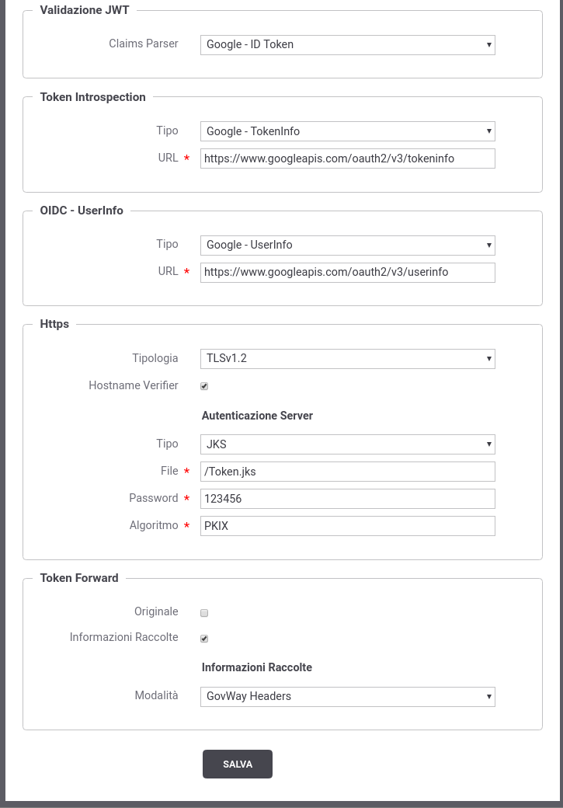

.. _registrazioneAuthServer:

Registrazione Authorization Server
~~~~~~~~~~~~~~~~~~~~~~~~~~~~~~~~~~

Per poter definire politiche di controllo degli accessi basate sui Token
è necessario creare delle Token Policy da riferire nel *'Controllo degli
Accessi'* delle specifiche erogazioni e fruizioni come è stato descritto
nei precedenti paragrafi (vedi ad es. :numref:`quick_oauthIntrospectionConfig_fig`).

Ogni Token Policy definisce la configurazione necessaria al Gateway per
interagire con uno specifico Authorization Server. All'interno di una
Token Policy vengono definite:

-  *Posizione Token*: indica dove il gateway si attende di ricevere il
   token.

-  *Validazione JWT*: indica se la validazione di un token '*JWT*\ '
   (`RFC 7519 <https://tools.ietf.org/html/rfc7519>`__) è utilizzabile e
   nel caso tutti i parametri (es. keystore, claim parser) necessari a
   validarlo secondo la specifica JWS (`RFC
   7515 <https://tools.ietf.org/html/rfc7515>`__) o JWE (`RFC
   7516 <https://tools.ietf.org/html/rfc7516>`__).

-  *Token Introspection*: indica se la validazione di un token tramite
   il servizio Introspection (definito dalla specifica `RFC
   7662 <https://tools.ietf.org/html/rfc7662>`__) è utilizzabile. Poichè
   tale servizio deve essere disponibile sull'\ *Authorization Server*
   devono essere forniti i parametri necessari all'invocazione
   (endpoint, configurazione ssl ...).

-  *OIDC - UserInfo*: le informazioni riguardanti ad esempio
   l'\ *Username* e l'\ *eMail* potrebbero non essere disponibili dopo
   la semplice validazione dell'access token (sia introspection che
   jwt), e per ottenerle è necessario richiedere maggiori informazioni
   sull'utente tramite il servizio *OIDC UserInfo* (definito dalla
   specifica `OIDC Connect -
   UserInfo <https://openid.net/specs/openid-connect-core-1_0.html#UserInfo>`__).
   Anche per questo servizio, che deve essere disponibile
   sull'\ *Authorization Server*, devono essere forniti i parametri
   necessari alla sua invocazione (endpoint, configurazione ssl ...).

-  *Token Forward*: definisce come le informazioni raccolte durante la
   validazione del token e/o il token originale vengono inoltrate
   all'applicativo. Per maggiori dettagli vedere la sezione :ref:`tokenForward`

Per modificare una Token Policy esistente (es. Google), o crearne di
nuove, cliccare sul menù nella voce *'Configurazione - Token Policy'*
della govwayConsole. Per creare una nuova policy si utilizza il pulsante
*Aggiungi* mentre per modificarne una esistente si deve cliccare sul
nome della Policy.

.. figure:: ../../_figure_scenari/TokenPolicy-google-parte1.png
    :scale: 100%
    :align: center
    :name: quick_oauthTokenPolicyEsempio1_fig

    Token Policy di esempio: Google (1/2)

    Token Policy di esempio: Google (2/2)
