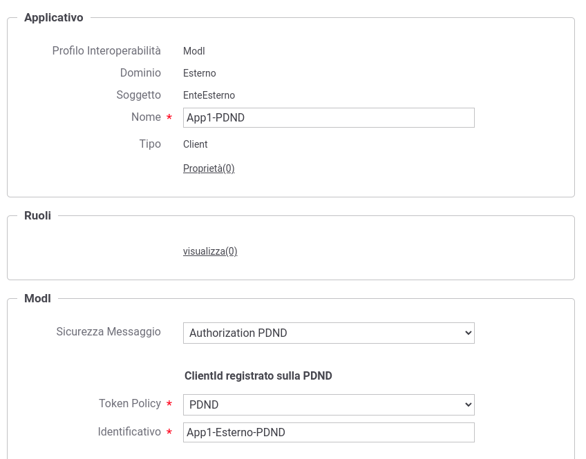

.. _scenari_erogazione_rest_modipa_audit_01_configurazione:

Configurazione
--------------

.. note::

  Per operare con la govwayConsole in modo conforme a quanto previsto dalla specifica del Modello di Interoperabilità si deve attivare, nella testata dell'interfaccia, il Profilo di Interoperabilità 'ModI'. Si suggerisce inoltre di selezionare il soggetto 'Ente' per visualizzare solamente le configurazioni di interesse allo scenario e nascondere le configurazioni "di servizio" necessarie ad implementare la controparte.

  .. figure:: ../../../_figure_scenari/modipa_profilo.png
   :scale: 80%
   :align: center
   :name: modipa_profilo_audit_01_fig

   Profilo ModI della govwayConsole

La configurazione dello scenario è del tutto analogo a quello descritto nello scenario :ref:`scenari_erogazione_rest_modipa_auth_pdnd_configurazione` con la sola eccezione del pattern di sicurezza aggiuntivo utilizzato in questo scenario: "AUDIT_REST_01".

**Registrazione API**

Viene registrata l'API "PetStoreAuditPDND" con il relativo descrittore OpenAPI 3. Vengono selezionati i pattern "ID_AUTH_CHANNEL_01" (sicurezza canale) e "ID_AUTH_REST_01" (sicurezza messaggio) nella sezione "ModI"  indicando nel campo "Generazione Token" il valore "Authorization PDND". Viene infine abilitata l'opzione 'Informazioni Audit' e selezionato il pattern "AUDIT_REST_01" e lo schema dei dati "Linee Guida ModI" (:numref:`modipa_profili_api_audit01_fig`). Per ulteriori dettagli sullo schema dei dati di un token di audit si rimanda alle sezioni :ref:`modipa_infoUtente_audit01_schema` e :ref:`modipa_infoUtente_audit01_schema_custom`.

 Configurazione Pattern ModI "AUDIT_REST_01" sulla API REST

**Applicativo Esterno**

È opzionalmente possibile registrare l'applicativo esterno che corrisponde al fruitore del servizio. Questa scelta può essere fatta in base al tipo di autorizzazione che si è impostata sui fruitori. Vediamo i seguenti casi:

- Se si desidera autorizzare qualsiasi fruitore proveniente dalla PDND, questo passo può anche essere omesso. La validazione del token è sufficiente a stabilire che il fruitore ha ottenuto un voucher dalla PDND valido per il servizio invocato. Questo scenario è quello preconfigurato.
- In alternativa è possibile configurare una autorizzazione puntuale procedendo alla registrazione degli applicativi fornendo i singoli 'client_id' necessari all'identificazione (:numref:`modipa_applicativo_esterno_pdnd_audit01_fig`). 

 Configurazione applicativo esterno (fruitore)

**Erogazione**

Nell'erogazione "PetStoreAuditPDND", relativa all'API precedentemente inserita, vanno indicati i dati specifici nella sezione "ModI Richiesta" (:numref:`modipa_erogazione_richiesta_audit01_fig`) necessari per validare le richieste in ingresso relativamente al token 'Agid-JWT-TrackingEvidence'. Si noti come è stato selezionato un truststore basato sulla PDND al fine di scaricare la chiave pubblica, corrispondente al kid presente nel token, tramite le :ref:`modipa_passiPreliminari_api_pdnd`.

 Configurazione richiesta dell'erogazione

