.. _scenari_erogazione_rest_modipa_audit_01_esecuzione:

Esecuzione
----------

.. note::

  Al fine di avere una consultazione immediata delle informazioni di interesse per lo scenario si consiglia di impostare, nella console 'govwayMonitor', nel menù in alto a destra il Profilo di Interoperabilità 'ModI'. Si suggerisce inoltre di selezionare il soggetto 'Ente' per visualizzare solamente le transazioni di interesse allo scenario e ignorare le transazioni "di servizio" necessarie ad implementare la controparte.

  .. figure:: ../../../_figure_scenari/modipa_profilo_monitor.png
   :scale: 80%
   :align: center
   :name: modipa_profilo_monitor_audit_01_fig

   Profilo ModI della govwayMonitor

L'esecuzione dello scenario è del tutto analogo a quello descritto nello scenario :ref:`scenari_erogazione_rest_modipa_auth_pdnd_esecuzione` con la sola eccezione del pattern di audit aggiuntivo utilizzato in questo scenario: "AUDIT_REST_01".

Per eseguire e verificare lo scenario si può utilizzare il progetto Postman a corredo con la request "Profilo ModI REST - Audit+PDND - IN App1" che è stata preconfigurata per il funzionamento con le caratteristiche descritte sopra.

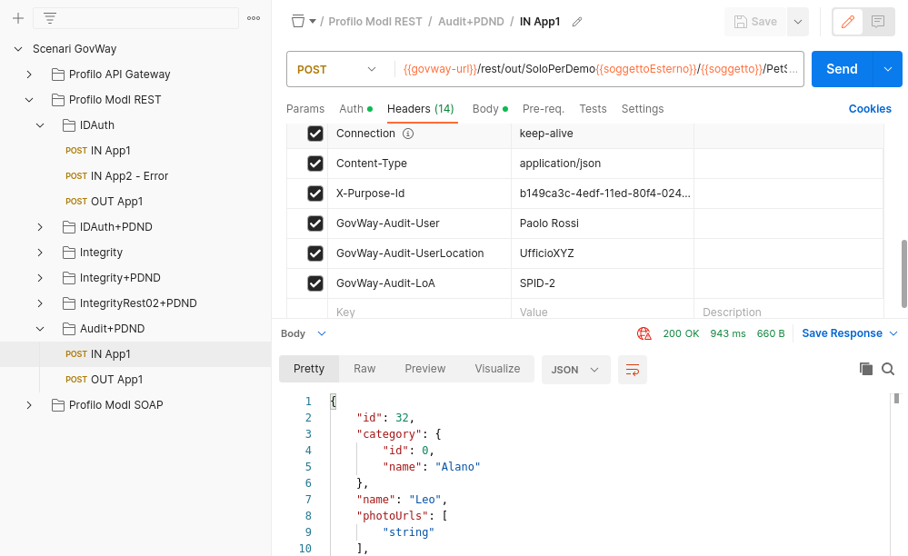

 Pattern Audit+PDND - Erogazione API REST, esecuzione da Postman

Dopo aver eseguito la "Send" e verificato il corretto esito dell'operazione è possibile andare a verificare cosa è accaduto, nel corso dell'elaborazione della richiesta, andando a consultare la console 'govwayMonitor'.

.. note::

  Le informazioni ottenute tramite le :ref:`modipa_passiPreliminari_api_pdnd` (chiavi pubbliche JWK e informazioni sui client) vengono salvate su cache locali. Al fine di forzare nuove invocazioni verso la "PDND simulata" è necessario attendere un minuto rispetto a precedenti invocazioni ed effettuare il reset delle cache locali di GovWay accedendo alla sezione :ref:`strumenti_runtime` della console di gestione '*govwayConsole*' e cliccando sul link '*Svuota tutte le Cache*'.

Le evidenze del processo di validazione relative al token PDND sono le medesime descritte nella scenario :ref:`scenari_erogazione_rest_modipa_auth_pdnd_esecuzione`. 

1. Dal dettaglio della richiesta si può visualizzare il messaggio che è stato inviato dal fruitore, come in :numref:`modipa_erogazione_messaggio_richiesta_audit_01_fig`. Come si nota, al payload JSON è associato un insieme di header HTTP tra i quali "Authorization" e "Agid-Jwt-TrackingEvidence" che contengono rispettivamente il token di sicurezza che il fruitore ha ottenuto dalla PDND e il token di audit. 

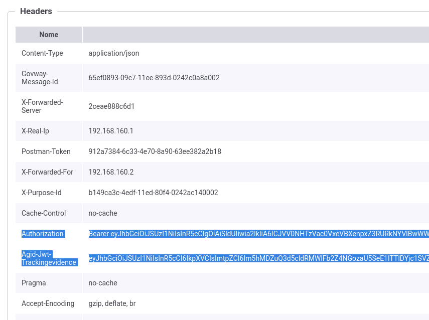
 
 Evidenza diagnostica degli header "Authorization" e "Agid-Jwt-TrackingEvidence"

2. Grazie alle configurazioni presenti nell'erogazione, ed in particolare all'indicazione che il token ricevuto deve essere validato tramite Token Policy PDND, GovWay è in grado di validare i dati di sicurezza ricevuti (:numref:`modipa_pdnd_validazione_token_audit01_02`) e decodificare il token. 

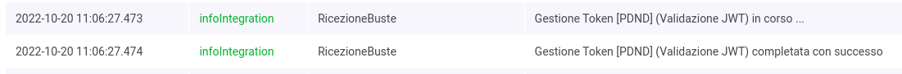

 Evidenza diagnostica della validazione del token

3. Viene inoltre validato l'ulteriore header "Agid-Jwt-TrackingEvidence" rispetto al pattern 'AUDIT_REST_01' indicato nella configurazione dell'API (:numref:`modipa_pdnd_audit01_token_1`). La validazione del token di audit viene effettuata scaricando la chiave pubblica, corrispondente al kid presente nel token, tramite le :ref:`modipa_passiPreliminari_api_pdnd`. Nello storico delle transazioni è possibile vedere come GovWay durante la gestione della richiesta di erogazione scaturisca un'ulteriore chiamata verso la PDND per ottenere la chiave pubblica (:numref:`modipa_pdnd_audit01_token_2`). La chiave pubblica una volta prelevata dalla PDND verrà aggiunta in una cache locale e le successive richieste non provocheranno ulteriori chiamate verso la PDND.

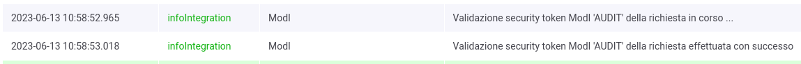

 Evidenza diagnostica della validazione del token di audit

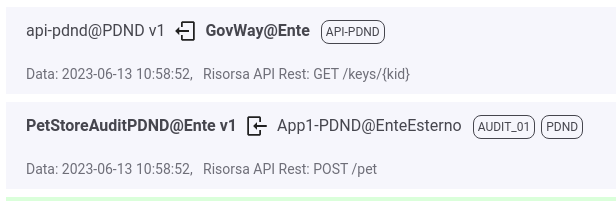

 Evidenza diagnostica della chiamata verso la PDND per ottenere la chiave pubblica

4. Analizzando il token di audit "Agid-Jwt-TrackingEvidence" ricevuto nella sezione header (:numref:`modipa_jwtio_header_audit01_fig`) si può notare la presenza del claim 'kid' che corrisponde all'identificativo della chiave pubblica registrata sulla PDND. L'identificativo 'kid' verrà utilizzato da GovWay per richiedere la chiave pubblica tramite le :ref:`modipa_passiPreliminari_api_pdnd` (:numref:`modipa_jwtio_header_audit01_kid_fig`). Nella sezione payload (:numref:`modipa_jwtio_payload_audit01_fig`) sono invece presenti le informazioni utili all'erogatore a identificare la specifica provenienza di ogni singola richiesta di accesso ai dati effettuta dal fruitore (userId, userLocation, LoA), insieme ai riferimenti temporali (iat, nbf, exp), all'audience (aud) e al 'purposeId' utilizzato dal fruitore per richiedere il token di autorizzazione alla PDND.

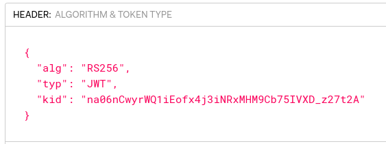

 Sezione "Header" del Token 'Agid-Jwt-TrackingEvidence' con pattern 'AUDIT_REST_01'

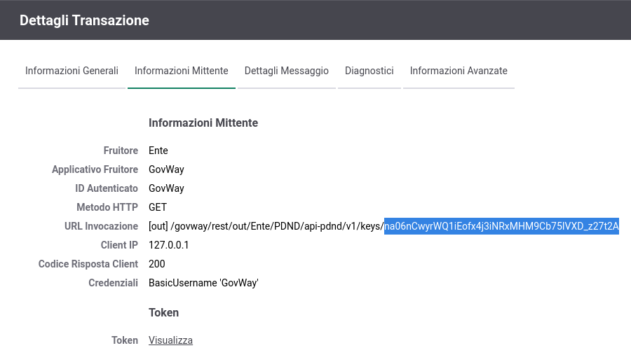

 Dettaglio della url di invocazione utilizzata da GovWay per prelevare la chiave pubblica, utilizzata per firmare il token di audit, dalla PDND

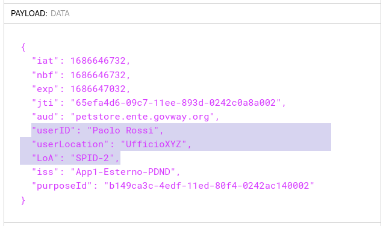

 Sezione "Payload" del Token 'Agid-Jwt-TrackingEvidence' con pattern 'AUDIT_REST_01'

5. Vengono inoltre recuperate e associate alla traccia maggiori informazioni sull'organizzazione afferente al 'client-id' presente nel token, sempre attraverso le :ref:`modipa_passiPreliminari_api_pdnd` (:numref:`modipa_jwtio_header_audit01_clientInfo1_fig`). Nello storico delle transazioni è possibile vedere come GovWay durante la gestione della richiesta di erogazione scaturisca due ulteriori chiamate verso la PDND per ottenere maggiori informazioni sul client e sull'organizzazione (:numref:`modipa_jwtio_header_audit01_clientInfo2_fig`). Le informazioni recuperate dalla PDND verranno aggiunte in una cache locale e le successive richieste non provocheranno ulteriori chiamate verso la PDND.

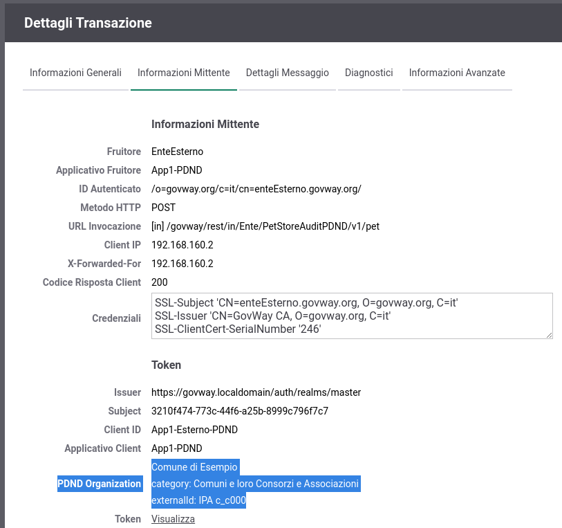

 Informazioni recuperate dalla PDND sull'organizzazione associata al 'client-id'

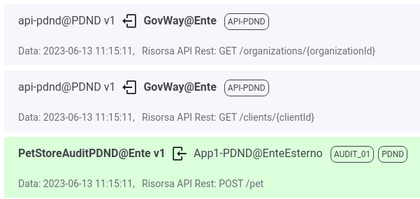

 Evidenza diagnostica delle chiamate verso la PDND per ottenere maggiori informazioni sul 'client-id'

6. Le evidenze del processo di validazione relativo al pattern "AUDIT_REST_01" sono visibili sulla govwayMonitor, andando a consultare la traccia del messaggio di richiesta (:numref:`modipa_traccia_richiesta_audit01_fig`). Nella sezione "Sicurezza Messaggio" sono riportate le informazioni estratte dai token di sicurezza presenti, tra cui si può notare le informazioni sull'utente fruitore.

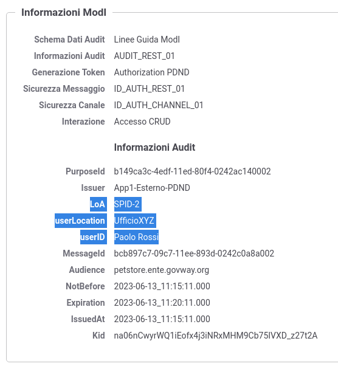

 Traccia della richiesta elaborata dall'erogatore, con pattern 'AUDIT_REST_01'

7. Esaminando il messaggio inoltrato al backend è possibile vedere come tra gli header HTTP inoltrati vi sia l'header 'GovWay-Token-PurposeId' contenente il valore del claim 'purposeId' presente sia nel token ricevuto dalla PDND che nel token di audit e gli header 'GovWay-Audit-UserID', 'GovWay-Audit-UserLocation' e 'GovWay-Audit-LoA' presenti nel token di audit (:numref:`modipa_pdnd_http_purposeId_audit01`). 

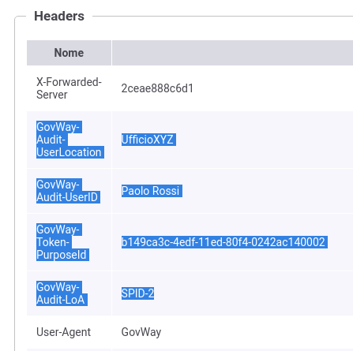

 Header HTTP 'GovWay-Token-PurposeId', 'GovWay-Audit-UserID', 'GovWay-Audit-UserLocation' e 'GovWay-Audit-LoA' inoltrati al backend

**Conformità ai requisiti ModI**

I requisiti iniziali, legati alla comunicazione basata su uno scenario ModI, sono verificati dalle seguenti evidenze:

1. la sicurezza messaggio applicata è quella dei pattern "ID_AUTH_REST_01 via PDND" + "AUDIT_REST_01" come ampiamente mostrato precedentemente dove sono stati mostrati i token validati e i criteri autorizzativi;

2. la validazione del token di audit viene effettuata scaricando la chiave pubblica, corrispondente al kid presente nel token, tramite le :ref:`modipa_passiPreliminari_api_pdnd`;

3. l'identificazione del fruitore avviene rispetto al claim 'client_id' presente all'interno del token e ulteriori informazioni sull'organizzazione afferente vengono ottenute invocando le :ref:`modipa_passiPreliminari_api_pdnd`;

4. le informazioni sul fruitore presenti nel token di audit vengono aggiunte alla traccia.
