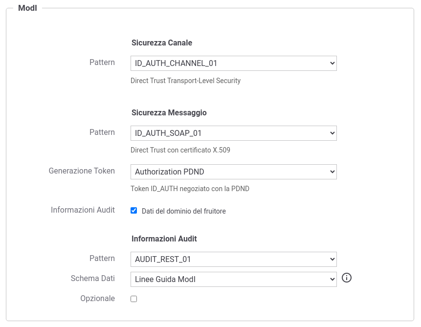

.. _scenari_erogazione_soap_modipa_audit_02_configurazione:

Configurazione
--------------

.. note::

  Per operare con la govwayConsole in modo conforme a quanto previsto dalla specifica del Modello di Interoperabilità si deve attivare, nella testata dell'interfaccia, il Profilo di Interoperabilità 'ModI'. Si suggerisce inoltre di selezionare il soggetto 'Ente' per visualizzare solamente le configurazioni di interesse allo scenario e nascondere le configurazioni "di servizio" necessarie ad implementare la controparte.

  .. figure:: ../../../_figure_scenari/modipa_profilo.png
   :scale: 80%
   :align: center
   :name: modipa_profilo_soap_audit_02_fig

   Profilo ModI della govwayConsole

Il processo di configurazione per questo scenario è del tutto analogo a quello descritto per lo scenario :ref:`scenari_erogazione_rest_modipa_auth_configurazione`. Nel seguito sono evidenziate le sole differenze. 

L'interfaccia wsdl del servizio soap è ottenibile all'indirizzo 'https://www.w3schools.com/xml/tempconvert.asmx?wsdl'.

**Registrazione API**

Viene registrata l'API "TemperatureConversionAuditPDND" con il relativo descrittore WSDL. Vengono selezionati i pattern "ID_AUTH_CHANNEL_01" (sicurezza canale) e "ID_AUTH_SOAP_01"  (sicurezza messaggio) nella sezione "ModI" indicando nel campo "Generazione Token" il valore "Authorization PDND". Viene infine abilitata l'opzione 'Informazioni Audit' e selezionato il pattern "AUDIT_REST_01" e lo schema dei dati "Linee Guida ModI" (:numref:`modipa_profili_api_soap_audit_01_fig`). Per ulteriori dettagli sullo schema dei dati di un token di audit si rimanda alle sezioni :ref:`modipa_infoUtente_audit01_schema` e :ref:`modipa_infoUtente_audit01_schema_custom`.

 Configurazione Pattern ModI "AUDIT_REST_01" sulla API SOAP

**Erogazione**

Si registra l'erogazione SOAP 'TempConvertSoapAuditPDND', relativa all'API precedentemente inserita, indicando i dati specifici nella sezione "ModI Richiesta" (:numref:`modipa_erogazione_richiesta_soap_audit01_fig`) necessari per validare le richieste in ingresso relativamente al token 'Agid-JWT-TrackingEvidence'. Si noti come è stato selezionato un truststore basato sulla PDND al fine di scaricare la chiave pubblica, corrispondente al kid presente nel token, tramite le :ref:`modipa_passiPreliminari_api_pdnd`.

   .. figure:: ../../../_figure_scenari/modipa_erogazione_richiesta_soap_audit01.png
    :scale: 80%
    :align: center
    :name: modipa_erogazione_richiesta_soap_audit01_fig

    Configurazione richiesta dell'erogazione

