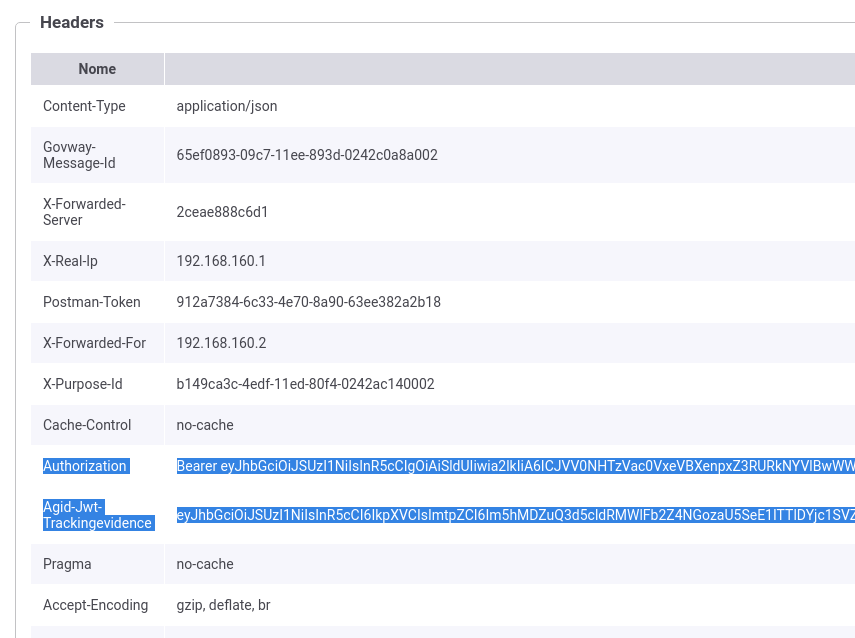

.. _scenari_fruizione_rest_modipa_audit_01_esecuzione:

Esecuzione
----------

.. note::

  Al fine di avere una consultazione immediata delle informazioni di interesse per lo scenario si consiglia di impostare, nella console 'govwayMonitor', nel menù in alto a destra il Profilo di Interoperabilità 'ModI'. Si suggerisce inoltre di selezionare il soggetto 'Ente' per visualizzare solamente le transazioni di interesse allo scenario e ignorare le transazioni "di servizio" necessarie ad implementare la controparte.

  .. figure:: ../../../_figure_scenari/modipa_profilo_monitor.png
   :scale: 80%
   :align: center
   :name: modipa_profilo_monitor_f_audit_01_fig

   Profilo ModI della govwayMonitor

L'esecuzione dello scenario è del tutto analogo a quello descritto nello scenario :ref:`scenari_fruizione_rest_modipa_auth_pdnd_esecuzione` con la sola eccezione del pattern di sicurezza aggiuntivo utilizzato in questo scenario: "AUDIT_REST_01".

Per eseguire e verificare lo scenario si può utilizzare il progetto Postman a corredo con la request "Profilo ModI REST - Audit+PDND - OUT App1" che è stata preconfigurata per il funzionamento con le caratteristiche descritte sopra.

 Pattern Audit+PDND - Fruizione API REST, esecuzione da Postman

Dopo aver eseguito la "Send" e verificato il corretto esito dell'operazione è possibile andare a verificare cosa è accaduto nelle diverse fasi dell'esecuzione andando a consultare la console 'govwayMonitor'.

Le verifiche da effettuare sono le medesime di quelle descritte nello scenario :ref:`scenari_fruizione_rest_modipa_auth_pdnd_esecuzione`. Di seguito vengono riportati solo i punti salienti in cui emerge una differenza dovuta al pattern di audit utilizzato.

- Il messaggio di richiesta inviato dal fruitore contiene tra gli header HTTP le informazioni da inserire nel token di audit (:numref:`modipa_fruizione_messaggio_richiesta_audit_01_http_fig`) e il purpose-id da inserire nella richiesta del voucher alla PDND.

 Messaggio di richiesta in ingresso (con informazioni sull'utente fruitore inserite negli header HTTP)

- Il messaggio di richiesta inviato dal fruitore viene elaborato da Govway che, tramite la configurazione della firma digitale associata all'applicativo mittente, è in grado di produrre un token di sicurezza da inviare alla PDND con il quale ottenere indietro un voucher spendibile per il servizio desiderato. Questa parte è stata ampiamente mostrata nella scenario :ref:`scenari_fruizione_rest_modipa_auth_pdnd_esecuzione`.

  Oltre al token della PDND, GovWay produce un ulteriore token "Agid-JWT-TrackingEvidence" previsto dal pattern "AUDIT_REST_01". Da govwayMonitor si può visualizzare il messaggio di richiesta in uscita che è il medesimo di quello in entrata con la differenza che sono stati aggiunti gli header HTTP "Authorization" e "Agid-Jwt-TrackingEvidence" che contengono rispettivamente il token ottenuto dalla PDND e il token di audit.  (:numref:`modipa_fruizione_messaggio_richiesta_audit_01_fig`).

 Messaggio di richiesta in uscita (con token di sicurezza inseriti nell'header HTTP)

- L'header e i payload del token "Agid-JWT-TrackingEvidence" sono identici a quelli già visualizzati nello scenario di erogazione REST, relativamente al messaggio in ingresso (:numref:`modipa_jwtio_header_audit01_fig` e :numref:`modipa_jwtio_payload_audit01_fig`).
  Le informazioni inserite nel token vengono anche tracciate e sono visibili sulla govwayMonitor, andando a consultare la traccia del messaggio di richiesta (:numref:`modipa_traccia_richiesta_fruitore_audit_01_fig`). Nella sezione "Sicurezza Messaggio" sono riportate le informazioni estratte dai token di audit.

 Traccia della richiesta generata dal fruitore

**Conformità ai requisiti ModI**

I requisiti iniziali, legati alla comunicazione basata su uno scenario ModI, sono verificati dalle seguenti evidenze:

1. viene effettuata una negoziazione del voucher PDND come mostrato nelle tracce relative ai token scambiati con la PDND;

2. l'invocazione del servizio avviene fornendo il voucher della PDND precedentemente negoziato;

3. viene inoltre prodotto l'header http "Agid-Jwt-TrackingEvidence" previsto dal pattern di audit "AUDIT_REST_01".
