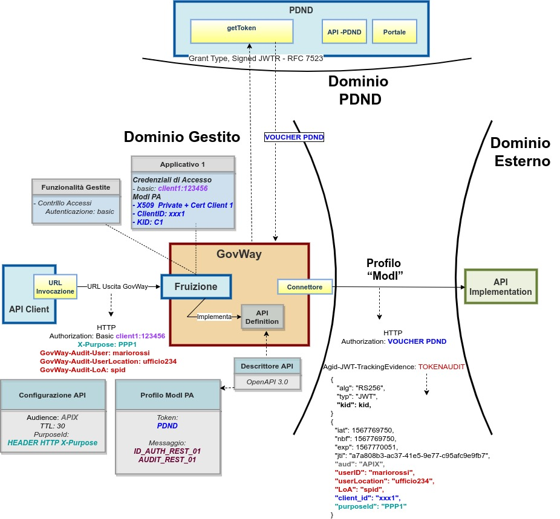

.. _scenari_fruizione_rest_modipa_audit_01:

Fruizione API REST
======================

**Obiettivo** 

Fruire di un servizio REST, definito tramite una API REST (OpenAPI 3.0), che richieda per l'accesso oltre ai token di sicurezza descritti nei precedenti scenari anche un token aggiuntivo adibito a contenere informazioni utili all'erogatore a identificare la specifica provenienza di ogni singola richiesta di accesso ai dati effettuta dal fruitore. Il token di audit deve rispettare il pattern di sicurezza descritto nella sezione :ref:`modipa_infoUtente_audit01`.

**Sintesi**

Mostriamo in questa sezione come procedere per l'integrazione di un applicativo con un servizio REST erogato nel rispetto della normativa italiana alla base dell'interoperabilità tra i sistemi della pubblica amministrazione. In particolare andiamo ad illustrare lo scenario in cui il servizio è stato registrato sulla PDND, e il fruitore per poterlo fruire deve ottenere un voucher dalla PDND che successivamente deve inviare all'erogatore insieme alla normale richiesta di servizio. Oltre al voucher il fruitore devo anche presentare il token di audit "Agid-JWT-TrackingEvidence" previsto dal pattern "AUDIT_REST_01".

La figura seguente descrive graficamente questo scenario.

 Fruizione di una API REST con profilo 'ModI', pattern AUDIT_REST_01 e pattern ID_AUTH_REST_01 via PDND

Le caratteristiche principali di questo scenario sono:

1. un applicativo fruitore che dialoga con il servizio erogato in modalità ModI in accordo ad una API condivisa e pubblicata su PDND;
2. la comunicazione diretta verso il dominio erogatore veicolata su un canale gestito con il pattern di sicurezza canale "ID_AUTH_CHANNEL_01";
3. l'autenticità della comunicazione tra il servizio erogato e ciascun fruitore è garantita tramite sicurezza a livello messaggio con pattern "ID_AUTH_REST_01 via PDND";
4. le informazioni di audit, richieste dall'erogatore per identificare la specifica provenienza di ogni singola richiesta di accesso ai dati effettuta dal fruitore, vengono inserite in un token di audit conforme al pattern "AUDIT_REST_01". Le informazioni vengono fornite dall'applicativo fruitore tramite header HTTP.

.. toctree::
    :maxdepth: 2

    esecuzione
    configurazione
