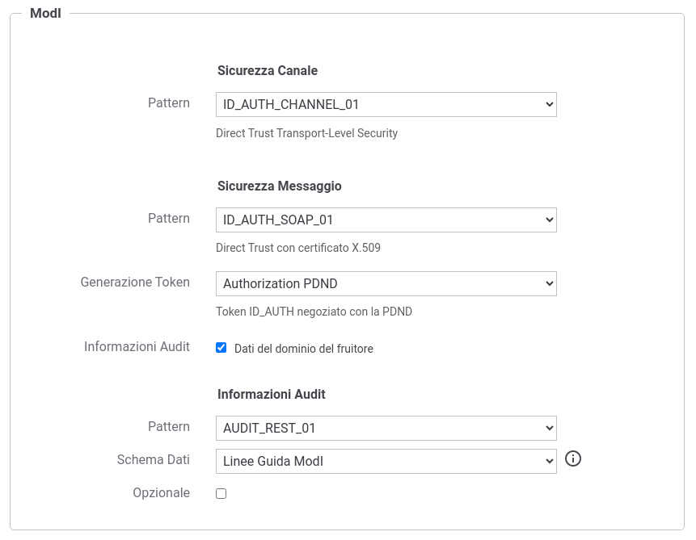

.. _scenari_fruizione_soap_modipa_audit_01_configurazione:

Configurazione
--------------

.. note::

  Per operare con la govwayConsole in modo conforme a quanto previsto dalla specifica del Modello di Interoperabilità si deve attivare, nella testata dell'interfaccia, il Profilo di Interoperabilità "ModI". Si suggerisce inoltre di selezionare il soggetto 'Ente' per visualizzare solamente le configurazioni di interesse allo scenario e nascondere le configurazioni "di servizio" necessarie ad implementare la controparte.

  .. figure:: ../../../_figure_scenari/modipa_profilo.png
   :scale: 80%
   :align: center
   :name: modipa_profilo_f_soap_audit_01_fig

   Profilo ModI della govwayConsole

La configurazione dello scenario è del tutto analogo a quello descritto nello scenario :ref:`scenari_fruizione_soap_modipa_auth_configurazione` con le sole differenze dovuto al differente pattern di sicurezza utilizzato "INTEGRITY_SOAP_01 con ID_AUTH_SOAP_01".

**Registrazione API**

Viene registrata l'API "TemperatureConversionAuditPDND" con il relativo descrittore WSDL. Vengono selezionati i pattern "ID_AUTH_CHANNEL_01" (sicurezza canale) e "ID_AUTH_SOAP_01" (sicurezza messaggio) nella sezione "ModI" indicando nel campo "Generazione Token" il valore "Authorization PDND". Viene infine abilitata l'opzione 'Informazioni Audit' e selezionato il pattern "AUDIT_REST_01" e lo schema dei dati "Linee Guida ModI" (:numref:`modipa_profili_api_soap_audit_01_fr_fig`). Per ulteriori dettagli sullo schema dei dati di un token di audit si rimanda alle sezioni :ref:`modipa_infoUtente_audit01_schema` e :ref:`modipa_infoUtente_audit01_schema_custom`.

 Configurazione Pattern ModI "AUDIT_REST_01" sulla API SOAP

**Fruizione**

Si registra la fruizione SOAP 'TempConvertSoapAuditPDND', relativa all'API precedentemente inserita, indicando i dati specifici nella sezione "ModI Richiesta" (:numref:`modipa_fruizione_richiesta_soap_audit_01_fig`) necessari a generare il token 'Agid-JWT-TrackingEvidence'. In particolare è possibile specificare l'audience atteso dall'erogatore e il tempo di validità del token.

   .. figure:: ../../../_figure_scenari/modipa_fruizione_richiesta_soap_audit_01.png
    :scale: 80%
    :align: center
    :name: modipa_fruizione_richiesta_soap_audit_01_fig

    Configurazione richiesta della fruizione

