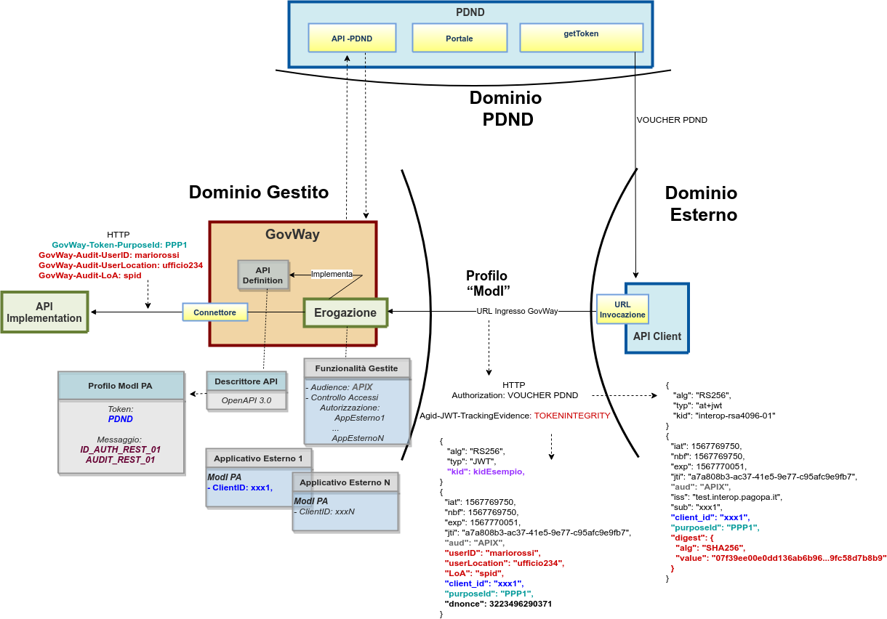

.. _scenari_erogazione_rest_modipa_audit_02:

Erogazione API REST
=======================

**Obiettivo** 

Esporre un servizio, definito tramite una API REST (OpenAPI 3.0), che richieda per l'accesso oltre ai token di sicurezza descritti nei precedenti scenari anche un token aggiuntivo adibito a contenere informazioni utili all'erogatore a identificare la specifica provenienza di ogni singola richiesta di accesso ai dati effettuta dal fruitore. Il token di audit deve rispettare il pattern di sicurezza descritto nella sezione :ref:`modipa_infoUtente_audit02`.

.. note::

  Il token descritto nel pattern :ref:`modipa_infoUtente_audit02` va in aggiunta rispetto agli altri token di sicurezza e quindi può essere utilizzato in combinazione con qualsiasi dei token descritti nei precedenti scenari purchè il token 'Authorization' sia negoziato tramite la PDND. 

**Sintesi**

Mostriamo in questa sezione come procedere per l'esposizione di un servizio REST da erogare nel rispetto della normativa italiana alla base dell'interoperabilità tra i sistemi della pubblica amministrazione. In particolare andiamo ad illustrare lo scenario in cui un servizio è stato registrato sulla PDND, e i fruitori per poterlo fruire devono ottenere un voucher dalla PDND che successivamente devono inviare all'erogatore insieme alla normale richiesta di servizio.
Oltre al voucher devono anche presentare il token di audit "Agid-JWT-TrackingEvidence" previsto dal pattern "AUDIT_REST_02". Da notare come nel pattern :ref:`modipa_infoUtente_audit02` sia previsto che nel voucher della PDND sia presente il digest del token di audit utile a verificare la correlazione tra i due token.

La figura seguente descrive graficamente questo scenario.

 Erogazione di una API REST con profilo 'ModI', pattern AUDIT_REST_02 e pattern ID_AUTH_REST_01 via PDND

Le caratteristiche principali di questo scenario sono:

1. un applicativo eroga un servizio, rivolto a fruitori di domini esterni, in conformità al Modello di Interoperabilità AGID e il servizio viene registrato sulla PDND;
2. la comunicazione con i domini esterni avviene su un canale gestito con il pattern di sicurezza canale "ID_AUTH_CHANNEL_01";
3. l'autenticità della comunicazione tra il servizio erogato e ciascun fruitore è garantita tramite sicurezza a livello messaggio con pattern "ID_AUTH_REST_01 via PDND";
4. per la fruizione viene richiesto un token aggiuntivo, conforme al pattern "AUDIT_REST_02", adibito a contenere informazioni utili all'erogatore a identificare la specifica provenienza di ogni singola richiesta di accesso ai dati effettuta dal fruitore;
5. la validazione del token di audit viene effettuata scaricando la chiave pubblica, corrispondente al kid presente nel token, tramite le :ref:`modipa_passiPreliminari_api_pdnd`;
6. la verifica di correlazione tra il token di audit e il token di autenticazione avviene tramite il calcolo del digest del token di audit "Agid-JWT-TrackingEvidence" e la comparazione con il valore del digest presente nel token "Authorization";
7. vengono inoltre recuperate e associate alla traccia maggiori informazioni sull'organizzazione afferente al 'client-id' presente nel token, sempre attraverso le :ref:`modipa_passiPreliminari_api_pdnd`.

.. toctree::
    :maxdepth: 2

    esecuzione
    configurazione
