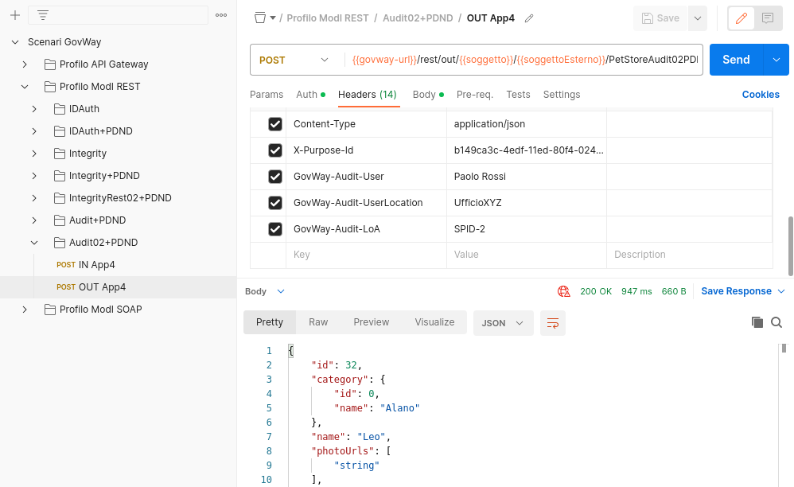
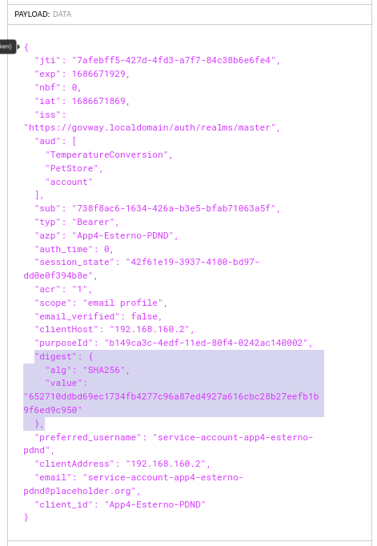

.. _scenari_fruizione_rest_modipa_audit_02_esecuzione:

Esecuzione
----------

.. note::

  Al fine di avere una consultazione immediata delle informazioni di interesse per lo scenario si consiglia di impostare, nella console 'govwayMonitor', nel menù in alto a destra il Profilo di Interoperabilità 'ModI'. Si suggerisce inoltre di selezionare il soggetto 'Ente' per visualizzare solamente le transazioni di interesse allo scenario e ignorare le transazioni "di servizio" necessarie ad implementare la controparte.

  .. figure:: ../../../_figure_scenari/modipa_profilo_monitor.png
   :scale: 80%
   :align: center
   :name: modipa_profilo_monitor_f_audit_02_fig

   Profilo ModI della govwayMonitor

L'esecuzione dello scenario è del tutto analogo a quello descritto nello scenario :ref:`scenari_fruizione_rest_modipa_audit_01_esecuzione`. Di seguito verranno evidenziate solamente le differenze che comporta l'utilizzo del pattern "AUDIT_REST_02" al posto di "AUDIT_REST_01".

Per eseguire e verificare lo scenario si può utilizzare il progetto Postman a corredo con la request "Profilo ModI REST - Audit02+PDND - OUT App4" che è stata preconfigurata per il funzionamento con le caratteristiche descritte sopra.

 Pattern Audit02+PDND - Fruizione API REST, esecuzione da Postman

Dopo aver eseguito la "Send" e verificato il corretto esito dell'operazione è possibile andare a verificare cosa è accaduto nelle diverse fasi dell'esecuzione andando a consultare la console 'govwayMonitor'.

Le evidenze del processo di validazione relative al token PDND sono le medesime descritte nella scenario :ref:`scenari_fruizione_rest_modipa_auth_pdnd_esecuzione`. 

Le evindenze del processo di validazione del token di audit "Agid-Jwt-TrackingEvidence" sono le stesse descritte nello scenario :ref:`scenari_fruizione_rest_modipa_audit_01_esecuzione`. Di seguito viene riportato solamente un dettaglio differente presente all'interno del token "Authorization" e richiesto dal pattern "AUDIT_REST_02" per implementare la correlazione tra il token di autenticazione e il token di audit.

Analizzando il token di auth "Authorization", ottenuto dalla PDND ed inviato all'erogatore, nella sezione payload (:numref:`modipa_jwtio_payload_audit02_auth2_fig`) oltre alle consuete informazioni sull'identità del fruitore (client_id), i riferimenti temporali (iat, nbf, exp), l'audience (aud) e il 'purposeId' utilizzato dal fruitore per richiedere il token di autorizzazione alla PDND, è presente anche il claim 'digest' utilizzato dall'erogatore per verificare la corrispondenza rispetto al digest calcolato sul token di audit "Agid-Jwt-TrackingEvidence" ricevuto.

 Sezione "Payload" del Token 'Authorization' con pattern 'AUDIT_REST_02'

**Conformità ai requisiti ModI**

La verifica dei requisiti ModI per questo scenario non differisce da quanto già descritto in :ref:`scenari_fruizione_rest_modipa_audit_01_esecuzione`.
