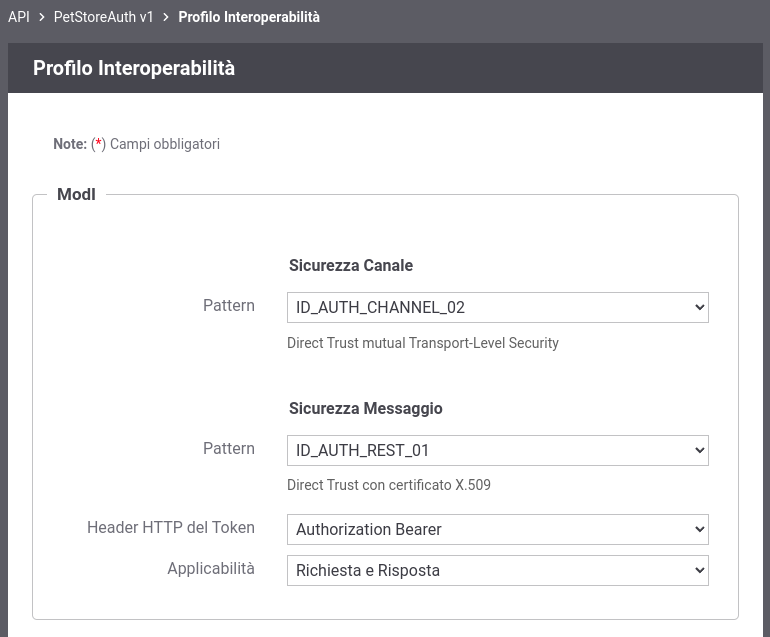

.. _scenari_erogazione_rest_modipa_auth_configurazione:

Configurazione
--------------

.. note::

  Per operare con la govwayConsole in modo conforme a quanto previsto dalla specifica del Modello di Interoperabilità si deve attivare, nella testata dell'interfaccia, il Profilo di Interoperabilità 'ModI'. Si suggerisce inoltre di selezionare il soggetto 'Ente' per visualizzare solamente le configurazioni di interesse allo scenario e nascondere le configurazioni "di servizio" necessarie ad implementare la controparte.

  .. figure:: ../../../_figure_scenari/modipa_profilo.png
   :scale: 80%
   :align: center
   :name: modipa_profilo_fig

   Profilo ModI della govwayConsole

**Registrazione API**

Viene registrata l'API "PetStoreAuth" con il relativo descrittore OpenAPI 3. Vengono selezionati i pattern "ID_AUTH_CHANNEL_02" (sicurezza canale) e "ID_AUTH_REST_01" (sicurezza messaggio) nella sezione "ModI" (:numref:`modipa_profili_api_fig`).

 Configurazione Pattern ModI "ID_AUTH_REST_01" sulla API REST

**Applicativo Esterno**

È opzionalmente possibile registrare l'applicativo esterno che corrisponde al fruitore del servizio. Questa scelta può essere fatta in base al tipo di autorizzazione che si è impostata sui fruitori. Vediamo i seguenti casi:

- Se il truststore utilizzato da Govway per l'autenticazione dei fruitori (sicurezza messaggio) contiene i singoli certificati degli applicativi autorizzati, questo passo può anche essere omesso. La gestione del truststore è sufficiente a stabilire i singoli fruitori autorizzati.
- Se il truststore contiene la CA emittente dei certificati utilizzati dai fruitori, l'autorizzazione puntuale non è possibile a meno di non procedere con la registrazione puntuale degli applicativi fornendo i singoli certificati necessari per l'identificazione (:numref:`modipa_applicativo_esterno_fig`). Questo scenario è quello preconfigurato.

.. figure:: ../../../_figure_scenari/modipa_applicativo_esterno.png
 :scale: 80%
 :align: center
 :name: modipa_applicativo_esterno_fig

 Configurazione applicativo esterno (fruitore)

**Erogazione**

Si registra l'erogazione "PetStoreAuth", relativa all'API precedentemente inserita, indicando i dati specifici nella sezione "ModI Richiesta" (:numref:`modipa_erogazione_richiesta_fig`). In questo contesto vengono inseriti i dati necessari per validare le richieste in ingresso.

.. figure:: ../../../_figure_scenari/modipa_erogazione_richiesta.png
 :scale: 80%
 :align: center
 :name: modipa_erogazione_richiesta_fig

 Configurazione richiesta dell'erogazione

La sezione "ModI Risposta" si utilizza per indicare i parametri per la produzione del token di sicurezza da inserire nel messaggio di risposta (:numref:`modipa_erogazione_risposta_fig`).

.. figure:: ../../../_figure_scenari/modipa_erogazione_risposta.png
 :scale: 80%
 :align: center
 :name: modipa_erogazione_risposta_fig

 Configurazione risposta dell'erogazione

Se si è scelto di registrare gli applicativi esterni, fruitori del servizio, è possibile intervenire sulla configurazione del "Controllo degli Accessi" per l'erogazione, in modo da specificare i singoli applicativi fruitori autorizzati ad effettuare richieste al servizio erogato. Questo scenario è quello preconfigurato come mostrato nelle figure :numref:`modipa_auth_config_fig` e :numref:`modipa_auth_applicativi_fig`.

 Controllo accessi con autorizzazione degli applicativi esterni

 Lista degli applicativi esterni autorizzati

